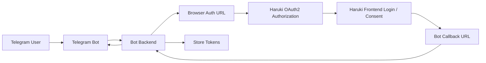

# Haruki Toolbox OAuth2 保密客户端接入说明

本文档面向以下客户端：

- Telegram Bot 后端
- 需要安全保存 `client_secret` 的 Web 后端
- 需要长期保存 refresh token 的服务端应用

本文档默认你对接的是当前线上环境：

- 前端：`https://haruki.seiunx.com`
- 后端 / Oathkeeper：`https://toolbox-api-direct.haruki.seiunx.com`

---

## 1. 这份文档解决什么问题

现有总文档主要强调：

- public client
- `Authorization Code + PKCE`
- 浏览器前端承接 `/oauth2/login` 与 `/oauth2/consent`

但对于 Telegram Bot 这类“客户端本身有后端、需要保存 `client_secret`”的场景，还需要额外说明：

- 如何申请 `confidential` client
- 如何使用 `client_secret_basic`
- 如何设计浏览器回调页
- 如何把 OAuth 结果绑定回 Telegram 用户
- 如何安全保存 refresh token

本文档只讲这部分。

---

## 2. 先讲结论

如果你要做 Telegram Bot 或类似需要 `client_secret` 的接入，当前版本推荐的模式是：

- 客户端类型：`confidential`
- 授权模式：`authorization_code`
- 刷新模式：`refresh_token`
- token 端点认证方式：`client_secret_basic`

也就是说：

- 浏览器授权仍然是标准 OAuth2 Authorization Code Flow
- 用户仍然会经过前端登录页和授权页
- 你的 Bot 后端在回调页拿到 `code` 之后，再带 `client_id + client_secret` 去换 token

---

## 3. 当前服务端支持什么，不支持什么

### 3.1 当前明确支持

- `authorization_code`
- `refresh_token`
- confidential client 使用 `client_secret_basic`

这是由当前 Hydra client 创建逻辑决定的，相关代码在：

- [`hydra_clients.go`](/Users/seiun/GolandProjects/Haruki-Toolbox-Backend/internal/modules/oauth2/hydra_clients.go)

其中 confidential client 会被创建为：

- `token_endpoint_auth_method = client_secret_basic`
- `grant_types = ["authorization_code", "refresh_token"]`

### 3.2 当前不建议按已支持来假设的能力

以下场景这份服务端当前**不要默认当作已支持**：

- `device_code`
- 纯 `client_credentials` 获取用户资源
- 纯聊天窗口内完成 OAuth 授权、没有浏览器回调页

对 Telegram Bot 来说，这意味着：

> 你不能只靠 bot 消息对话完成 OAuth 登录，必须提供一个浏览器授权回调页。

---

## 4. Telegram Bot 推荐架构

推荐结构如下：



更直白一点：

1. 用户在 Telegram 中触发“绑定 Haruki 账号”
2. Bot 后端生成授权链接
3. 用户在浏览器打开该链接
4. 用户在 Haruki 前端完成登录和授权
5. 浏览器跳回你的回调地址
6. 你的后端用 `client_secret` 换 token
7. 你的后端把 OAuth 结果绑定到这个 Telegram 用户

---

## 5. 先申请一个 confidential client

管理员需要在后台创建 OAuth client：

- `clientType = confidential`

管理端创建成功后，会返回：

- `clientId`
- `clientSecret`

相关服务端创建逻辑在：

- [`hydra_handlers.go`](/Users/seiun/GolandProjects/Haruki-Toolbox-Backend/internal/modules/adminoauth/hydra_handlers.go)

### 示例请求

```json
{
  "clientId": "telegram-bot-prod",
  "name": "Telegram Bot Prod",
  "clientType": "confidential",
  "redirectUris": [
    "https://bot.example.com/oauth/callback/haruki"
  ],
  "scopes": [
    "user:read",
    "bindings:read",
    "game-data:read"
  ]
}
```

### 示例响应重点

```json
{
  "status": 200,
  "message": "oauth client created",
  "updatedData": {
    "clientId": "telegram-bot-prod",
    "clientSecret": "once-returned-secret",
    "clientType": "confidential"
  }
}
```

注意：

- `clientSecret` 是敏感信息
- 应只保存在你的服务端
- 不要放进 Telegram Mini App 前端代码
- 不要放进浏览器可见脚本

---

## 6. 授权地址怎么生成

confidential client 发起浏览器授权时，入口仍然是：

- `GET https://toolbox-api-direct.haruki.seiunx.com/api/oauth2/authorize`

### 最小必需参数

- `response_type=code`
- `client_id=<你的 client_id>`
- `redirect_uri=<你注册的 redirect_uri>`
- `scope=<申请的 scope>`
- `state=<随机字符串>`

### 示例

```text
https://toolbox-api-direct.haruki.seiunx.com/api/oauth2/authorize
?response_type=code
&client_id=telegram-bot-prod
&redirect_uri=https%3A%2F%2Fbot.example.com%2Foauth%2Fcallback%2Fharuki
&scope=user%3Aread%20bindings%3Aread%20game-data%3Aread
&state=botbind_abc123xyz
```

### 是否必须使用 PKCE

对于 confidential client：

- 当前不是必须
- 仅使用 `client_secret_basic` 就可以完成标准交换

如果你的后端同时控制授权发起和回调处理，也可以继续启用 PKCE 作为额外保护，但这不是当前接入的必需条件。

---

## 7. 浏览器里会发生什么

用户打开授权链接后，浏览器流程和 public client 基本一致：

1. 进入 `/api/oauth2/authorize`
2. 跳到 Hydra 授权入口
3. Hydra 再把浏览器带到：
   - `https://haruki.seiunx.com/oauth2/login`
   - `https://haruki.seiunx.com/oauth2/consent`
4. 用户完成登录与授权
5. 浏览器最终跳回你的 `redirect_uri`

所以 Telegram Bot 这一类 confidential client 的核心区别不是“浏览器授权流程不同”，而是：

- code 交换 token 时由你的后端完成
- 后端需要带 `client_secret`

---

## 8. 回调页该怎么做

你的回调地址例如：

- `https://bot.example.com/oauth/callback/haruki`

收到请求后，后端至少要做这几件事：

1. 读取 query 参数中的 `code`
2. 读取 query 参数中的 `state`
3. 校验 `state`
4. 根据 `state` 找回当前 Telegram 用户上下文
5. 用 `code` 去换 token
6. 保存 token

### 为什么 `state` 很重要

对 Telegram Bot 来说，`state` 通常用来绑定：

- 这次授权属于哪个 Telegram 用户
- 这次授权是否仍然有效
- 是否已被使用过

推荐你在服务端存一条临时记录，例如：

- `state`
- `telegram_user_id`
- `created_at`
- `expires_at`
- `used=false`

授权回调完成后立即把它标记为已使用。

---

## 9. 如何换 token

拿到授权码后，调用：

- `POST https://toolbox-api-direct.haruki.seiunx.com/api/oauth2/token`

这个接口由 backend 代理到 Hydra token endpoint。

### 9.1 confidential client 的标准写法

使用 HTTP Basic Auth：

```bash
curl -X POST 'https://toolbox-api-direct.haruki.seiunx.com/api/oauth2/token' \
  -u 'telegram-bot-prod:your-client-secret' \
  -H 'Content-Type: application/x-www-form-urlencoded' \
  -d 'grant_type=authorization_code' \
  -d 'code=authorization-code-from-callback' \
  -d 'redirect_uri=https://bot.example.com/oauth/callback/haruki'
```

### 9.2 成功响应示例

```json
{
  "access_token": "access-token",
  "refresh_token": "refresh-token",
  "expires_in": 3600,
  "token_type": "bearer",
  "scope": "user:read bindings:read game-data:read"
}
```

### 9.3 常见错误

- `invalid_client`
  原因通常是 `client_id/client_secret` 不匹配
- `invalid_grant`
  原因通常是：
  - `code` 已使用
  - `redirect_uri` 不匹配
  - `code` 已过期

---

## 10. 如何刷新 token

当 access token 过期后，继续使用 refresh token：

```bash
curl -X POST 'https://toolbox-api-direct.haruki.seiunx.com/api/oauth2/token' \
  -u 'telegram-bot-prod:your-client-secret' \
  -H 'Content-Type: application/x-www-form-urlencoded' \
  -d 'grant_type=refresh_token' \
  -d 'refresh_token=your-refresh-token'
```

对 confidential client，推荐始终使用 Basic Auth 携带：

- `client_id`
- `client_secret`

---

## 11. 如何调用受保护资源

拿到 access token 后，使用：

```http
Authorization: Bearer <access_token>
```

### 可访问的主要接口

#### 11.1 用户资料

- `GET /api/oauth2/user/profile`
- 需要 scope：`user:read`

#### 11.2 用户绑定

- `GET /api/oauth2/user/bindings`
- 需要 scope：`bindings:read`

#### 11.3 游戏数据

- `GET /api/oauth2/game-data/:server/:data_type/:user_id`
- 需要 scope：`game-data:read`

注意：

- 游戏数据接口还会检查 token 对应用户是否有该绑定
- 也会检查绑定是否已经验证

---

## 12. Telegram Bot 的一套推荐业务流程

下面给一个更贴近 Telegram Bot 的完整流程。

### 第 1 步：用户在 Telegram 中点击“绑定 Haruki”

Bot 后端生成一条临时授权记录：

- `telegram_user_id = 123456`
- `state = random-string`
- `expires_at = now + 10 min`

### 第 2 步：Bot 给用户发浏览器授权链接

形如：

```text
https://toolbox-api-direct.haruki.seiunx.com/api/oauth2/authorize?response_type=code&client_id=telegram-bot-prod&redirect_uri=https%3A%2F%2Fbot.example.com%2Foauth%2Fcallback%2Fharuki&scope=user%3Aread%20bindings%3Aread%20game-data%3Aread&state=random-string
```

### 第 3 步：用户在浏览器完成登录和授权

这一段由 Haruki 前端承接。

### 第 4 步：你的回调页收到 `code` 与 `state`

后端：

1. 校验 `state`
2. 找到对应的 `telegram_user_id`
3. 用 `code` 换 token

### 第 5 步：保存授权结果

建议至少保存：

- `telegram_user_id`
- `haruki_subject` 或业务用户标识
- `access_token`
- `refresh_token`
- `expires_at`
- `scope`

### 第 6 步：回调页提示成功

回调页可以向用户显示：

- “Haruki 账号已绑定成功，现在可以返回 Telegram”

同时 Bot 可以主动发消息提醒用户绑定完成。

---

## 13. 安全建议

### 13.1 不要把 `client_secret` 暴露到前端

对于 Telegram Bot / Mini App：

- `client_secret` 只能保存在后端
- 不能写进 JS
- 不能写进浏览器可见配置

### 13.2 严格校验 `redirect_uri`

换 token 时的 `redirect_uri` 必须与授权时一致，并且与后台注册值一致。

### 13.3 `state` 必须一次性使用

不要只校验“存在”，还要校验：

- 是否过期
- 是否已消费
- 是否属于当前 Telegram 用户流程

### 13.4 refresh token 应视为高敏感凭证

推荐：

- 加密存储
- 泄露时立即轮换 client secret 并撤销 token

---

## 14. 不要这样接

以下方式不推荐：

### 14.1 直接把 confidential client 当 SPA 用

错误做法：

- 浏览器前端直接持有 `client_secret`

这是典型泄露风险。

### 14.2 Telegram Bot 没有回调页，只想靠消息文本拿 token

当前服务端没有专门给这种模式开放 `device_code` 文档化接入方式，因此不要按这个假设来设计。

### 14.3 用 `client_credentials` 替代用户授权

当前业务资源接口是面向“用户授权后的 bearer token”的，不是给 bot 自己拿一个机器 token 就能直接读所有用户数据。

---

## 15. 一句话推荐方案

如果你是 Telegram Bot 或其他需要 `client_secret` 的服务端客户端，请按下面方式接：

> **申请 `confidential` client，使用浏览器 `authorization_code` 完成用户授权，在你自己的后端回调页使用 `client_secret_basic` 换 token，并保存 refresh token 用于后续代表用户调用 Haruki OAuth2 资源接口。**
