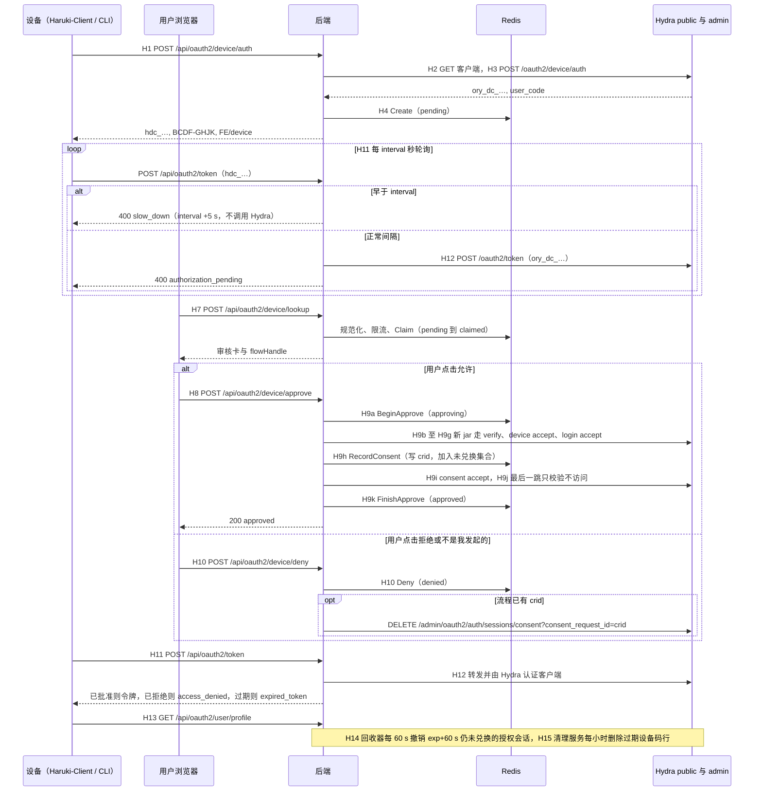

# OAuth2 设备授权（Device Code）设计

状态：**2026-10-07 按产品方向重新定位**（见 §2）。初版把设备授权写成 Haruki Cloud 聊天机器人迁移方案、并把 Haruki-Client 列为「不在范围内」，与产品设想相反，相关目标、接入方、决策与上线计划已全部推翻重写；Hydra 实测、代驱链、状态机、限流与预算等通用机制不受影响，原样保留。Phase 0 前置修复（BE-1～BE-4、FE-1、FE-1b）与 BE-5 已在合并分支 `feat/oauth2-device-flow`（后端 #97、前端 #104）上完成，按决定**整个功能完成后一起合并**。日期：2026-10-07。基于生产现用的 Hydra v25.4.0 实测。

本文是 Haruki Toolbox 引入 OAuth 2.0 设备授权许可（[RFC 8628](https://www.rfc-editor.org/rfc/rfc8628)，设备码流程）的评审与实施设计，供后端、前端、运维评审和实施时对照。它主要描述我们自己的系统；接入方契约的规范性要点见 §16，上线前由 BE-11 原样写进 [OAuth2 / OIDC 接入](oauth2-integration.zh-CN.md) 新增的 §4A。**本文是临时设计文档**：BE-11 合并时删除本文和 [文档索引](README.md)「待实施设计」中的对应行，架构与运维手册并入 [Ory 套件使用说明](ory-suite-usage.zh-CN.md) 新增的 §10.5 / §10.6，代码无法表达的约束写成代码旁注释。

**证据标注**：「实测（类生产）」指与生产同配置的 non-dev `oryd/hydra:v25.4.0` + Postgres 18、https issuer、明文 http serve、与生产相同的 hydra.yml，代驱链另在两个同配置实例上逐跳复核过（码有效期 10 min 与 40 s 各一）；「实测（dev）」指 `--dev` + 内存库，只用于与存储层无关的结论；「源码」指 Hydra v25.4.0（生产）与 v26.2.0（当前最新，2026-03-20）；「代码」指本仓库 @ dbd8368 与前端仓库 Haruki-Toolbox @ edaa777；「待验证」指尚未实测，上线前按 §14.2 预检确认。

| 术语 | 含义 |
| --- | --- |
| 设备授权许可 | 客户端 `grant_types` 含 `urn:ietf:params:oauth:grant-type:device_code` |
| 包装设备码 | 交给设备的 `hdc_…`；Hydra 原始设备码 `ory_dc_…` 从不离开服务端 |
| 代驱链（BFF） | 后端在一次 approve 请求内代替浏览器走完 Hydra 的整段浏览器链路 |
| 流程标记 | 附在代驱链首个 verify 请求上的 `haruki_dfl=<fid>`，把 login/consent 绑定到本流程 |
| 令牌端点兼容层 | 改造后的 `POST /api/oauth2/token`：解包 `hdc_`、执行 `slow_down`、按流程状态改写 Hydra 响应 |
| 未兑换集合 | Redis ZSET `haruki:oauth2-device:unredeemed`：已写入授权请求 ID（`crid`，即 `consent_request_id`）但尚未交出令牌的流程 |

## 1. 结论

- **定位：Toolbox 自己的通用功能。** 设备授权（RFC 8628）是 Toolbox OAuth 提供方的一项独立能力：任何由管理员登记、并按客户端开通设备授权许可的 OAuth 客户端都能用它在没有浏览器的环境里取得 Toolbox 令牌。它不绑定任何特定接入方，也不改变现有授权码客户端。
- **Haruki-Client 的两套认证互相独立。** 机器人功能（命令路由、调用 Haruki Cloud）继续用 Haruki Cloud 的 AuthV3 认证，本方案**不改、不引用**；车牌收集是独立功能，改用 Toolbox OAuth2 设备授权。两套凭据互不派生、互不传递：设备授权的发码与展示不经机器人通道，设备标签与内省结果里不含 bot_id、QQ 号或任何 Cloud 身份，Toolbox 令牌也从不发给 Haruki Cloud。
- **首个接入方：Haruki-Client 的车牌收集向 Sekai Station 提交车牌。** Haruki-Client（由运行者自行部署的 OneBot v11 客户端）开启 `enableRoomCollect` 后，从白名单 CN 群消息中抓取 5 位车牌（房间号），POST 到 Sekai Station 的 `submitRoomNumber`。今天它用每位运行者手工配置的静态 token 签名（`x-client-token = sha256(车牌-botId-token)`），token 要人工分发、无法按人撤销、Station 也不知道提交者是谁。改为：Haruki-Client 以公共客户端 `haruki-client` 走设备授权，由运行者在 `/device` 用自己的 Toolbox 账号批准，拿到带 `station:room:write` 的令牌，提交时以 `Authorization: Bearer` 携带。旧的静态签名代码全部删除，不做新旧双轨。
- **`station:room:write` 是公开可用的普通 scope。** Toolbox 的 OAuth 服务对所有登记的客户端开放：任何客户端只要管理员给它登记了该 scope、并经用户授权（授权码或设备授权都行），拿到的令牌就能提交车牌；Station 后端接受**一切**有效且带该 scope 的 Toolbox 令牌，不限客户端。
- **Station 用内部 API 验 token。** Sekai Station 是我们自己的服务（目前与 Toolbox 后端同机、独立进程运行）；它的后端调用 Toolbox 后端新增的内部 API `POST /internal/oauth2/introspect`（BE-12，§6.9）：挂在 backend 主端口 16666 上，经 tailnet 与容器网络可达、不经 Oathkeeper（公网到不了），带内部 token；返回令牌是否有效、Toolbox 用户 ID、客户端与 scope。
- **可行。** 生产 Hydra v25.4.0 自带设备流程及迁移 `20241609000001000000_device_flow`。只要由 Toolbox 后端补上 Hydra 缺少的限流、单次使用、拒绝回传、过期语义和过期数据清理，就能对外提供符合 RFC 8628 的设备授权许可；补齐方案的每个关键环节都已实测（类生产）跑通。生产 `hydra` 库已有 `hydra_oauth2_device_auth_codes` 表（2026-10-07 核对，§3.4）。
- **推荐方案：后端中介 + 服务端代驱（BFF）**，Hydra 的设备机制只由后端调用。设备调用后端代理 `POST /api/oauth2/device/auth`，拿到包装设备码和前端短验证地址 `https://haruki.seiunx.com/device`，Hydra 的 `/oauth2/device/*` 不路由。用户登录后在 `/device` 输入 8 位用户码，后端用 Redis Lua **认领**并展示审核卡；点「允许」时后端新建内存 Cookie 容器（jar），经内部 `http://hydra:4444` 同步走完 verify → device accept → login accept → consent accept → success，每一跳用流程标记绑定；点「拒绝」只写 Redis 状态，若已记录 `crid` 再按它撤销。`/api/oauth2/token` 改为令牌端点兼容层，非设备授权许可逐字节透传；发现文档的 `device_authorization_endpoint` 与 `token_endpoint` 从上线当天起都指向后端。回收器（后端 scheduler，每 60 s）撤销「已批准却从未兑换」的授权会话，清理服务（compose sidecar，每小时）删除过期设备码行。
- **前置修复先行。** 客户端整体 PUT 抹字段、按客户端撤销返回 400、停用客户端仍能授权、日志不脱敏用户码、注册丢回跳等缺陷今天就影响授权码客户端；对应修复（JSON Patch 生命周期、逐 subject 撤销、active 拦截、脱敏、保留回跳，以及管理端展示新响应的前端配套）已在合并分支上完成，随整个功能一起合并上线（§12；2026-10-07 决定不再单独先行）。
- **升级 Ory 解决不了问题**（§3.2）。生产继续用 v25.4.0、不打补丁；真实 Hydra 集成测试（BE-9）在 v25.4.0 与 v26.2.0 上各跑一遍，作为今后修改 `ORY_VERSION` 的门禁。
- **规模：** Toolbox 侧合计约 27.5 人日（后端 19.75、前端 6.25、运维 1.5），其中 scope 与内部 API BE-12 1.0 人日；接入方侧 Haruki-Client 设备登录与 Bearer 提交（同时删除旧签名代码）约 2–3 人日，等 Toolbox 侧完成后再做；Sekai Station 后端改为调用内部 API 约 1 人日（§13）。原 Phase 4「Haruki Cloud 数据对齐」已删除。

## 2. 背景、目标与非目标

### 2.1 背景

- **只支持授权码。** 创建客户端时 `grant_types` 被硬编码为 `["authorization_code","refresh_token"]`，`redirectUris` 必填；接入文档 §12.7 明确写着不支持 `device_code`。没有浏览器、也没有回调地址的程序（常驻进程、命令行、路由器上的服务）今天无法以 Toolbox 用户身份取得令牌。
- **发现文档宣告了打不开的端点。** 生产发现文档已宣告 `device_authorization_endpoint=…/oauth2/device/auth` 和 `device_code` 授权类型，但 Oathkeeper 对该地址返回 404。
- **Haruki-Client 的车牌提交靠静态共享 token。** `src/services/collect/service.rs`：白名单 CN 群里出现 5 位数字即 POST `{endpoint}/submitRoomNumber`，头 `x-client-name: haruki-<bot_id>`、`x-client-token: sha256("<room>-<bot_id>-<token>")`，`token` 来自本地 `cn_collect_configs.yaml`。token 由人工发放，泄漏后只能整体更换；Sekai Station 看到的提交者只有 `bot_id` 和掩码 QQ 号，没有可撤销、可追溯的身份。
- **本机其他服务无法校验 Toolbox 令牌的用途。** 现有 Bearer 端点 `/api/oauth2/user/profile` 只回答「这是谁」（需 `user:read`），不告诉调用方令牌签给了哪个客户端、带哪些 scope；Station 拿它校验分不出令牌有没有提交权限。Hydra admin 内省只在 Toolbox 的容器网络里，也不检查客户端的 `haruki.active`。

### 2.2 接入方与优先级

| 优先级 | 接入方 | 类型 | scope | 本方案覆盖 |
| --- | --- | --- | --- | --- |
| P0 | **Haruki-Client 的车牌收集功能**（Rust，运行者自行部署，开启 `enableRoomCollect` 时；机器人功能仍走 Cloud 认证，不在此列） | 公共客户端 `haruki-client`（发行版无法保密 secret），仅设备授权 | `user:read offline_access station:room:write` | 首个接入方；旧静态签名代码在新版中全部删除 |
| P0 | **Sekai Station 后端**（车牌接收方；我们的资产，独立进程） | 内部服务：经 Toolbox 内部 API 校验令牌（不是 OAuth 客户端，不参与授权流程） | 不申请用户授权；接受一切有效且带 `station:room:write` 的令牌 | BE-12 内部 API；Station 后端改为调用它 |
| P1 | 其他客户端（无头程序、网页应用都可以） | 公共或机密，管理员逐个登记 | 现有 scope，以及 `station:room:write`（管理员按需登记） | 通用能力，不单独开发；带 `station:room:write` 的令牌同样能向 Station 提交 |

不在范围内：Haruki-Client 机器人功能的认证（Haruki Cloud AuthV3，保持不变）；聊天机器人用设备授权替代私有 API、Haruki Cloud 账号绑定与「全量游戏数据」授权（初版的 P0 与 Phase 4，已删除）；HarukiProxy 的无头登录（可在通用能力上线后自行接入，不在本方案排期）。

### 2.3 目标

1. **标准兼容**：设备授权端点 `/api/oauth2/device/auth` 与令牌端点兼容层 `/api/oauth2/token`；按发现文档配置的库（Rust `oauth2` crate、Go `golang.org/x/oauth2`）无需改端点配置（重试要求见 §16）。**可信的验证入口**：`https://haruki.seiunx.com/device`（完整地址 `…/device?user_code=BCDF-GHJK`）；必须先登录才能提交代码，用户全程不接触 Hydra 主机。
2. **单次使用、结果回传设备**：一个用户码最多被一个账号批准一次（认领 + CAS）；设备能收到 `access_denied`、`expired_token`、`slow_down`。
3. **抵御远程钓鱼和暴力破解**：审核卡展示客户端、发起时间、应用自述和固定钓鱼警示并须勾选确认；无效情况统一 `invalid_code`；最坏期望命中约 0.74 次/年，启动时校验。
4. **最小权限**：设备 scope 白名单，`email` 一律拒绝；`station:room:write` 是普通 scope，客户端须由管理员登记该 scope、用户在审核卡或同意页上看到红色写入提示后才授予；`game-data:write` 规则不变（只给带 `allow_write` 的公共客户端）。
5. **令牌可被内部服务校验**：Station 后端经内部 API 得到 `active`、`user_id`、`client_id`、`scope`、过期时间与设备标签；该 API 只在 tailnet 与容器网络上可达，不经 Oathkeeper、公网不可达，并要求内部 token。
6. **可撤销、可运维**：按设备撤销；运行时总开关免重启；回收器、清理服务、日志告警与运维手册随首发上线。
7. **前置修复先行**：PF1–PF10 在 Phase 0 完成（已在合并分支上）；PF11 的按 ID 撤销 helper 随 BE-6，授权会话解码与按设备撤销路由随 BE-10。**升级门禁**：BE-9 同时覆盖 v25.4.0 与 v26.2.0。

### 2.4 非目标（v1 不做）

- 不升级、不修改 Ory；不在 Oathkeeper 上路由 `/oauth2/device/auth`、`/oauth2/device/verify`、`/oauth2/fallbacks/device`（架构测试约束）。
- 不改车牌抓取规则（5 位数字正则、群白名单）；Station 的认证从静态签名换成调用内部 API；Haruki-Client 只改车牌提交（删除旧签名、改用 Bearer），不触碰机器人功能与 Cloud 认证。
- 暂缓到 v1.1 及以后：`game-data:write` 的升级认证；发起人提示与社交绑定比对；设备授权登记表；管理员「撤销某时刻之后的设备授权」；统计端点；通知邮件；按客户端设置令牌寿命的 UI；批准后修改设备标签；可配置的第三方 scope 目录（v1 `station:room:write` 写在代码的 scope 表里）。
- 后端不做按 IP 限流（`c.IP()` 是 Oathkeeper 的地址）；SafeLine 不支持按路径规则（已确认），所以也不在边缘按路径限流，防暴力破解完全依赖后端的全局、按用户、按客户端预算（§8.3）。OAuth 与设备流程不走 `toolbox-api-cdn`。

## 3. 已验证事实

### 3.1 Hydra v25.4.0 设备流程的行为与缺口

| 行为 | 证据 | 设计应对 |
| --- | --- | --- |
| `POST /oauth2/device/auth` 只收表单；用 HTTP Basic 时表单里也必须有 `client_id`（否则 "Provided client_id mismatch"）；客户端须有设备授权许可。响应多出 `"Header":null`，带 `ory_dc_…`、未分组的用户码、`expires_in`（599）、`interval`（5） | 实测（类生产） | 代理从 Basic 注入 `client_id`，重建响应去掉 `Header`，`ory_dc_` 不出服务端 |
| `verification_uri` 固定为 PublicURL + `/oauth2/device/verify`。`WEBFINGER_OIDC_DISCOVERY_DEVICE_AUTHORIZATION_URL` / `…_TOKEN_URL` 会同时改变两份 `.well-known` 文档，`private_key_jwt` 的 audience 新旧令牌地址都接受，但 `verification_uri`、issuer、authorization_endpoint 不变 | 源码 + 实测（类生产） | 后端改写为前端短地址；上线当天两项发现文档都覆盖到后端 |
| `…_USER_CODE_LENGTH=8` + `…_CHARACTER_SET=BCDFGHJKLMNPQRSTVWXZ` 生效；匹配精确且区分大小写（小写、带 `-` 或空格都 400）；输错不消耗 challenge；只做 accept 不会把码标为已用。schema 中 `entropy_preset` 与 `{length, character_set}` 为 oneOf | 实测（类生产）+ 源码 | 服务端规范化后提交；单次使用由我们保证；compose 只设 LENGTH + CHARACTER_SET，契约测试禁止 `entropy_preset` |
| 从不返回 `slow_down`（`ShouldRateLimit` 恒为 false）；从未批准的码过期后仍返回 `authorization_pending`，只有「过期后才批准」的码返回 `expired_token` | 源码 + 实测（dev） | 兼容层本地实现 `slow_down`，`now ≥ exp` 时返回 `expired_token` |
| login/consent 的 reject 到不了设备：浏览器在 Hydra 主机上得到裸 JSON 400，设备继续 pending，Hydra 不保存记录，同一用户码之后仍可被接受；consent 路径从不写 `UserCodeRejected` | 实测（类生产）+ 源码 | 拒绝只写 Redis `denied`，兼容层返回 `access_denied` |
| 批准不是单次的：同一用户码可在多个 challenge 上 accept。Postgres 上不带 `openid` 时两边都显示成功、令牌 subject 由先后决定；带 `openid` 时先完成者胜、败者 409；败者都留下孤儿授权会话 | 实测（类生产） | Lua 认领 + 批准 CAS，在任何 Hydra 调用之前完成 |
| 设备模式的 login/consent 请求没有设备字段和用户码；`request_url` = issuer 的 verify 地址 + 首个 verify 的查询串（`user_code` 的值被替换为 `****`），自定义参数一路保留：`haruki_dfl` 出现在 device accept 的 `redirect_to`、login/consent 的 `request_url` 和每个 accept 的 `redirect_to` 中 | 源码 + 实测（类生产） | 每一跳校验流程标记和 `client_id`；首个 verify 绝不带 `user_code`；通用端点按 `request_url` 识别并拒绝设备模式 |
| device accept（`PUT /admin/oauth2/auth/requests/device/accept`）是唯一的设备 admin 端点，没有 GET、没有 reject。码错或过期 400，challenge 不存在 404，超过 `ttl.login_consent_request`（30 min）401；首个 verify 不带 `user_code` 时 `redirect_to` 只有 `client_id`、`device_verifier`、`haruki_dfl` | 实测（dev + 类生产） | 首次尝试 400 → `code_expired`，重试时 400 → `unconfirmed`；401/404 换新 jar 重来一次 |
| non-dev 下所有 Cookie 带 `Secure`，标准 cookiejar 经内部 http 会丢弃，下一跳 403 "No CSRF value…"，「名称→值」jar 强制发送即可；Hydra 不看 Host / X-Forwarded-Proto；non-dev 要求 https issuer。`ory_hydra_device_csrf` 不带客户端后缀，同一浏览器第二次 verify 会覆盖它 | 源码 + 实测（类生产 / dev） | 名称→值 jar，只改写 issuer 源的 verify 地址；每次批准新建 jar |
| 共享 jar 中 `remember=true` 登录后，下一流程 login `skip=true` 且带上一个用户的 subject；机密客户端即使新 jar 也会因库中记住的授权而 consent `skip=true` | 实测（类生产） | login `remember=false, remember_for=0`，`skip==true` 直接失败；忽略 consent skip |
| consent accept 完成、尚未访问 `consent_verifier` 时崩溃：授权会话列表为空，设备仍 pending，新链可成功；新 jar 重放旧 verifier 得 403；原 jar 晚些访问最后一跳仍成功 | 实测（类生产） | 崩溃恢复与 `unconfirmed` 语义 |
| `hdc_…` 直接交给 Hydra `/oauth2/token`，公共和机密客户端都得到 400 `invalid_grant`（不是 5xx）。Hydra 先认证客户端再判断设备码状态：secret 错误时即使码有效也 401 | 实测（类生产）+ 源码 | 写死 Hydra 地址的轮询方明确失败；兼容层先转发 Hydra 认证再改写，并本地校验请求客户端 = 流程 `cid` |
| 设备令牌与授权码令牌相同（`ory_at_` / `ory_rt_`，带 `openid` 有 RS256 id_token，带 `offline_access` 有刷新令牌，刷新轮换 + 重用检测）；内省无授权类型字段，`ext` 即授权会话的 `session.access_token` | 实测 | Bearer 中间件与资源接口不改；设备令牌靠 `ext.flow` 区分 |
| `DELETE /admin/oauth2/auth/sessions/consent?consent_request_id=X`（单独使用）撤销该链 AT+RT（含刷新所得），多带参数 400，不存在的 ID 返回 204。设备轮询前撤销会级联删除设备码行（外键 `ON DELETE CASCADE`），之后轮询 `invalid_grant`、用户码也不能再被接受 | 实测（类生产）+ 源码 | 按设备撤销前先确认 ID 属于调用者；回收器与停用可以干净地取消 |
| 按客户端整体撤销（`client=X&all=true` 或只带 `client`）返回 400；`DELETE /admin/oauth2/tokens?client_id` 只删 AT，刷新令牌照样换新；`subject` 中未编码的 `+` 返回 204 但什么都没删。Hydra 不看 `metadata.haruki.active`，停用的客户端照样能发码并完成设备流程 | 实测（类生产）+ 源码 | 按 subject 撤销（`url.Values` 编码）；device/auth、lookup、approve、兼容层四处检查 active |
| JSON Patch 保留 `grant_types`、各项寿命、`post_logout_redirect_uris` 与其他 metadata；`test` 操作返回 500；改成 `client_secret_basic` 不同时写 secret 会锁死客户端；一次 patch 即可改为仅设备（`response_types:[]`、`redirect_uris:[]`）；`redirect_uris` 为空而保留 `post_logout_redirect_uris` 返回 400 `invalid_client_metadata`；`PUT …/lifespans` 替换全部寿命字段 | 实测（类生产） | 客户端生命周期改用 JSON Patch |
| 每次 device/auth 写一行（约 1.2 KB），单个匿名客户端可打到约 465 req/s；只有成功签发才删行，janitor 不清理；`expires_at` 无索引、类型 `timestamp without time zone`、按 UTC 写入；保留 ≥ 1 h 宽限期分批删除不影响进行中的流程 | 实测（类生产）+ 源码 | 在 Hydra 之前限流，另加清理服务 |
| pairwise subject 的设备客户端若无 `redirect_uri` / `sector_identifier_uri`，在 consent 一跳 400 | 实测（dev） | 后端从不设置 `subject_type` |

### 3.2 v26.2.0 没有修复（源码对照）

`ShouldRateLimit` 仍恒为 false（两版都在 `fosite/handler/rfc8628/strategy_hmacsha.go:98-101`）；`forwardDeviceRequest` 仍把 verify 查询串写入 `RequestURL`、`user_code` 值替换为 `****`，login/consent 仍无设备字段（v25 `consent/strategy_default.go:1226` → v26 `:1215`，`consent/helper.go:35-48` 相同）；device accept 仍不保证单次使用（`consent/handler.go:1009` → `:1048`）；仍没有设备码 janitor flush 和新的设备表迁移；consent 路径仍不写 `UserCodeRejected`（只有 `oauth2/handler.go:772` → `:784` 写 `UserCodeAccepted`）；多余的 `Header` 字段仍被序列化。§3.1 的缺口在 v26.2.0 上同样成立。

### 3.3 我们代码的现状

| 现状（代码） | 与本方案的关系 |
| --- | --- |
| Oathkeeper：`hydra-public-oauth` 把 `oauth2/auth`、`oauth2/token`、`oauth2/revoke`、`oauth2/sessions/logout`、`userinfo` 直通 `hydra:4444`；`haruki-public-oauth-proxy`（noop）负责 `/api/oauth2/` 下的 token、revoke、login、logout 系列，`haruki-protected-oauth-consent`（cookie_session + header）负责 login/accept … authorize/consent（`/api/oauth2/authorize` 与 `user/*`、`game-data/*` 分别由 `haruki-public-oauth-authorize`、`haruki-public-direct-auth` 负责）；没有任何设备路由（生产只读探测为 404） | 两条后端规则各加分支；Hydra 设备路径保持不路由 |
| `/api/oauth2/token`、`/revoke` 用通用 `handleHydraPublicProxy` 原样透传方法、查询串、请求体与 Authorization，没有授权类型白名单 | 抽出 `forwardHydraPublicRequest`，令牌端点挂兼容层 |
| 访问 Hydra 的 HTTP 客户端（`internal/platform/oauth2/provider.go`）只设 Timeout，默认跟随重定向 | 新增不跟随重定向的 `DoWithoutRedirect` |
| consent accept 只限制 scope / audience 为请求子集，`session.access_token` 只写 `{uid}` | 抽出 `buildHydraConsentAcceptBody` 供代驱链共用 |
| Bearer 中间件做内省、`token_use`、subject→本地用户、客户端 active 与 scope 检查，不读 `ext`；`/api/oauth2/user/profile` 需要 `user:read` | 设备令牌直接可用；设备回显「已授权为 <name>」 |
| 客户端整体 PUT、按客户端撤销 400、consent 与 webhook 不查 active、转发浏览器 `acr`、日志不脱敏用户码、授权会话不解码 `request_url` / `context`、前端已授权应用 key 重复、注册丢 `?redirect` | 现存缺陷，修复见 §12 |
| 其他服务只能用 `/api/oauth2/user/profile` 间接校验令牌，拿不到 `client_id` 与 scope；backend 端口 16666 发布在 tailnet 地址 `100.80.207.86:16666`，公网流量只经 Oathkeeper 进来，没有规则的路径一律 404 | 内部 API `POST /internal/oauth2/introspect` 挂在 16666 上，Oathkeeper 不加规则（公网不可达），tailnet 与容器网络可达；另加内部 token（BE-12，§6.9） |
| 可复用 `IncrementWithTTL`、预占 / 释放 Lua（`userpasswordreset/rate_limit.go`）、HMAC 哈希 KeyBuilder（`hashNormalizedIdentifier` 先 trim 再转小写）；`/api/oauth2/*` 目前无任何限流 | 复用；新增不改大小写的 `hashExactIdentifier` |
| `BACKEND_ENABLE_TRUST_PROXY` 默认 false，`c.IP()` 是 Oathkeeper 容器地址；Fiber `c.Bind().Body` 也绑定表单；Kratos 会话 Cookie 的 domain 是 `haruki.seiunx.com`，覆盖其所有子域 | 不做按 IP 限流；浏览器端点要求 JSON + Origin 白名单 |
| `respondHydraError` 把 Hydra 英文 `error_description` 原样返回前端；已有需要二次认证的 `PUT /api/admin/config/runtime`；前端 `requiresAuth` 守卫会先弹错误提示，当前版本 9.5.0 | 设备浏览器端点不用它；新增运行时总开关字段；`/device` 不加守卫，页面自己显示登录卡片 |

### 3.4 生产核对结果与仍待验证（2026-10-07）

| 事实 | 结果 | 对设计的影响 |
| --- | --- | --- |
| 生产 `hydra` 库已有 `hydra_oauth2_device_auth_codes` | **已确认** | 无需迁移 |
| Oathkeeper CORS 生效值（env `SERVE_PROXY_CORS_ALLOWED_ORIGINS_0`）为 `https://haruki.seiunx.com` | **已确认** | 浏览器端点可直接用 |
| SafeLine 对非浏览器的 API POST 是否挑战 | **不挑战**：外网以非浏览器 UA 直接 POST `toolbox-api-direct…/api/oauth2/token` 得到 Hydra 的 JSON 401，POST `…/api/oauth2/device/auth` 得到 Oathkeeper 的 JSON 404，都穿过了 SafeLine | 设备侧两个 POST 不需要豁免，Haruki-Client 可从公网直接调用 |
| SafeLine 能否按路径设 CC 与挑战豁免 | **不支持**（运维确认） | 不做边缘按路径限流；预算完全由后端承担（§8.2、§8.3） |
| EdgeOne `toolbox-api-cdn` 不缓存 `/api/oauth2/*`、转发 `Cookie` 与 `Origin` | **可调整回源与缓存配置**（运维确认） | 设备页仍固定走 direct（§15 Q6），EdgeOne 只需加「不缓存」兜底 |
| Kratos 注册是否限制一次性邮箱 | **不限制**（运维确认；注册须验证邮箱） | 每账号每天 20 次失败的上限可被多开账号绕过，安全底线仍由全局预算保证（≈ 0.74 次/年），但「打满全局熔断让所有人 10 分钟无法输码」的 DoS 成本很低，告警必须有人值守（§15 Q1） |
| 生产 `session_sign_token` 非空且 ≥ 16 字节 | **不满足：为空**（YAML 无该键，env `SESSION_SIGN_TOKEN` 未设） | 设备流程的 HMAC 键依赖它，启动校验会拒绝空值；设置它同时改变会话签名与现有 Redis 哈希键（大概率全员重新登录），须单独安排维护窗口（§15 Q7） |
| 生产 Redis `maxmemory` / `maxmemory-policy` | 未核对 | 方案不依赖，只作记录 |
| 新用户注册 → 邮箱验证 →「继续」回到 `return_to` 的完整往返（FE-1） | 待验证 | Phase 0 冒烟在生产 Kratos 上走一遍 |
| Sekai Station 的部署 | **已确认**：我们的资产，独立进程（目前与 Toolbox 后端同机） | 经 tailnet 或容器网络调用内部 API，不需要公开接口与第三方凭据 |

仓库 compose 未设 Redis `maxmemory-policy`（默认 `noeviction`）；方案不依赖淘汰策略：热键都有 TTL，未兑换集合由回收器清空，内存打满表现为写入报错（503），不会静默丢键。已验证：清理服务经 `docker compose config` / `create` 渲染为单元素列表 command，`$$` 渲染为 `$`，busybox `sh -n` 通过，并在真实 Hydra v25.4.0 表上按批只删除过期行。

## 4. 架构与端到端时序

### 4.1 参与方与主机

| 角色 | 地址 | 说明 |
| --- | --- | --- |
| API（后端 + Hydra issuer） | `https://toolbox-api-direct.haruki.seiunx.com` | Hydra issuer `${HYDRA_PUBLIC_BASE_URL}` = 后端公共基址 `${BACKEND_PUBLIC_BASE_URL}`；链路 SafeLine → Oathkeeper → `backend:16666` / `hydra:4444` |
| 前端 SPA | `https://haruki.seiunx.com` | EdgeOne Pages，SPA 回退正常提供 `/device`、`/device/done` |
| Hydra 内部地址 | public `http://hydra:4444`，admin `http://hydra:4445` | 只有后端访问 |
| Haruki-Client | 运行者的主机，经公网访问 API 地址 | 只调用 device/auth、token、revoke 与 `/api/oauth2/user/profile`；车牌提交发往 Sekai Station，不经 Toolbox |
| Sekai Station 后端 | 独立进程（目前与 Toolbox 同机，可在任意 tailnet 节点） | 只调用内部 API：`http://100.80.207.86:16666/internal/oauth2/introspect`（tailnet）或 `http://backend:16666/…`（加入 `haruki-net` 的容器） |
| 内部 API 的可达性 | backend `:16666` 上的 `/internal/*` | Oathkeeper 无规则（公网 404）；tailnet 与容器网络可达；必须带内部 token |
| 禁止使用 | `toolbox-api-cdn` | OAuth 和设备流程一律不走 CDN 主机 |

架构不变量：浏览器**从不**访问 Hydra 主机；设备**只**拿到 `hdc_…`，`ory_dc_…` 在 Redis 中密封存放；代驱链的 jar 每次批准新建、只在内存、处理函数返回即丢弃，从不持久化或写日志；原始用户码、`hdc`、`ory_dc_`、流程句柄从不出现在 Redis 键名和日志中；Hydra 的 `/oauth2/device/auth`、`/oauth2/device/verify`、`/oauth2/fallbacks/device` 在 Oathkeeper 上返回 404（架构测试守护）。

### 4.2 编号步骤

API = `https://toolbox-api-direct.haruki.seiunx.com`，FE = `https://haruki.seiunx.com`。下文 H1–H15 指本表的步骤。

| 步骤 | 调用方 → 被调方 | 方法与路径 | 认证 | 作用 / 预期 |
| --- | --- | --- | --- | --- |
| H1 | 设备 → 后端 | `POST API/api/oauth2/device/auth`，表单 `client_id`、`scope`、`device_label?` | 机密客户端 HTTP Basic，公共客户端只带 `client_id`；Oathkeeper `haruki-public-oauth-proxy`（noop） | 发起流程 |
| H2 | 后端 → Hydra admin | `GET /admin/clients/{client_id}` | admin | 检查存在、`metadata.haruki.active`、设备授权许可、客户端白名单（可选，默认留空）、scope 策略、发码上限 |
| H3 | 后端 → Hydra public | `POST /oauth2/device/auth`，表单只带 `client_id` 和 `scope`，转发原 `Authorization` | Hydra 认证客户端 | 200 `{Header, device_code: ory_dc_…, user_code, verification_uri, …, expires_in, interval}` |
| H4 | 后端 → Redis → 设备 | Lua `deviceFlowCreateScript`，响应 200 | — | `{device_code: hdc_…, user_code: "BCDF-GHJK", verification_uri: FE/device, verification_uri_complete, expires_in, interval}`；状态 `pending` |
| H5 | 设备 → 用户 | 在本地展示用户码与完整验证地址（Haruki-Client：只写控制台日志，**不经**机器人通道发送），同时开始轮询 | — | — |
| H6 | 浏览器 → 前端 | `GET FE/device?user_code=BCDF-GHJK` | 无；未登录时页面内显示登录卡片，经 `/user/login?redirect=/device?user_code=BCDF-GHJK` → Kratos → 返回 | 读取 `user_code` 后立即 `router.replace` 去掉查询串，**不**自动提交 |
| H7 | 浏览器 → 后端 | `POST API/api/oauth2/device/lookup`，JSON `{"userCode":"BCDF-GHJK"}` | Kratos Cookie → Oathkeeper `haruki-protected-oauth-consent`；后端再查 Content-Type 与 Origin | 规范化、限流、认领 Lua（`pending → claimed`，租约 300 s），再执行一次 H2，返回审核卡数据与 `flowHandle` |
| H8 | 浏览器 → 后端 | `POST API/api/oauth2/device/approve`，JSON `{flowHandle,userCode,label,acknowledged:true}` | 同 H7 | 同步执行 H9a–H9k，截止 15 s |
| H9a | 后端 → Redis | Lua `deviceFlowBeginApproveScript` | — | `claimed → approving`（租约 30 s、生成 `anonce`、att+1） |
| H9b | 后端 → Hydra public | `GET /oauth2/device/verify?haruki_dfl={fid}`（不带 Cookie，**绝不带** `user_code`） | 无 | 302 `FE/device?device_challenge=X`；`ory_hydra_device_csrf` 存入 jar |
| H9c | 后端 → Hydra admin | `PUT /admin/oauth2/auth/requests/device/accept?device_challenge=X`，`{"user_code":"BCDFGHJK"}` | admin | 200，`redirect_to` 含 `client_id=C`、`device_verifier`、`haruki_dfl=F`，**不含** `user_code`（出现即失败关闭） |
| H9d | 后端 → Hydra public | `GET /oauth2/device/verify?<H9c 的查询串>`，带 jar | jar | 302 `FE/oauth2/login?login_challenge=L` |
| H9e | 后端 → Hydra admin | `GET /admin/oauth2/auth/requests/login?login_challenge=L` | admin | 校验 `skip==false`、客户端、流程标记、scope，audience 为空 |
| H9f | 后端 → Hydra admin | `PUT …/login/accept`，`{"subject":S,"remember":false,"remember_for":0}` | admin | `redirect_to` 含 `login_verifier`、`client_id=C`、`haruki_dfl=F` |
| H9g | 后端 → Hydra public | `GET` 改写后的 `redirect_to`，带 jar | jar | 302 `FE/oauth2/consent?consent_challenge=K` |
| H9h | 后端 → Hydra admin + Redis | `GET …/consent?consent_challenge=K`；Lua `deviceFlowRecordConsentScript` | admin | 校验；在 consent accept **之前**写入 `crid`、`sub` 并加入未兑换集合 |
| H9i | 后端 → Hydra admin | `PUT …/consent/accept` | admin | `redirect_to` 含 `consent_verifier`、`client_id=C`、`haruki_dfl=F` |
| H9j | 后端 → Hydra public | `GET` 改写后的 `redirect_to`，带 jar | jar | 预期 302 `FE/device/done?client_id=C`，只校验**不访问**；失败处理见 §9 |
| H9k | 后端 → Redis / 审计 | Lua `deviceFlowFinishApproveScript`（→ `approved`），审计 `user.oauth.device.approve`，丢弃 jar | — | 200 `{status:"approved",…}` |
| H10 | 浏览器 → 后端 | `POST API/api/oauth2/device/deny`，JSON `{flowHandle, reason}` | 同 H7 | Lua `deviceFlowDenyScript` → `denied`；不调用 Hydra reject；流程已有 `crid` 时随后按它撤销 |
| H11 | 设备 → 后端 | `POST API/api/oauth2/token`，`grant_type=urn:ietf:params:oauth:grant-type:device_code&device_code=hdc_…[&client_id=…]`（机密客户端加 Basic） | Oathkeeper `haruki-public-oauth-proxy` | Lua `deviceFlowPollScript`；过早则本地 `slow_down`，否则 H12 |
| H12 | 后端 → Hydra public | `POST /oauth2/token`，`grant_type`、`device_code=ory_dc_…`、`client_id=C`，转发原 `Authorization` | Hydra 认证客户端 | 按流程状态改写；Lua `deviceFlowSettleScript` 落定 |
| H13 | 设备 → 后端 | `GET API/api/oauth2/user/profile`，`Bearer ory_at_…`（需 `user:read`） | `haruki-public-direct-auth` → Bearer 中间件 | 设备**必须**显示「已授权为 <name>」 |
| H14 | 回收器 → Hydra admin | `DELETE /admin/oauth2/auth/sessions/consent?consent_request_id=…` | admin | 未兑换集合中到 `exp + 60 s` 仍未 `issued` 且有 `crid` 的流程，撤销其授权会话；非终态置 `expired` |
| H15 | 清理服务 → Postgres | 分批 `DELETE FROM hydra_oauth2_device_auth_codes …` | `HYDRA_DB_USER` | 每小时一次 |

### 4.3 时序图



## 5. 关键决策

| 决策点 | 最终选择 | 主要理由 | 放弃的方案 |
| --- | --- | --- | --- |
| 浏览器跳转还是服务端驱动 | **服务端代驱（BFF）**：整段 Hydra 浏览器链路在 `POST /api/oauth2/device/approve` 内同步走完，每个请求一个内存 jar | 只有驱动方能把 login/consent 与用户码对应；同时避开 device CSRF Cookie 被覆盖、API 主机上的裸 JSON 页、应用内 webview Cookie 问题、verifier 重放、登录会话 skip；已实测（类生产） | 浏览器跳转：需暴露 `/oauth2/device/verify`，用户码进入 Hydra 主机 URL，consent 无法关联码；把 jar 存进 Redis 的 BFF：没必要 |
| 设备授权端点 | 后端代理 `POST /api/oauth2/device/auth`，发现文档覆盖为它；Hydra 三条设备路径不路由 | Hydra 无法限流、不清理设备码、不看 `haruki.active`、`verification_uri` 写死在 API 主机 | Oathkeeper 直接暴露；两者同时暴露 |
| 交给设备的 device_code | 包装设备码 `hdc_` + base64url(32 随机字节)；`ory_dc_` 以 AES-256-GCM 密封，密钥由 hdc 经 HKDF 派生 | Hydra 换不了 `hdc_`，所有轮询必经兼容层；Redis 转储换不出令牌 | 直接下发 `ory_dc_`：写死 Hydra 地址的轮询方会悄悄失去拒绝、过期、降速信号 |
| 令牌端点与发现文档 | `/api/oauth2/token` 改为兼容层；**上线当天** 设 `WEBFINGER_OIDC_DISCOVERY_TOKEN_URL=${BACKEND_PUBLIC_BASE_URL}/api/oauth2/token`；Hydra `/oauth2/token` 仍由 `hydra-public-oauth` 路由 | 否则按发现文档的客户端会把 `hdc_` 发给 Hydra；`private_key_jwt` 不受影响；非设备授权逐字节透传 | 推迟到 Phase 3 覆盖；用 Oathkeeper 改道 issuer 的 `/oauth2/token` |
| 轮询语义与过期 | 过早轮询本地 `slow_down`；其余**一律先转 Hydra** 认证客户端，再按流程状态改写；Hydra 200 但流程不可签发时不交出令牌并按 `crid` 撤销。从未批准的码在 `now ≥ exp` 起返回 `expired_token`（Hydra 会一直 pending） | RFC 6749 §3.2.1：先认证客户端再透露状态；代价是每活跃流程每 5 s 至多一次 Hydra 调用 | 不认证客户端、在本地回答；过期只靠客户端超时 |
| 流程绑定 | 32 位 hex 的 `fid` 以 `haruki_dfl=<fid>` 附在首个 verify 上；之后每个 `redirect_to`、Location 与 login/consent 的 `request_url` 都须 `haruki_dfl==fid` 且 `client_id==cid` | 实测标记一路保留；同一（用户，客户端）的并发流程也不串 | 按（subject，客户端）绑定 |
| 单次使用 | lookup 时 Lua **认领**（绑定 Toolbox 用户 + Kratos 会话哈希 + flowHandle，租约 300 s）；批准时 Lua **BeginApprove CAS**（`claimed → approving`，租约 30 s，nonce，最多 3 次），都在任何 Hydra 调用之前；可确定的失败恢复为 `claimed` | Hydra accept 不是单次的，Postgres 上竞争结果任意，`openid` 的 409 不够 | 依赖 `openid` 409；只在 accept 时加锁 |
| 批准时的原始用户码 | 浏览器在 approve 中重新提交 `userCode`；后端规范化后常数时间比较 `hx("uc", code)` 与 `uch`，一致才用于 device accept；不存可逆数据 | 服务端否则拿不到原始码 | 把用户码密封进 Redis |
| 用户码 | 字母表 `BCDFGHJKLMNPQRSTVWXZ`（20 个辅音）、8 位（34.58 bit）、TTL 10 min、显示 `XXXX-XXXX`、服务端规范化；用 LENGTH + CHARACTER_SET，**不用** `ENTROPY_PRESET` | 已实测；纯字母不用切键盘，无元音不拼词，无 0/O/1/I | Hydra `high` / `medium` / `low` 预设；32 字符集 |
| 输入代码前必须登录 | 必须登录；`/device` 不加 `requiresAuth`，页面自己显示登录卡片并经 `/user/login?redirect=/device?user_code=…` 保留代码 | 认领与失败预算按账号计；`c.IP()` 不可用 | 先输码再登录（匿名探测） |
| 不提供有效性探测 | 未知、认领前已过期、被其他账号认领或处理统一 400 `invalid_code` 并计入预算；格式错误 `malformed_code` 不计；文案写明「无效、已过期或已被其他账号使用；请在设备上重新获取」；命中他人认领记 `lookup_conflict` | 猜码者拿不到额外信号，受害者知道怎么做 | 单独的 409 `code_in_use` |
| 拒绝 | 写 Redis `denied`，兼容层返回 `access_denied`，Hydra 200 也不交出令牌；不调用 Hydra reject；有 `crid` 时按它撤销 | Hydra reject 不保存任何东西；最后一跳结果未知时 Hydra 可能已完成同意 | 调用 Hydra consent reject |
| 登录与同意规则 | login accept `{subject: CurrentHydraSubject, remember:false, remember_for:0}`，不带 `acr`；login `skip==true` 直接 `failed`、不回显 skip 的 subject；consent accept `remember:false, remember_for:0`，忽略 consent skip | 共享会话的 skip 会带出他人 subject | 沿用 skip；记住设备授权 |
| 通用 login/consent 端点 | 设备模式 challenge（`request_url` path 以 `/oauth2/device/verify` 结尾）在 accept、reject、GET 三类路径（含匿名的 login GET 与旧版 `authorize/consent` 拒绝分支）一律 403；consent 各路径先查 subject 归属，再判设备模式（accept 最后再查客户端 active），非本人只得到 subject 不符；所有流程不再转发 `acr`；通用 consent accept 拒绝停用客户端 | 纵深防御，并修复既有缺口；检查顺序保证不构成探测 | — |
| Scope 策略 | 设备可用 `openid profile offline_access user:read bindings:read game-data:read station:room:write`（都须是该客户端已登记的 scope）；`game-data:write` 仍**只给** `metadata.haruki.device.allow_write=true` 的**公共**客户端；`email` 与 `audience` 参数一律拒绝；设备授权请求**必须包含** `user:read`；v1 不做升级认证 | `station:room:write` 是公开可用的普通 scope，由管理员按客户端登记、用户授权决定；回显「已授权为 <name>」依赖 `user:read` | 只允许指定客户端申请车牌权限；为每个接入方写死 scope |
| 允许的客户端 | 公共与机密都可，须管理员创建并按客户端开通设备授权许可；另有客户端白名单（可选，默认留空） `oauth2.device_flow.client_allowlist`（空 = 所有持有该许可的客户端） | 首个接入方 `haruki-client` 是公共客户端；通用能力也要覆盖机密客户端 | 只允许机密客户端；只允许官方公共客户端 |
| 总开关 | 三层：运行时 `oauth2DeviceFlowEnabled`（免重启，字段缺失视为**关闭**，读取出错返回 503）；按客户端去掉设备授权许可；启动配置 `oauth2.device_flow.enabled`。生效 = 启动 ∧ 运行时 | 单节点生产，重启即全站停服 | 只有启动配置 |
| 设备标签 | 设备可带不可信的 `device_label`（≤ 64 rune，清洗），显示为「应用自述」；批准时可改；最终写入 consent `context.haruki.label` 与 `session.access_token.device_label`；批准后不能改名 | 两处都可见 | 本地标签表 |
| 按设备撤销 | `DELETE /api/user/:toolbox_user_id/oauth2/authorizations/:client_id/consents/:consent_request_id`：先列出调用者自己的授权会话并要求 `(consent_request_id, client_id)` 匹配，否则 404 且**不调用 Hydra** | Hydra 对不存在的 ID 也返回 204，预检是唯一越权防线 | 只能按客户端撤销 |
| 回收器 | 随首发（BE-6）上线，每 60 s 处理未兑换集合中到 `exp + 60 s` 仍未 `issued` 且有 `crid` 的流程：按 `crid` 撤销；非终态置 `expired`，`denied` / `failed` 不变 | 否则孤儿授权会话出现在已授权应用和 webhook 推送范围 | 放到 Phase 3 |
| 设备码行清理 | compose sidecar `hydra-device-janitor`：列表形式 command，`expires_at < (now() AT TIME ZONE 'UTC') - interval '1 hour'`，每批 `LIMIT 5000`，每小时一次，日志 `deleted=` / `remaining=` | Hydra 不清理该表；折叠写法会丢 SQL 引号 | 给后端配 Hydra DSN；宿主机 cron |
| 限流维度 | 只用客户端、Toolbox 用户和全局三类键，不按 IP；SafeLine 不支持按路径规则，边缘也不做按 IP 限流 | 信任代理关闭时 IP 键退化为全局桶；预算按全局计，不依赖边缘 | 按 IP 的键；把限流寄托在 SafeLine |
| 浏览器端点 CSRF 防护 | lookup / approve / deny 只收 `Content-Type: application/json`（否则 415），且 `Origin ∈ oauth2.device_flow.allowed_origins`（否则 403）；flowHandle 只在 JSON 体中传递 | Fiber 也绑定表单；Kratos Cookie 覆盖所有子域 | 只靠 CORS 预检 |
| 验证地址 | `verification_uri = https://haruki.seiunx.com/device`；`verification_uri_complete = https://haruki.seiunx.com/device?user_code=BCDF-GHJK` | 短、第一方域名 | Hydra API 主机地址；另申请短域名 |
| 按客户端撤销全部 / 停用 | 逐 subject `DELETE …/sessions/consent?subject=S&client=C`（`url.Values` 编码 `+`），用户来自 `collectHydraClientAuthorizationRecords`，每个用户的 Kratos ID 与本地 `users.id` 两个 subject 都撤销；绝不用 `client+all`；停用在补丁落地后一律 200，撤销全部部分失败 200，响应附 `revokedSubjects`、`failedSubjects`、`revocationComplete`；`DELETE /admin/oauth2/tokens?client_id` 只作删 AT 的补充 | Hydra 只接受三种参数组合 | 本地授权登记表（会丢数据、需回填） |
| 客户端生命周期 | 更新、启停、轮换 secret 改用 JSON Patch（`PATCH /admin/clients/{id}`），只用 `add` / `replace`，不用 `test`；启停只对 `/metadata/haruki/active` 定点 `add`；不传 `grantTypes` / `postLogoutRedirectUris` 表示保持 | 整体 PUT 会抹字段；整体回写 metadata 会让大整数失真并覆盖并发修改 | 先 GET 合并再 PUT；`replace /metadata` |
| 内部服务如何校验令牌 | backend 主端口 16666 新增 `POST /internal/oauth2/introspect`：Oathkeeper 不加规则（公网不可达），tailnet 与容器网络可达；请求须带 `Authorization: Bearer <internal token>`（YAML 存 SHA-256，常数时间比较）；后端经 Hydra admin 内省并检查客户端 active，返回 `active`、`user_id`（`users.id`）、`client_id`、`scope`、`exp` / `iat`、`device_label` | Station 是自有服务，在 tailnet 上即可；不需要公开接口、第三方凭据和成对标识；Station 自己决定接受哪些 scope（只认 `station:room:write`，不限客户端） | 公开的 `/api/oauth2/introspect` + 资源服务器凭据；单独只绑 127.0.0.1 的端口（Station 不一定同机）；让 Station 直连 Hydra admin（拿不到 active 检查，且要暴露 Hydra 内网） |
| 防点击劫持 | `/device` 检测到 `window.top !== window.self` 时不渲染审核卡，只显示「请在新窗口打开」 | EdgeOne Pages 按路径设响应头未确认 | `frame-ancestors` 响应头（待验证） |
| 分支与合并 | 后端与前端各一个合并分支 `feat/oauth2-device-flow`（后端 #97、前端 #104），按 BE / FE 编号逐个提交（每个提交一项，便于评审与回退），**整个功能完成后一次合并** | 运营决定；前置修复与功能一起上线，部署时 Phase 0 冒烟先行 | 前置修复以独立 PR 先上线 |

已定案、不再讨论的取舍：统一 `invalid_code`（文案点明「已被其他账号使用」）；保留 `hdc_` 包装并在上线当天覆盖发现文档的 `token_endpoint`；撤销全部仍按用户枚举，不建登记表；发起人提示推迟到 v1.1；device accept 返回 400 时首次 410 `code_expired`、重试 202 `unconfirmed`（只有认领者能走到这一步，不构成探测，绝不返回 401）；任何管理员登记的公共客户端都可开通设备授权，无 `allow_write` 时只读；写操作 v1 不做升级认证。

## 6. 接口契约

### 6.1 通用规则

- 面向设备的端点（device/auth、令牌端点兼容层）：RFC 6749 / 8628 错误体 `{"error","error_description"}`；后端生成的每个响应（含设备分支透传的 Hydra 响应）都设 `Cache-Control: no-store` 与 `Pragma: no-cache`。后端自产错误只用 `invalid_request`、`invalid_client`、`unauthorized_client`、`invalid_scope`、`invalid_grant`、`slow_down`、`access_denied`、`expired_token`、`temporarily_unavailable`、`server_error`；Hydra 自身的 RFC 错误原样透传（设备分支的 `authorization_pending` / `invalid_grant` 按流程状态翻译）。限流用 429 `temporarily_unavailable` + `Retry-After`，不用 `slow_down`。
- 面向浏览器的端点（lookup / approve / deny / 按设备撤销）：统一信封 `{status, message, updatedData}`，`Cache-Control: no-store`；错误时 `updatedData = {"code", "retryAfter"?, "retryable"?}`，`message` 为固定英文短句。处理函数**从不自己返回 401**（前端遇 401 走会话过期跳转），从不转发 Hydra 的 `error_description`（不用 `respondHydraError`）；Hydra 在 H9c 返回的 401/404 内部处理。
- **错误信封约定**（凡是 `{status, message, updatedData}` 信封的端点都适用，包括 Phase 0 改动的管理端客户端接口与通用 login / consent 加固）：机器可读错误码一律放在 `updatedData.code`，`message` 是简短的人类可读英文句子；前端只按 `code` 分支，不解析 `message`。已有端点原有的 message 保持不变。
- 请求体一律从 `c.Body()` 自行解析；浏览器端点用 `encoding/json/v2`，不用 `c.Bind().Body` / `bindBodyIfPresent`。列表字段（`scopes`、`failedSubjects`、`grantTypes` 等）初始化为非 nil 空切片（见 [JSON 约定](json-conventions.zh-CN.md)）。
- 新路由一律无条件注册，由处理函数按开关拦截；不新增 `HarukiToolboxRouterHelpers` / `DBManager` 字段，模块内不读 `config.Cfg`。新增文件均在 `internal/modules/oauth2/`：`hydra_device_config.go`、`hydra_device_codes.go`、`hydra_device_store.go`、`hydra_device_rate_limit.go`（建议名）、`hydra_device_policy.go`（建议名）、`hydra_device_authorization.go`、`hydra_token_endpoint.go`、`hydra_device_reaper.go`（以上 BE-6）、`hydra_device_verification.go`、`hydra_device_browser.go`（建议名，以上 BE-7）、`hydra_device_live_test.go`（BE-9）。

### 6.2 `POST /api/oauth2/device/auth`（新增，匿名）

- Oathkeeper `haruki-public-oauth-proxy`（noop，交替项加 `device/auth`）；处理函数 `handleHydraDeviceAuthorization(hydraConfig, cfg DeviceFlowConfig, store)`。
- 请求：`application/x-www-form-urlencoded`（`mime.ParseMediaType` 判断，允许 `charset`），body ≤ 4096 字节。`client_id` 无 Basic 时必填，Basic 与表单同时出现须相等；`scope` 必填；`device_label` 可选，清洗并截断到 64 rune；出现 `audience` ⇒ `invalid_request`；其余字段（含 `haruki_*`）丢弃不转发。Basic 凭据先 base64 解码，再对用户名和密码分别 URL 反转义（RFC 6749 §2.3.1）。
- 处理顺序（必须按此顺序）：
  1. Content-Type、大小、解析（不访问 Redis / Hydra）→ 功能闸门 `cfg.Active(ctx)`：明确关闭 ⇒ 400 `unauthorized_client`，运行时配置读取出错且无 1 s 内缓存值 ⇒ 503。
  2. H2 `GetHydraOAuthClient`，结果按 `client_id` 进程内缓存 5 s（存在与 404 都缓存）。404 ⇒ 计入只告警的 `auth-attempt:unknown-client`，401 `invalid_client`；Hydra admin 不可达 ⇒ 503。
  3. `auth-attempt:client:{hx(cid)}` 计数，**只告警不拒绝**：机密客户端的 secret 要到 H3 才由 Hydra 校验，按客户端拒绝会让带错误 secret 的匿名洪泛挡住真正的机密客户端。
  4. 客户端白名单（可选，默认留空）、客户端 active、设备授权许可 → scope 策略（§6.6）→ `deviceRateReserveScript` 预占按客户端类型分开的全局池 `auth-issued:global:{public|confidential}` 与 `auth-issued:client:{hx}`。
  5. H3：经 `forwardHydraPublicRequest` 发送 `client_id=…&scope=…`（`client_id` 始终放进表单），转发原 `Authorization`。Hydra 非 200 ⇒ **释放两项预占**，原样透传状态码与 RFC JSON（含 `WWW-Authenticate`）。
  6. 解码（忽略 `Header`）并自检：`normalizeDeviceUserCode(user_code)` 须成功且等于原值，否则 500 并记 `charset_mismatch`；`expires_in` 不得超过配置的 `user_code_ttl` 5 s 以上，否则 500 并记 `ttl_mismatch`（环境漂移时失败关闭）→ 生成 `fid`、`hdc`、密封值 `wdc`，执行 `deviceFlowCreateScript` → 返回 200：

```json
{"device_code":"hdc_…","user_code":"BCDF-GHJK",
 "verification_uri":"https://haruki.seiunx.com/device",
 "verification_uri_complete":"https://haruki.seiunx.com/device?user_code=BCDF-GHJK",
 "expires_in":<Hydra expires_in>,"interval":<max(Hydra interval, 5)>}
```

| HTTP | `error` | 条件 |
| --- | --- | --- |
| 400 | `invalid_request` | Content-Type 不对；body > 4 KiB；无法解析；缺 client_id；表单 client_id ≠ Basic 用户名；出现 `audience` |
| 401 | `invalid_client` | 本地查不到客户端；或透传 Hydra 401（secret 错误） |
| 400 | `unauthorized_client` | 启动开关或运行时总开关为关（字段缺失也算关）；不在白名单；客户端已停用；无设备授权许可 |
| 400 | `invalid_scope` | scope 为空；缺 `user:read`（`error_description` 为 "user:read is required for device authorization"）；含 `email`；不允许的 `game-data:write`；透传 Hydra `invalid_scope` |
| 429 | `temporarily_unavailable` + `Retry-After` | 超过 `auth-issued:global:{public\|confidential}` 或 `auth-issued:client` |
| 503 | `temporarily_unavailable` | 运行时配置读取出错；Redis 或 Hydra 不可达；Redis 写入失败（已产生的 Hydra 行交给清理服务） |
| 500 | `server_error` | `charset_mismatch`；`ttl_mismatch`；`UC_COLLISION` |
| 其他 | Hydra 透传 | Hydra 的其他 4xx |

### 6.3 `POST /api/oauth2/token`（改动：新增设备分支）

- Oathkeeper `haruki-public-oauth-proxy`（不变）；`handleHydraTokenEndpoint(apiHelper, hydraConfig, cfg, store)` 替换原来的 `handleHydraPublicProxy(hydraConfig, "/oauth2/token")`；`/api/oauth2/revoke` 仍用 `handleHydraPublicProxy`，行为不变。
- **非设备授权许可**（`grant_type` 不是设备授权许可，或 body 不是表单）：与今天**逐字节一致**地转发原始 body、query 和头，由新增的 `TestTokenShimNonDeviceGrantVerbatim`（挂载 `handleHydraTokenEndpoint`）守护；现有 `TestHandleHydraPublicProxy` 不改，只继续守护 `/revoke` 用的函数。
- **设备分支**：请求客户端 = Basic 用户名，否则表单 `client_id`。顺序：参数检查 → `dc` 索引 → 功能闸门 → `deviceFlowPollScript`（传入请求客户端）→ 状态为 `approving` / `approved` / `unconfirmed`（下称已批准类）时**预取**客户端启用状态（只在 Hydra 认证通过后使用）→ 解封 → H12（`client_id=<流程 cid>`，转发原 `Authorization`）→ `deviceFlowSettleScript` → 按下表翻译。

| 条件 | 响应 | 状态变化 |
| --- | --- | --- |
| 既无 Basic 也无表单 `client_id`；缺 `device_code`；表单 `client_id` ≠ Basic 用户名 | 400 `invalid_request` | — |
| `device_code` 不以 `hdc_` 开头；查不到 `hx("dc",hdc)`；请求客户端 ≠ 流程 `cid` | 400 `invalid_grant` | — |
| 启动开关或运行时总开关为关 | 400 `expired_token` | — |
| 运行时配置读取出错（且无 1 s 内缓存值） | 503 `temporarily_unavailable` | — |
| 早到轮询（`now − lpoll < ivl·1000 − 1000 ms`） | 400 `{"error":"slow_down","error_description":"polling too frequently","interval":<新 ivl>}` | `ivl=min(ivl+5,60)`，`sdn+1`；pending / claimed 时 `sdn>30` ⇒ `failed` |
| 已批准类且预取客户端失败（Hydra admin 不可达） | 503（不转发） | — |
| Hydra 401 `invalid_client` | 透传 | — |
| Hydra 200 且已批准类且客户端启用 | 透传令牌 | → `issued`，ZREM，flow 与 dc PEXPIRE 300 s |
| Hydra 200 且已批准类且客户端已停用 | 不交出令牌，按 `crid` 撤销（级联作废刚签发的 AT/RT）；400 `access_denied` | → `denied`；撤销成功则 ZREM，失败留给回收器 |
| Hydra 200 且 `st∈{pending,claimed,denied,failed,expired}` | 不交出令牌，按 `crid` 撤销；`denied` ⇒ 400 `access_denied`，其余 ⇒ 400 `expired_token`；记 `token_after_terminal` | 不变；撤销成功则 ZREM |
| Hydra `authorization_pending` 且 `denied` | 400 `access_denied` | — |
| Hydra `authorization_pending` 且 `failed` | 400 `expired_token` | — |
| Hydra `authorization_pending` 且（`expired` 或 `now ≥ exp`） | 400 `expired_token` | 非终态 → `expired`（有 `crid` 的保留集合成员资格） |
| Hydra `authorization_pending`，其他 | 透传 | — |
| Hydra `expired_token` | 400 `expired_token` | `pending` / `claimed` → `expired`；已批准类 → `expired` 但**不 ZREM**，由回收器撤销 |
| Hydra `invalid_grant` 且 `denied`；或已批准类且客户端已停用 | 400 `access_denied` | 后者 → `denied`，ZREM |
| Hydra `invalid_grant` 且 `st=expired`（含回收器撤销之后） | 400 `expired_token` | — |
| Hydra `invalid_grant` 且已批准类（客户端启用） | 透传 | → `expired`，ZREM（令牌可能已被一次结算失败的轮询领走，或授权会话已撤销） |
| Hydra 其他响应；`invalid_grant` 其他情况 | 透传 | — |
| Redis 不可用 | 503 `temporarily_unavailable` | — |

- 早到判定只看 `lpoll`：首次轮询一定转发；每次轮询（转发或 `slow_down`）都把 `lpoll` 更新为 now，无视 `slow_down` 的客户端会一直拿到 `slow_down`，直到超过 30 次被判 `failed`。
- 客户端认证之前本地给出的回答只有：参数错误的 `invalid_request`、`slow_down`、未知码或客户端不符的 `invalid_grant`、功能关闭的 `expired_token`、存储或 Hydra admin 不可达的 503。停用、已拒绝、已过期都在 Hydra 认证后才透露，secret 错误的轮询方只看到透传的 401。
- 「不交出令牌」时用 `RevokeHydraConsentSessionByID(crid)`；`crid` 为空在设计上不会发生，万一发生照样不交出并记 error 日志。
- 签发成功写审计 `user.oauth.device.token_issued`：请求是匿名的，不能用 `WriteUserAuditLog`（会把 actor 记成目标用户本人），改用 `harukiAPIHelper.WriteSystemLog` + `BuildSystemLogEntryFromFiber`，actor 匿名，target = 认领者 `cby`。
- Settle 失败（Hydra 已 200、Redis 写出错）短退避重试 2 次，仍失败照常交出令牌并记 `settle_failed`；流程仍在未兑换集合，回收器会在 `exp + 60 s` 撤销这些令牌，设备需重新绑定（接受的残余代价）。
- Hydra 自身的 `/oauth2/token` 保持由 `hydra-public-oauth` 路由，供写死 Hydra 地址的授权码客户端使用；它收到 `hdc_…` 只会返回 400 `invalid_grant`。

### 6.4 浏览器端点：lookup / approve / deny

均挂在 Oathkeeper `haruki-protected-oauth-consent`（交替项加 `device/lookup`、`device/approve`、`device/deny`），外包现有 `authenticatedUser` 助手；开头都是功能闸门（关闭 ⇒ 403 `feature_disabled`，读取出错 ⇒ 503）→ Content-Type（415）→ Origin（403）→ 请求体 ≤ 1 KiB。

**`POST /api/oauth2/device/lookup`（认领）**：请求 JSON `{"userCode": string}`；200 `updatedData`：

```json
{"flowHandle":"dfh_…","userCode":"BCDF-GHJK",
 "client":{"clientId":"…","clientName":"…","clientType":"public|confidential","firstParty":true,"initiatorVerified":true},
 "scopes":[{"scope":"game-data:read","risk":"identity|read|write|offline"}],
 "deviceLabel":"Haruki-Client @ home-server","requestedAt":"2026-10-07T08:00:00Z","expiresAt":"2026-10-07T08:10:00Z",
 "account":{"userId":"…","name":"…"},"writeWarning":false}
```

- 风险分级：`openid`、`profile` → `identity`；`offline_access` → `offline`；`user:read`、`bindings:read`、`game-data:read` → `read`；`game-data:write` → `write`（此时 `writeWarning=true`）。`requestedAt` / `expiresAt` 取流程 `crt` / `exp`（UTC，RFC 3339）；`firstParty` = `metadata.haruki.device.first_party` ∧ 机密客户端（公共客户端的 `client_id` 任何人都能冒用，永远不报「官方」）；`initiatorVerified` = 机密客户端；`account.userId` = `users.id`。
- 顺序：`lookup:user` 计数（429）→ 规范化（失败 ⇒ `malformed_code`，不计预算）→ `deviceRateReserveScript` 一次预占 `lookup-fail:user`、`lookup-fail:user-day`、`lookup-fail:global`（任一达上限 ⇒ 429 且不消耗任何计数）→ **一次** `EVAL deviceFlowClaimScript`（KEYS = `uc`、新 `fh`；脚本内读 `uc` 得 fid 再读写流程 HASH，`MISSING` / `EXPIRED` / `TAKEN` 都只有一次往返，响应时间无法区分「不存在」与「已被他人认领」，也没有先 GET 后 EVAL 的竞态）→ 按结果：
  - `CLAIMED_NEW` / `CLAIMED_RENEWED`：释放预占；H2 刷新客户端（不可用 ⇒ 流程 `failed`，403 `client_unavailable`）；审计 `user.oauth.device.claim`；200。
  - `MISSING` / `EXPIRED` / `TAKEN`：保留预占，400 `invalid_code`；日志 `lookup_fail`，`TAKEN` 记 `lookup_conflict`。
  - `HANDLED_OWN` ⇒ 释放，409 `already_handled`；`IN_PROGRESS_OWN` ⇒ 释放，409 `flow_conflict`；`EXPIRED_OWN` ⇒ 释放，410 `code_expired`。

**`POST /api/oauth2/device/approve`（批准）**：请求 `{"flowHandle": string, "userCode": string, "label": string（可选）, "acknowledged": true}`；200 `{"status":"approved","clientName":"…","consentRequestId":"…","accountName":"…"}`；202 `{"status":"unconfirmed"}` 表示最后一跳结果未知（Hydra 实际已完成时设备仍会拿到令牌）。

- 顺序：`acknowledged === true`，否则 `ack_required` → `decision:user-day` 计数 → 读 `fh` 索引得 fid（缺失 ⇒ `flow_conflict`）→ 规范化 `userCode`（失败 ⇒ `malformed_code`），`subtle.ConstantTimeCompare` 比较 `hx("uc",code)` 与 `uch`（不等 ⇒ `flow_conflict`）→ 清洗 `label` → H2 刷新（不可用 ⇒ `failed`，403 `client_unavailable`）→ `deviceFlowBeginApproveScript`：`HANDLE_MISMATCH` / `IN_PROGRESS` ⇒ `flow_conflict`，`SESSION_CHANGED` ⇒ `session_changed`，`NOT_CLAIMER` / `HANDLED` ⇒ `already_handled`，`TOO_LATE` / `EXPIRED` ⇒ `code_expired`，`MAX_ATTEMPTS` ⇒ `approval_failed`（`retryable:false`）→ 代驱链 H9b–H9j（§9）→ `deviceFlowFinishApproveScript`，审计 `user.oauth.device.approve`。
- 标签优先级：用户填写的非空 `label`（`label_source=user`）> 设备自报 `device_label`（`device`）> 默认 `"{clientName} · {YYYY-MM-DD}"`（Asia/Shanghai 日期，`default`）；非空但清洗后为空 ⇒ `invalid_request`。

**`POST /api/oauth2/device/deny`（拒绝）**：请求 `{"flowHandle": string, "reason": "user_denied" | "not_initiated_by_me"}`，缺省 `user_denied`，其他值 ⇒ `invalid_request`；200 `{"status":"denied"}`。

- 顺序：`decision:user-day` 计数 → `fh` 索引（缺失 ⇒ `flow_conflict`）→ `deviceFlowDenyScript`（结果码映射同 approve；成功返回 `crid`）→ `crid` 非空则 `RevokeHydraConsentSessionByID(crid)`（期望 204）→ 审计 `user.oauth.device.deny`；`not_initiated_by_me` 另记 `phishing_signal`。**不调用 Hydra reject**。
- 允许拒绝的状态是 `claimed` 与批准租约已过期的 `approving`；后者正是「后端在最后一跳后崩溃」或「H9j 结果未知后用户改点拒绝」：Hydra 可能已完成同意，只写 Redis 挡不住签发，所以写入 `denied` 后立即按 `crid` 撤销，Hydra 级联删除设备码行，之后轮询得到 `invalid_grant` 并被翻译为 `access_denied`。撤销失败不影响拒绝结果（仍 200），由兼容层和回收器兜底；`claimed` 上的 `crid` 来自已回退的尝试，撤销是无害的 204。首次 lookup 即已认领，所以「待认领时拒绝」同样可行，审核卡同时提供「拒绝」和「不是我发起的」。

### 6.5 浏览器端错误码（码表固定）

| code | HTTP | 条件 | 计入 lookup 失败预算 | 前端去向（FE-3 `mapDeviceErrorCode`） |
| --- | --- | --- | --- | --- |
| （无 code） | 401 / 404 | 401：Oathkeeper `cookie_session` 失败；404：网关或后端尚无该路由 | — | 401 ⇒ `signedOut` 登录卡片；404 ⇒ `unavailable` |
| `feature_disabled` | 403 | 启动开关关闭或运行时总开关为关（字段缺失也算关） | — | `unavailable`「设备登录暂未开放」 |
| `unsupported_media_type` | 415 | Content-Type ≠ `application/json` | — | `error` 结果卡片 |
| `origin_rejected` | 403 | 缺 `Origin` 或不在 `allowed_origins` | — | `error` 结果卡片 |
| `invalid_request` | 400 | JSON 错、缺字段、label 只有控制字符、未知 deny reason | 否 | 留在当前状态，行内提示 |
| `malformed_code` | 400 | 规范化失败 | **否** | `entry`，输入框下方 |
| `invalid_code` | 400 | 未知、认领前已过期、已被其他账号认领或处理 | **是** | `entry`（保留输入），输入框下方 |
| `rate_limited` | 429（+`Retry-After`、`retryAfter`） | 任一浏览器侧限制 | — | 留在当前状态，按 `retryAfter` 倒计时禁用按钮 |
| `code_expired` | 410 | 本人的流程已过期、approve 时剩余不足 30 s、首次 device accept 收到 Hydra 400 | 否 | `expired` |
| `already_handled` | 409 | 本人的流程已是 `approved` / `unconfirmed` / `issued` / `denied` / `failed` | 否 | `error`；`approveOutcomeUnknown` 为真时转 `unconfirmed` |
| `flow_conflict` | 409 | 流程句柄不匹配、批准已在进行、userCode ≠ 流程 | 否 | `entry`（保留代码，再次「继续」即重新 lookup） |
| `session_changed` | 409 | 认领发生在另一个 Kratos 会话 | 否 | 同 `flow_conflict` |
| `ack_required` | 400 | approve 时 `acknowledged !== true` | 否 | `review`，高亮确认框 |
| `client_unavailable` | 403 | 客户端已删除 / 停用 / 被移除设备授权许可 / 不在白名单 / 不再符合策略 | 否 | `error` 结果卡片 |
| `approval_failed` | 502（`retryable` true/false） | Hydra 链路确定失败；可重试时状态回到 `claimed` | 否 | `retryable:true` 回到 `review`；`false` 转 `failed` |
| `temporarily_unavailable` | 503 | Redis 或 Hydra 不可达；运行时配置读取出错（拒绝时撤销失败不算） | 否 | 留在当前状态，行内提示（网络错误同此，文案 `unknown`） |

`invalid_code` 是唯一的「码不可用」信号；按设备撤销另有 `authorization_not_found`（404）与 `revoke_failed`（502）；通用登录 / 同意加固使用 `device_flow_challenge`（403）与 `client_disabled`（403），管理端轮换公共客户端 secret 使用 `public_client_has_no_secret`（400），同样放在 `updatedData.code`。

### 6.6 其他新增与变更接口

| 接口 | 改动 |
| --- | --- |
| device/auth 请求时的 scope 策略（`hydra_device_policy.go`） | `scope` 非空且 ⊆ 客户端 scope，并 ⊆ {`openid`,`profile`,`offline_access`,`user:read`,`bindings:read`,`game-data:read`} ∪（公共客户端且 `allow_write` 时加 `game-data:write`）∪ {`station:room:write`}；**必须含** `user:read`；含 `email` ⇒ `invalid_scope`；带 `audience` ⇒ `invalid_request` |
| `GET /api/user/:toolbox_user_id/oauth2/authorizations`（`haruki-protected-user-get`）及管理员只读镜像 `GET /api/admin/users/:target_user_id/oauth-authorizations` | 每项增加 `flowType: "device"\|"browser"` 与 `deviceLabel`（浏览器授权为空串）；`flowType="device"` 当且仅当 `context.haruki.flow=="device"` 或 `consent_request.request_url` 的 path 以 `/oauth2/device/verify` 结尾；前端改以已有的 `consentRequestId` 作 key |
| `DELETE /api/user/:toolbox_user_id/oauth2/authorizations/:client_id/consents/:consent_request_id`（新增；`haruki-protected-user` 已覆盖；group 守卫 `RequireAuthenticatedSelf`） | `handleRevokeOAuthAuthorizationConsent`：`ListHydraConsentSessionsForSubjects(CurrentHydraSubjects)` → 无匹配 `(consent_request_id, client_id)` ⇒ 404 `authorization_not_found` 且**不调用 Hydra** → 否则 `RevokeHydraConsentSessionByID` ⇒ 200 `{revoked:true}`，Hydra 出错 ⇒ 502 `revoke_failed`；审计 `user.oauth.authorization.revoke_consent`；`Cache-Control: no-store`。现有按应用撤销 `DELETE …/authorizations/:client_id` 不变（subject+client），同时删掉该客户端的浏览器与设备授权 |
| `POST` / `PUT /api/admin/oauth-clients…` | BE-2 已加 `postLogoutRedirectUris`（创建时写入；更新时省略 = 保留，非 nil 含 `[]` = 替换；list / create / update 回显）；更新把公共客户端切换为机密时在同一补丁写入新 secret，只在这次响应的 `updatedData.clientSecret` 中返回一次。BE-5 再加 `grantTypes`（nil = 更新时保留；`GrantTypes` 已由 BE-2 贯通 upsert 输入）与 `devicePolicy{firstParty, allowWrite, maxCodesPer10m}`（`HydraOAuthClientUpsertInput.DevicePolicy` 及其类型、metadata 布局都在 BE-5 定义），create / update / list 回显 `grantTypes`、`devicePolicy`、`deviceEnabled`；metadata 只用定点 `add` 写自己的键（写到已存在的最深父节点），保留未知键，布局 `{"haruki":{"active":true,"device":{"first_party":false,"allow_write":false,"max_codes_per_10m":60}}}` |
| `PUT /api/admin/oauth-clients/:client_id/active`；`POST …/:client_id/revoke`（不指定用户） | 停用：JSON Patch 定点 `add /metadata/haruki/active`，`active=false` 时再逐 subject 撤销，最后 `DELETE /admin/oauth2/tokens?client_id` 补删 AT；补丁落地后**一律 200** `{clientId, active, revokedSubjects, failedSubjects, revocationComplete}`，列表、某个 subject 或补删 AT 失败都在 200 内报告（`revocationComplete=false`，`message` 改为 "oauth client disabled, but some grants could not be revoked"），**绝不返回 500**；启用返回 `0`、`[]`、`true`。撤销全部：逐 subject 撤销，现有响应加同样三个字段；部分失败 200（"oauth client authorizations revoked partially"）；列不出授权，或找到授权却没有一个确认撤销（按授权计，不按 `revokedSubjects`）⇒ 500 且不补删 AT（撤销幂等，重试安全）；补删 AT 失败仍 500；`revokedAuthorizations` 只计用户没有失败 subject 的授权。`revokedSubjects` 计 Hydra 接受的 subject（含本来就为空的第二个 subject，可能大于授权数）；`failedSubjects` 是非 nil 列表，只列操作者本人及其可管理用户的 subject（纵深防御：这些路由今天仅限 super_admin，实际不会过滤掉任何项），审计记完整失败数；`revocationComplete` 把被过滤的 subject、列表失败与补删 AT 失败都算进去 |
| `DELETE /api/admin/oauth-clients/:client_id`；轮换 secret | 删除前不再撤销（原先无效的 `client+all` 让默认删除在删客户端之前就 500），依赖 Hydra 删除客户端时的级联（授权会话、AT、RT 都 `ON DELETE CASCADE`），`deletedAuthorizations` 仍按记录数报告，`deleteTokens` 仍先发一次多余的删 AT；机密客户端轮换为 `replace /client_secret`；公共客户端（`token_endpoint_auth_method=none`）轮换 ⇒ 400，`updatedData.code=public_client_has_no_secret`，不写 Hydra |
| `PUT /api/admin/config/runtime`（需二次认证） | 载荷 `oauth2DeviceFlowEnabled *bool`（`omitzero`）；`GET` 返回有效值 `bool`（nil ⇒ false）；运行时配置审计记录新值 |
| 通用 login / consent（GET、accept、reject，含旧版 `authorize/consent` 的批准与拒绝分支） | `isDeviceFlowRequestURL` 判定设备模式 ⇒ 403 `device_flow_challenge`：login 的 GET、accept、reject 都经同一个带守卫的 GET（accept 与 reject 因此多一次 admin GET）；consent 各路径先做原有的 subject 归属检查，再判设备模式，`acceptHydraConsent` 最后查 active，非本人只得到 subject 不符；login accept 不再转发 `acr`；consent accept 遇停用或已删除客户端 ⇒ 403 `client_disabled`，查询失败 ⇒ 503 且不回显 Hydra 文本；两个 403 的码在 `updatedData.code`（503 只有 message）；`WebhookAuthorizer` 剔除停用与已删除客户端，单个客户端查询失败只跳过它并告警 |

管理端客户端校验：`parseAdminOAuthClientPayload` 只做逐字段清洗（`sanitizeAdminOAuthClientRedirectURIs` 必须接受空列表）；依赖「生效授权类型」的条件规则在**处理函数**中、GET 当前客户端**之后**执行，`effectiveGrantTypes = payload.GrantTypes（非 nil 时）否则 current.GrantTypes`，否则编辑一个 `redirectUris=[]` 的仅设备客户端却不改授权类型，会被误判为授权码客户端。所有变更接口已是 super_admin 专用。

| 规则 | 失败响应 |
| --- | --- |
| `grantTypes` ⊆ {`authorization_code`, `refresh_token`, 设备授权许可}；须含 `authorization_code` 或设备授权许可；`refresh_token` 只能与其一同时出现（`response_types = ["code"]` 当且仅当含 `authorization_code`，否则 `[]`，推导不报错） | 400 |
| `redirectUris` 当且仅当生效 grantTypes 含 `authorization_code` 时必填 | 400 |
| 仅设备客户端 `redirect_uris: []` 时 `postLogoutRedirectUris` 必须为空，两者同一补丁清空 | 400 `post_logout_requires_redirect_uris` |
| `postLogoutRedirectUris` 每项须与某个 `redirectUris` 的 scheme、host、port 一致 | 400 |
| `offline_access` ∈ scopes ⇒ `refresh_token` ∈ 生效 grantTypes | 400 |
| 生效 grantTypes 含设备授权许可 ⇒ 客户端 scope 含 `user:read` | 400 `device_requires_user_read` |
| `devicePolicy.allowWrite=true` ⇒ 公共客户端且有设备授权许可且 scopes 含 `game-data:write` | 400 `device_write_requires_public_client` |
| `devicePolicy.maxCodesPer10m` ∈ [1, 600]，默认 60；`firstParty` 只是界面徽章，只对机密客户端生效 | 400 |
| 有设备授权许可且 scope 含 `email`（永远不能经设备流程授予）；后端从不设置 `subject_type` | 仅警告 / — |

### 6.7 审计与日志

浏览器端点用 `WriteUserAuditLog`；匿名设备请求（`token_issued`）用 `WriteSystemLog`；device/auth 不写审计行（量大），只写结构化日志 `oauth2_device event=authorize`。元数据始终含 `clientID`、`deviceFlowID`，从不含任何码。

| action | 时机 | 额外元数据 |
| --- | --- | --- |
| `user.oauth.device.claim` | lookup 认领成功 | `scopes` |
| `user.oauth.device.approve` | approve 结束（成功或失败） | `result`、`reason`、`scopes`、`label`、`consentRequestId`、`attempt` |
| `user.oauth.device.deny` | deny 成功 | `reason` |
| `user.oauth.device.token_issued` | 兼容层交出令牌（actor 匿名，target = `cby`） | — |
| `user.oauth.authorization.revoke_consent` | 按设备撤销 | `consentRequestId` |

- 结构化日志统一为 `oauth2_device event=<e> fid=… cid=… [stage=… reason=… status=… hydra_error=…]`，`<e>` ∈ {`authorize`, `lookup_fail`, `lookup_conflict`, `lookup_fail_global_warn`, `claim`, `approve`, `deny`, `phishing_signal`, `chain_error`, `login_skip_unexpected`, `unconfirmed`, `poll_slow_down`, `token_issued`, `token_after_terminal`, `settle_failed`, `reaped`, `charset_mismatch`, `ttl_mismatch`, `auth_issued_global_warn`, `auth_unknown_client_warn`, `auth_attempt_client_warn`}。
- 永不记录：jar 内容、`Set-Cookie`、`Location` / `redirect_to`、challenge、verifier、`user_code`、`hdc`、`ory_dc_`、`flowHandle`、Hydra device/auth 响应体；只记 `fid`、`cid`、阶段、枚举原因、HTTP 状态、Hydra `error` 码。管理端客户端变更沿用 `WriteAdminAuditLog`：BE-3 起停用与撤销全部的元数据加 `revokedSubjects`、`failedSubjects`（完整失败数）、`revocationComplete` 与 `queryAuthorizationsFailed` / `revokeTokensFailed` 标志（停用即使撤销不完整也记 `success`），BE-5 再加 `grantTypes`、`devicePolicy`。

### 6.8 `/device` 页面与后端相关的约定（前端 FE-3 / FE-4）

- 路由 `/device`（`oauth.device`，不加 `requiresAuth`）与 `/device/done`（重定向回 `/device`）加入 `oauthBrowserFlowRoutes`，i18n bundle 前缀加 `/device`；`OAuthLogin.vue`、`OAuthConsent.vue`、`OAuthLogout.vue` 不改。读取 `user_code` 后只在输入框为空时预填，立即 `router.replace({ query: {} })`，**不自动提交**，`device_challenge` 一律忽略；GA 的 `page_location` 去掉 `user_code` 与各类 challenge 参数。
- 设备端点请求固定带 `skipAuthRedirect: true, skipErrorToast: true`，approve 绝不自动重试；`flowHandle` 只存在内存中，不进 URL 或存储。429 只从 `updatedData.retryAfter` 读秒数：Oathkeeper CORS 的 `exposed_headers` 只有 `Content-Type`，页面读不到 `Retry-After`。标签只在清洗后非空且不同于设备自述时才放进 approve 请求体，否则后端会把设备自述误记为 `label_source=user`。
- 审核卡元素全部必选：客户端名与等宽 `clientId`；徽章（公共客户端永远不显示「官方」，改为「公开应用」并固定提示「任何人都可以以此应用的名义发起请求；只有你本人刚刚在自己的设备上发起时才继续」）；权限与风险色（`write` 红色）；「应用自述」纯文本（禁止 `v-html`）；发起与剩余时间；当前账号与「切换账号」；固定钓鱼警告；「请确认设备上显示的是 {userCode}」；标签输入；必选确认框；「允许 / 拒绝 / 不是我发起的」。iframe 内只显示「请在新窗口打开」，不发任何请求；应用内浏览器（UA 匹配 `MicroMessenger|QQ/|Telegram`）提示并只复制不含代码的 `/device` 地址。
- 固定文案（i18n 三语，`zh-CN` 如下）：钓鱼警告「只有在你本人刚刚发起时才继续；不要输入他人发给你的代码」；确认框「我确认这是我本人刚刚在自己的设备或程序上发起的」；结果页 approved「请回到设备，它应显示『已授权为 {name}』。如果不是你本人操作，请立即到「已授权应用」撤销」（`{name}` 取 approve 返回的 `accountName`），unconfirmed「授权可能已完成，请查看设备；若设备未显示成功，请重新获取代码」，denied / expired / failed「请在设备上重新获取代码」。错误码到页面状态的映射见 §6.5 末列；不显示后端 `message`，只显示 `oauth.device.error.<code>`（另有 `unknown` 兜底）。approve 遇网络错误或超时不自动重试，记 `approveOutcomeUnknown`，保留到用户点「输入新代码」为止。
- 管理端（FE-2）：更新请求**只在用户改过授权类型（`editGrantTypesTouched`）时才带 `grantTypes`**，否则后端按「省略即保留」保留现值，列表响应缺 `grantTypes` 时归一化出的默认值不会抹掉设备授权许可；前端校验码 `grantTypeRequired` / `deviceWriteRequiresPublic` / `postLogoutRequiresRedirect` / `deviceRequiresUserRead` 与 §6.6 后端 400 规则一一对应；运行时总开关字段缺失时显示为关。停用 / 撤销全部的撤销不完整警告（按 `revocationComplete` 判断，不按 `failedSubjects` 是否为空）、切换为机密客户端后的一次性 secret、公共客户端不提供「轮换 secret」，都已由 FE-1b 在 Phase 0 完成，FE-2 不再重复。

### 6.9 内部 API：`POST /internal/oauth2/introspect`（新增，供内部服务校验令牌；BE-12）

- **路由与可达性**：注册在 backend 主端口 16666 上。Oathkeeper **不加任何规则**，公网请求到不了（Oathkeeper 对无规则路径返回 404）；16666 发布在 tailnet 地址 `100.80.207.86:16666`，Station 后端经 tailnet 调用，或作为容器加入 `haruki-toolbox-services_haruki-net` 调 `http://backend:16666`。架构测试 `TestInternalAPINotRoutedByOathkeeper` 断言没有任何 Oathkeeper 规则匹配 `/internal/`。
- **认证**：`Authorization: Bearer <internal token>`，YAML `oauth2.internal_api.token_sha256`（64 位十六进制）常数时间比较；缺失或不符 ⇒ 401 `{"error":"unauthorized"}`。tailnet 上其他节点也能连到 16666，所以内部 token 是必需的第二道门槛；token 只放在 Station 后端的配置里（不进仓库），轮换 = 两边改配置并重启。`token_sha256` 为空则不注册该路由。
- **请求**：`Content-Type: application/x-www-form-urlencoded` 的 `token=<access_token>`，或 JSON `{"token":"…"}`；只接受访问令牌（Hydra 内省 `token_use != access_token` ⇒ `active:false`）。
- **处理**：Hydra admin `POST /admin/oauth2/introspect` → 非 active、`exp` 已过、令牌客户端停用或已删除（复用 `checkHydraOAuth2ClientActive`，5 s 进程内缓存）、subject 解析不到本地用户 ⇒ `{"active":false}`；否则 200：

```json
{"active":true,"user_id":"12345","client_id":"haruki-client","scope":"user:read offline_access station:room:write","exp":1791400000,"iat":1791396400,"device_label":"Haruki-Client @ home-server"}
```

  `scope` 是令牌被授予的全部 scope；`user_id` 是 Toolbox `users.id`（字符串，避免大整数精度问题）；`device_label` 取 `ext.device_label`（非设备授权的令牌省略）。不返回用户名、邮箱或 Hydra 原始字段（需要展示名时 Station 另调 `/api/oauth2/user/profile`，前提是令牌带 `user:read`）。**Station 后端的接受规则**：`active==true` 且 `scope` 含 `station:room:write`，不看 `client_id`。
- **缓存**：后端不缓存结果（撤销须立即生效）；Station 可按令牌 SHA-256 缓存 `active:true` 不超过 60 s，`active:false` 不缓存。
- **日志**：不逐次审计；401 记 WARN；令牌按 PF8 规则脱敏。
- **配置**：

```yaml
oauth2:
  internal_api:
    token_sha256: "<hex>"   # 空 = 不注册 /internal/oauth2/introspect
```

- **scope 定义**：`internal/platform/oauth2/scopes.go` 新增 `ScopeStationRoomWrite = "station:room:write"`，描述「以你的身份向 Sekai Station 提交车牌（房间号）」；风险分级 `write`（审核卡与授权码同意页都显示红色写入提示）；管理端客户端可选 scope、同意页与设备审核卡的三语文案随 FE-2 / FE-3 加入。

## 7. 数据模型与状态机

### 7.1 标识符与包装设备码

| 名称 | 格式（均来自 `crypto/rand`） | 谁能看到 | 用途 |
| --- | --- | --- | --- |
| `fid`（流程 ID） | 32 位小写 hex（16 字节） | 服务端；Hydra `request_url`（`haruki_dfl`）；授权会话 context；内省 `ext.device_flow_id` | 流程主键 + 流程标记 |
| `hdc`（包装设备码） | `hdc_` + base64url-nopad(32 字节) = 47 字符 | 仅设备 | 轮询用的 bearer 秘密；密封 `ory_dc_` 的密钥材料 |
| `flowHandle` | `dfh_` + base64url-nopad(32 字节) | 认领者浏览器（只在 JSON 体中） | approve / deny 的认领凭证 |
| `anonce` | 32 位 hex | 仅服务端 | 保护某一次批准尝试的 Record / Finish / Revert |

密封：`key = HKDF-SHA256(secret=raw32, salt=fid, info="haruki/oauth2-device/dc-wrap/v1", 32 字节)`（标准库 `crypto/hkdf`）；AES-256-GCM，12 字节随机 nonce，AAD = `"v1|" + fid + "|" + cid`；`wdc = base64url-nopad(nonce ‖ ciphertext ‖ tag)`。函数 `newWrappedDeviceCode`、`parseWrappedDeviceCode`（前缀 `hdc_` + 恰好 32 字节）、`sealHydraDeviceCode(raw, fid, cid, oryDC)`、`openHydraDeviceCode(raw, fid, cid, wdc)`。Redis 中只有 `wdc`，没有 `hdc` 解不开。

### 7.2 Redis 键

新增常量 `KeyModuleOAuth2Device = "oauth2-device"`、`KeyActionOAuth2Device = "oauth2-device"`（后者挂在现有 `KeyModuleRateLimit = "rate-limit"` 下）。新增 `hashExactIdentifier(domain, raw)` = hex(HMAC-SHA256(identifierHashSecret, domain+"\x00"+raw))，**不 trim、不转小写**（`hdc` 区分大小写），下文 `hx(d, v)` 即它。密钥取自 `user_system.session_sign_token`：设备流程启用时启动校验要求它非空且 ≥ 16 字节，不接受 KeyBuilder 退回无密钥 SHA-256（否则拿到 Redis 转储即可离线穷举 2.56×10^10 的码空间）。轮换它会让进行中的流程失效。v1 不另设专用密钥；由于它同时是会话签名密钥（`NewSessionHandler`）与现有 HMAC 键的来源，生产值为空时不能在上线窗口里临时设置，须先单独评估（§14.2 第 11 项、§15 F9）。

| Key 模式 | 类型 | 值 | TTL |
| --- | --- | --- | --- |
| `haruki:oauth2-device:flow:{fid}` | HASH | 字段见 7.3 | `expires_in + 1800 s`；`issued` 后 300 s |
| `haruki:oauth2-device:dc:{hx("dc",hdc)}` | STRING | fid | 同 flow |
| `haruki:oauth2-device:uc:{hx("uc",normalizedCode)}` | STRING（SET NX） | fid | `expires_in` |
| `haruki:oauth2-device:fh:{hx("fh",flowHandle)}` | STRING | fid | `min(300 s, exp−now)`，续租时重置 |
| `haruki:oauth2-device:unredeemed` | ZSET | 成员 fid，score = `exp`（ms） | 无（回收器或签发移除） |
| `haruki:rate-limit:oauth2-device:<计数器>` | 计数器 | §8.2 表中的 10 个计数器 key（9 个构造方法，公共 / 机密两个池共用 `BuildOAuth2DeviceAuthIssuedPoolKey(ctype)`）；客户端维度后缀为 `{hx("cid",cid)}`，用户维度为 `{hx("uid",uid)}`（`uid` = `users.id`） | 带 `-day` 的 86400 s，其余 600 s |

共 14 个 `BuildOAuth2Device…Key` 方法（`keys_test.go` 表驱动，并断言 `hashExactIdentifier("dc","AbC") != hashExactIdentifier("dc","abc")`）。store 注册时只保存 DBManager、每次调用才取 Redis，为 nil 时返回 `errDeviceStoreUnavailable` ⇒ 503（路由清单测试的 `DBManager{}` 中 Redis 为 nil）。

### 7.3 流程 HASH 字段（名称固定）

| 字段 | 含义 | 写入时机 |
| --- | --- | --- |
| `v` / `cid` / `ctype` / `scope` | `"1"`（结构版本）/ client_id / `public\|confidential` / 规范化 scope（去重、排序、空格连接） | 创建 |
| `dlb` / `uch` / `wdc` | 清洗后的 device_label / hx("uc", 规范化用户码) / 密封的 `ory_dc_` | 创建 |
| `crt` / `exp` | 创建时间 ms / `crt + expires_in·1000` | 创建 |
| `ivl` / `lpoll` / `sdn` | 轮询间隔 s / 上次轮询 ms / slow_down 次数 | 创建、轮询 |
| `st` | 状态 | 各脚本 |
| `cby` / `csh` / `cuntil` / `hnd` | 认领者 uid / hx("sess", `c.Locals("authProxySessionID")`)（无代理会话 ID 时 hx("sess","kratos:"+identityID)）/ 认领租约到期 ms / hx("fh", flowHandle) | 认领 |
| `att` / `auntil` / `anonce` | 批准尝试次数 / 批准租约到期 ms / 批准 nonce | BeginApprove |
| `sub` / `crid` | login accept 的 Hydra subject / 授权请求 ID，在 consent accept **之前**写入，同时把 fid 加入未兑换集合 | RecordConsent（H9h） |
| `lbl` / `lsrc` / `dres` / `ist` | 最终标签 / `user\|device\|default` / 拒绝原因 / 签发时间 ms | FinishApprove / Deny / Settle |

### 7.4 状态与转移

状态：`pending` 待认领 · `claimed` 已认领 · `approving` 批准中 · `approved` 已批准 · `unconfirmed` 待确认 · `issued` 已签发 · `denied` 已拒绝 · `failed` 已失败 · `expired` 已过期；后四个为终态。

**未兑换集合**的成员资格与状态分开管理：RecordConsent 时加入；只在五种情况移出：签发成功、Hydra 对已批准流程返回 `invalid_grant`、按 `crid` 撤销成功、H9j 之前的回退（Hydra 侧没有完成的同意）、回收器认领。带 `crid` 的 `denied` / `failed` / `expired` 在撤销成功前一直留在集合里。

| 从 | 事件 | 到 | 守卫 |
| --- | --- | --- | --- |
| — | device/auth 成功 | `pending` | — |
| `pending` | 用户 U lookup | `claimed`（cby=U、csh、hnd、cuntil=min(now+300 s, exp)） | now < exp |
| `claimed` | cby 本人再次 lookup（续租并签发新句柄）；其他用户 lookup（接管） | `claimed` | 接管须 cuntil < now |
| `claimed`（或 auntil < now 的 `approving`） | BeginApprove | `approving`（auntil=now+30 s、anonce、att+1） | cby=U ∧ hnd、csh 匹配 ∧ exp−now ≥ 30 s ∧ att < 3 |
| `approving` | RecordConsent | `approving`（写 `crid`、`sub`；ZADD） | anonce |
| `approving` | 代驱链成功 | `approved` | anonce |
| `approving` | H9j 之前确定的可重试失败；或 H9j 首次即明确非 302 且按 `crid` 撤销返回 204 | `claimed`（att ≥ 3 ⇒ `failed`） | anonce |
| `approving` | 校验不匹配 / login skip=true / 客户端不可用 / att=1 时 device accept 收到 400 | `failed` | anonce |
| `approving` | H9j 结果未知且重试仍非 302 或仍未知；H9j 明确非 302 但撤销失败；att>1 时 device accept 收到 400 | `unconfirmed` | anonce |
| `claimed`（或租约过期的 `approving`） | cby 拒绝 | `denied`（dres）；有 `crid` 时随后撤销，成功则 ZREM | hnd ∧ csh 匹配 |
| `pending` / `claimed` | now ≥ exp（每个脚本惰性判断）；slow_down 超过 30 次；lookup / approve 的 H2 刷新发现客户端不可用 | 分别 `expired` / `failed` / `failed` | — |
| 已批准类 | 兼容层看到的 Hydra 200 / `invalid_grant` / `expired_token` | 见 §6.3 表 | — |
| 未兑换集合中任一非 `issued` 状态 | 回收器在 `exp + 60 s` 处理 | 按 crid 撤销；非终态 → `expired`，`denied` / `failed` / `expired` 不变 | ZREM 返回 1 ∧ crid 非空 |

崩溃恢复：后端在代驱链中途崩溃时流程停在 `approving`（过了 H9h 则已在未兑换集合中），`auntil` 过后认领者可用新 jar 走新链（Hydra 不持久化半途的同意，旧 verifier 也无法重放）；崩溃在最后一跳之后时，重试的 device accept 收到 Hydra 400，按 att>1 进入 `unconfirmed`；认领者改点拒绝则按 `crid` 撤销；都不做时设备照常兑换，或回收器在 `exp + 60 s` 撤销。

定位流程：lookup 用 `uc` 索引，approve / deny 用 `fh` 索引，令牌请求用 `dc` 索引。未知、过期或已被替换的句柄 ⇒ `flow_conflict`；句柄 256 位不可猜，approve / deny 不构成探测。续租签发新句柄，旧 `fh` 靠 TTL 到期，旧句柄因 `hnd` 不匹配得到 `HANDLE_MISMATCH`。

### 7.5 Lua 脚本

全部经 `rdb.Redis.Eval` 执行，`now` 以 ARGV 毫秒传入（便于注入时钟）；每个脚本开头先做惰性过期。

| 脚本 | KEYS | 结果码 |
| --- | --- | --- |
| `deviceFlowCreateScript` | flow, dc, uc | `OK` / `UC_COLLISION`（SET NX 失败 ⇒ 500，不写 flow 与 dc）；依次 `SET uc fid NX PX expires_in`、`HSET flow` + `PEXPIRE (expires_in+1800)·1000`、`SET dc` |
| `deviceFlowClaimScript` | uc, fh(新) | `CLAIMED_NEW`、`CLAIMED_RENEWED`、`TAKEN`、`EXPIRED`、`EXPIRED_OWN`、`HANDLED_OWN`、`IN_PROGRESS_OWN`、`MISSING` |
| `deviceFlowBeginApproveScript` | flow | `OK(att)`、`HANDLE_MISMATCH`、`SESSION_CHANGED`、`NOT_CLAIMER`、`IN_PROGRESS`、`HANDLED`、`TOO_LATE`、`EXPIRED`、`MAX_ATTEMPTS` |
| `deviceFlowRecordConsentScript` | flow, unredeemed | `OK`（写 `crid`、`sub`，ZADD score=`exp`）、`NONCE_MISMATCH` |
| `deviceFlowFinishApproveScript`（`approved` / `unconfirmed` / `revert` / `failed`） | flow, unredeemed | `OK`、`ALREADY_ISSUED`（设备抢先兑换，按成功处理）、`NONCE_MISMATCH`；`revert` 只在确认 Hydra 侧没有完成的同意时用，且同时 ZREM |
| `deviceFlowDenyScript` | flow | `OK(crid)`、`HANDLE_MISMATCH`、`SESSION_CHANGED`、`NOT_CLAIMER`、`IN_PROGRESS`、`HANDLED`、`EXPIRED`；不改集合 |
| `deviceFlowPollScript` | flow | `{SLOW_DOWN, ivl}`、`{CLIENT_MISMATCH}`、`{FORWARD, st, exp, wdc, crid}`；flow 不存在返回 nil（⇒ `invalid_grant`） |
| `deviceFlowSettleScript`（Hydra 结果 `ok` / `pending` / `expired_token` / `invalid_grant` / `other`） | flow, unredeemed, dc | `{response, st}`，按 §6.3；`issued` 时 flow 与 dc PEXPIRE 300 s、ZREM、写 `ist` |
| `deviceFlowReapScript`；`deviceFlowMarkExpiredScript` | unredeemed, flow；flow | ZREM 抢占，仅当 ZREM=1 且 `st≠issued` 且 `crid` 非空时返回 `crid`；非终态置 `expired`，`denied` / `failed` 不变，对 `expired` 幂等 |
| `deviceFlowClientDisabledScript`、`deviceFlowFailScript`（建议名） | flow | 前者仅已批准类置 `denied`（不改集合，撤销成功后调用方 ZREM）；后者在 H2 刷新发现客户端不可用时仅 `pending` / `claimed` 置 `failed` |
| `deviceRateReserveScript` / `deviceRateReleaseScript` | N 个计数器 | 预占：任一 ≥ 上限 ⇒ 返回其 1 起始下标且不加，否则全部 INCR（首次 PEXPIRE）返回 0；释放：DECR（≤ 1 时 DEL），照抄 `userpasswordreset/rate_limit.go` |

Claim 在脚本内 `GET uc` 得 fid 再拼出 flow key，该 key 未在 KEYS 中声明，只适用于单节点 Redis（生产与 IT 都是单节点），将来改集群须改写。Claim 分支：`pending` ⇒ `CLAIMED_NEW`；`claimed` 且 cby=U ⇒ `CLAIMED_RENEWED`；他人租约已过期 ⇒ 接管 `CLAIMED_NEW`、未过期 ⇒ `TAKEN`；`approving` 且 cby=U ⇒ `IN_PROGRESS_OWN`；终态或 `approved` / `unconfirmed` 且 cby=U ⇒ `HANDLED_OWN`（`expired` ⇒ `EXPIRED_OWN`）；他人命中这些状态 ⇒ `TAKEN`；未认领就过期 ⇒ `EXPIRED`。不需要释放的计数器（`auth-attempt`、`lookup:user`、`decision`）沿用 `IncrementWithTTL`。

### 7.6 回收器

- `StartDeviceFlowReaper(ctx, opts DeviceFlowReaperOptions) (wait func())`，启动开关 `enabled=true` 时启动，由 `application.stopWorkers` 等待退出；**不受运行时总开关影响**。
- 每 `reaper_interval_seconds`（60 s）：`ZRANGEBYSCORE haruki:oauth2-device:unredeemed -inf (now−60000) LIMIT 0 100` → 对每个 fid 执行 `deviceFlowReapScript`（ZREM 抢占，多实例只处理一次）→ 返回 `crid` 则 `RevokeHydraConsentSessionByID`（期望 204），失败以 score=now 重新 ZADD 下轮再试 → 成功后 `deviceFlowMarkExpiredScript` 并记 `reaped`；`crid` 为空只标记过期。
- 宽限期 `exp` 之后 60 s：Hydra 在 `exp` 后拒绝兑换迟到的批准但**不删**授权会话，清理服务也只删设备码行。任何记录过 `crid` 却没交出令牌的流程都在 `exp + 60 s` 后的下一轮被撤销，不会长期留在「已授权应用」或 `WebhookAuthorizer` 的推送范围；唯一副作用是「交出了令牌但结算失败」时会撤销已交出的令牌。

## 8. 用户码、限流与暴力破解预算

### 8.1 用户码与标签

`normalizeDeviceUserCode(raw, charset, length)`，不引入新依赖：① 全角 U+FF01–U+FF5E 映射到 U+0021–U+007E，U+3000 映射为 U+0020；② ASCII 转大写；③ 删除所有 `unicode.IsSpace` 字符以及 `-`、`_`、`.`、U+2010–U+2015、U+2212、U+30FC；④ 长度恰为 `length` 且每个 rune 都在 `charset` 中才接受，否则 `malformed_code`（不计预算）。结果（如 `BCDFGHJK`）用于 `uch` / `uc` 哈希并发给 Hydra；`formatDeviceUserCode` 每 4 位以 `-` 连接（`BCDF-GHJK`）。前端只做 ①–③ 与形状校验 `^[A-Z0-9]{6,12}$`，字母表由服务端判定。

`sanitizeDeviceLabel`：trim；删除 Unicode Cc 与 Cf（含 U+200B–U+200F、U+202A–U+202E、U+2066–U+2069）；连续空白合并为一个空格；截断到 64 rune。

### 8.2 限流（固定窗口，INCR + 首次 PEXPIRE；上限只放在 YAML `oauth2.device_flow.limits`）

| Key（`haruki:rate-limit:oauth2-device:` 之后） | 窗口 | 默认上限 | 类型 | 作用面 | 超限响应 |
| --- | --- | --- | --- | --- | --- |
| `auth-attempt:unknown-client` | 10 min | 6000（只告警） | 计数器 | device/auth（H2 返回 404） | 不拒绝；达到时记 `auth_unknown_client_warn` |
| `auth-attempt:client:{hx}` | 10 min | 10 × 该客户端 `max_codes_per_10m`（默认 600，只告警） | 计数器 | device/auth（客户端存在） | 不拒绝；达到时记 `auth_attempt_client_warn` |
| `auth-issued:global:public` / `…:confidential` | 10 min | 各 600（之和 ≤ `auth_issued_global_per_10m` = 1200，启动校验；各到 300 时 WARN） | 预占；Hydra 非 200 释放 | device/auth（按客户端类型选池） | 429 `temporarily_unavailable` + `Retry-After` |
| `auth-issued:client:{hx}` | 10 min | `metadata.haruki.device.max_codes_per_10m`（默认 60，范围 1–600；`haruki-client` 用默认 60：每个实例只在首次启用或令牌失效时发起一次） | 预占；Hydra 非 200 释放 | device/auth | 同上 |
| `lookup:user:{hx}` | 10 min | 30 | 计数器 | lookup | 429 `rate_limited` |
| `lookup-fail:user:{hx}` | 10 min | 5 | 预占；认领成功释放 | lookup | 429 `rate_limited` |
| `lookup-fail:user-day:{hx}` | 24 h | 20 | 预占；成功释放 | lookup | 429 `rate_limited` |
| `lookup-fail:global` | 10 min | **150 硬上限**（50 时 WARN） | 预占；成功释放；读索引之前检查 | lookup（所有用户） | 429 `rate_limited` |
| `decision:user-day:{hx}` | 24 h | 20 | 计数器 | approve + deny | 429 `rate_limited` |
| 流程 `att` | 流程生命周期 | 3 | Lua | approve | `failed` ⇒ 502 `approval_failed`（`retryable:false`） |
| 流程 `ivl` / `sdn` | 每次轮询 | 初始 5 s，早到 +5 s（保持），上限 60 s，容差 1 s；pending / claimed 时早到超过 30 次 ⇒ `failed` | Lua | 令牌端点设备分支 | 400 `slow_down`（附 `interval`） |

- `Retry-After` 取超限 key 的剩余 TTL（至少 1 s），浏览器端点同时在 `updatedData.retryAfter` 返回；每个 WARN 只在计数恰好等于阈值时记一次（每窗口一次）。公共客户端的 `client_id` 可被任何人冒用，分池后最多耗尽公共池，不影响机密客户端；两池之和不超过 1200，预算中的 N_live 上界不变。
- **边缘**：SafeLine 不支持按路径规则（已确认），也已确认它不挑战非浏览器的 API POST（§3.4），所以设备侧 `device/auth`、`token` 无需豁免，边缘不做按 IP 限流；内部 API 不经边缘。EdgeOne `toolbox-api-cdn` 对 `/api/oauth2/*` 设「不缓存」作兜底（Oathkeeper 规则不区分 host）；EdgeOne Pages 的 `/device`、`/device/done` 不改。后端的全局、按用户、按客户端预算是唯一防线，§8.3 的预算不依赖边缘。

### 8.3 暴力破解预算（期望命中须 ≤ 约 1 次/年）

| 量 | 取值 |
| --- | --- |
| 码空间 S / 每年 10 分钟窗口数 W | 20^8 = 2.56×10^10（≈ 34.58 bit）/ 365×24×6 = 52,560 |
| 同时存活的码 N_live | ≤ (⌈TTL / 600 s⌉ + 1) × 1200 = **2400**（固定窗口 + 10 min TTL ⇒ 最多两个窗口的签发同时存活） |
| 每年失败查询 G | ≤ 150 × 52,560 = **7.884×10^6**（成功不耗全局预算，格式错误不算猜测） |
| **最坏期望** | 单次猜中 ≤ N_live / S = 9.375×10^-8，G × N_live / S ≈ **0.74 次/年**；实际 N_live ≈ 20 ⇒ ≈ 6.2×10^-3 次/年（约 160 年一次） |
| 攻击成本 | 每账号每天最多 20 次失败 ⇒ 打满 G 每天至少 1,080 个新账号；触发全局熔断需每 10 min 30 个账号 |
| 命中后果 | 攻击者只能用**自己的账号**批准陌生人的设备（设备显示「已授权为 <攻击者>」），拿不到受害者账号；命中他人已认领的码只在对方 300 s 租约到期且未批准时才可能接管 |
| DoS 杠杆（接受） | 全局熔断只阻断 lookup ≤ 10 min；device/auth、轮询和已认领流程的批准不受影响；缓解：50 时 WARN、封号、运行时总开关 |
| 设备码 | `hdc` 256 位、`ory_dc_` 不出服务端 ⇒ 不可暴力破解 |
| 行数 / 轮询上界 | Hydra 设备码每 10 min ≤ 1200 行，每行存活 ≤ exp + 1 h 宽限 + ≤ 1 h 清理间隔 ⇒ 稳态 ≤ 约 16k 行（约 19 MB）；转发到 Hydra 的轮询 ≤ N_live / 4 s = 600 次/秒（终态流程在 `dc` 索引存活期间仍会转发，行为不当的客户端最坏为数倍），实际 < 5 次/秒 |

启动校验：`52560 × lookup_fail_global_per_10m × (⌈user_code_ttl / 600 s⌉ + 1) × auth_issued_global_per_10m / charset_len^length > 1.0` 即拒绝启动。默认值 ≈ 0.74；默认限额下 TTL 超过 10 min 时系数至少为 3（≈ 1.11；30 min 时为 4，≈ 1.48），会拒绝启动，延长 TTL 必须同时调低限额。

## 9. 服务端代驱链（实测配方）

- **HTTP 客户端**：`internal/platform/oauth2/provider.go` 新增 `noRedirectClient`（超时同现有客户端，`CheckRedirect` 返回 `http.ErrUseLastResponse`，`Jar: nil`），暴露 `func (c *HydraConfig) DoWithoutRedirect(req *http.Request) (*http.Response, error)`。admin 调用复用 `getHydraLoginRequest` / `getHydraConsentRequest` 与 `sendHydraAdminJSON`（`hydraConsentRequestResponse` 需补 `ConsentRequestID string \`json:"consent_request_id"\``）；public 侧 GET 的响应体经 `io.LimitReader(…, 64<<10)`，admin 调用沿用现有 `io.ReadAll`。
- **Cookie 容器**：`type deviceCookieJar map[string]string`（name → value），BeginApprove **之后**创建，每次 approve 一个，返回即丢弃；吸收每个 Hydra **public** 响应的 `resp.Cookies()`，忽略 `Secure` / `Domain` / `Path` / `SameSite` / `HttpOnly`；`MaxAge < 0` 或 `Expires` 已过去时删除；只在请求 `hydraConfig.PublicEndpoint("/oauth2/device/verify")` 时把所有存活 Cookie 合并成一个 `Cookie` 头发送。
- **唯一的 URL 改写**：scheme+host 等于签发者源（`HydraIssuerOrigin()`）且 path 等于签发者 path + `/oauth2/device/verify` 的绝对 URL，改写为 `PublicEndpoint("/oauth2/device/verify") + "?" + RawQuery`。指向前端的 `Location` 只解析不请求，源须等于 `FrontendOrigin()`：H9b `/device` + `device_challenge`；H9d `/oauth2/login` + `login_challenge`；H9g `/oauth2/consent` + `consent_challenge`；H9j `/device/done` + `client_id == cid`。其他任何情况（他源、他路径、缺参数、带 `prompt`、出现 `user_code` 键、该 302 却不是）⇒ `errUnexpectedHydraRedirect` 失败关闭，记 `chain_error stage=<H9x> reason=<枚举>`（不含 URL）。不发送 `Host` / `X-Forwarded-*`。
- **流程标记**：H9b 只带 `haruki_dfl=<fid>`，**绝不带** `user_code`（Hydra 不会删它：原始值会追加到前端 Location，并在 `request_url` / `redirect_to` 中留下 `user_code=****`）。H9c / H9f / H9i 的每个 `redirect_to` 与 H9e / H9h 的 `request_url` 都须 `haruki_dfl==fid` 且 `client_id==cid`。
- **预算**：每次尝试最多 4 次 public GET（另加 1 次 H9j 重试）和 6 次 admin 调用（H9j 首次明确失败时另加 1 次撤销）；整链 `context.WithTimeout(approval_timeout_seconds = 15 s)`，小于 30 s 批准租约；H9j 的重试与撤销各用独立短超时（建议 5 s），最坏约 25 s，仍小于租约。

| 跳 | 必须满足 | 失败时 |
| --- | --- | --- |
| H2 刷新 | 客户端存在、启用、仍有设备授权许可、仍在白名单、流程 scope 仍符合策略 | `failed`，403 `client_unavailable` |
| H9b | 请求只带 `haruki_dfl`；302 → 前端 `/device?device_challenge=…`；jar 中有 `ory_hydra_device_csrf` | 网络 / 5xx：回退，502 可重试 |
| H9c | 200；`redirect_to` = 签发者源 + verify path，含 `device_verifier`、`client_id==cid`、`haruki_dfl==fid`，不含 `user_code` | 400：att=1 ⇒ `failed`，410 `code_expired`；att>1 ⇒ `unconfirmed`，202。401/404 ⇒ 换新 jar 从 H9b 重来一次，仍失败回退，502 可重试；从不对外暴露 401 |
| H9d | 302 → 前端 `/oauth2/login?login_challenge=L` | 403（jar 缺陷）⇒ 回退，502 可重试 + error 日志 |
| H9e | `skip == false`；`client.client_id == cid`；`request_url` 源与 path 正确且 `haruki_dfl==fid` ∧ `client_id==cid`；`requested_scope`（集合）== 流程 scope；`requested_access_token_audience` 为空 | `skip==true` ⇒ `failed` + `login_skip_unexpected`（绝不 accept、不回显 subject）；其他不匹配 ⇒ `failed`，502 不可重试 + 安全日志 |
| H9f | body 恰为 `{"subject":CurrentHydraSubject(c),"remember":false,"remember_for":0}`（无 `acr`、无 `context`）；`redirect_to` 含 `login_verifier`、标记与 `client_id`，无 `prompt` | 回退，502 可重试（不匹配 ⇒ `failed`） |
| H9g | 302 → 前端 `/oauth2/consent?consent_challenge=K` | 回退，502 可重试 |
| H9h | `subject == S`；client、`request_url`、scope、audience 同 H9e；忽略 `skip`（记日志）；在 H9i **之前** RecordConsent | 不匹配 ⇒ `failed` |
| H9i | `redirect_to` 含 `consent_verifier`、标记与 `client_id` | 回退，502 可重试 |
| H9j | 302 → 前端 `/device/done?client_id=cid` ⇒ 成功 | **首次结果未知**（超时 / 传输错误）⇒ 同 jar、独立短超时重试一次：302 即成功；任何非 302（实测为 403 "The consent verifier has already been used"，说明首跳已在 Hydra 完成）或仍未知 ⇒ `unconfirmed`，202。**首次即明确非 302** ⇒ 先 `RevokeHydraConsentSessionByID(crid)`（Hydra 先写授权会话、再在另一事务中更新设备码，5xx 时可能已留下授权会话），204 后才回退为 `claimed` 并 ZREM、502 可重试；撤销失败 ⇒ `unconfirmed`，202 |

H9c–H9i 任一处 admin 5xx 或网络错误 ⇒ 回退，502 可重试（H9j 之前放弃的挑战不会持久化；H9h 之后回退时一并 ZREM）。3 次尝试后流程置 `failed`。

**同意 accept body** 由从 `acceptHydraConsent` 抽出的 `buildHydraConsentAcceptBody(…)` 构造，浏览器路径与代驱链共用；浏览器路径的 `session.access_token` 仍只有 `{"uid":…}` 且不带 `context`，行为不变。`grant_scope` 中永远没有 `email`，id_token 不含 email 声明。

```json
{"grant_scope":["<流程 scope>"],"grant_access_token_audience":[],"remember":false,"remember_for":0,
 "session":{"access_token":{"uid":"<users.id>","flow":"device","device_flow_id":"<fid>","device_label":"<label>"},
            "id_token":"<buildHydraOIDCIDTokenClaims(uid, name, email, emailVerified, grantScope)>"},
 "context":{"haruki":{"flow":"device","device_flow_id":"<fid>","label":"<label>","label_source":"user|device|default","approved_via":"device-bff/v1"}}}
```

## 10. 配置与部署

### 10.1 `.env` 与 `docker-compose.yml`

`.env.example` 在 `HYDRA_PUBLIC_BASE_URL` 之后追加 10 个键（Hydra 与后端的唯一配置来源）：`DEVICE_FLOW_USER_CODE_LENGTH=8`、`DEVICE_FLOW_USER_CODE_CHARSET=BCDFGHJKLMNPQRSTVWXZ`、`DEVICE_FLOW_USER_CODE_TTL=10m`、`DEVICE_FLOW_POLLING_INTERVAL=5s`、`OAUTH2_DEVICE_FLOW_ENABLED=false`、`OAUTH2_DEVICE_FLOW_CLIENT_ALLOWLIST=`、`OAUTH2_DEVICE_FLOW_ALLOWED_ORIGINS=`、`HYDRA_DEVICE_JANITOR_GRACE="1 hour"`、`HYDRA_DEVICE_JANITOR_BATCH=5000`、`HYDRA_DEVICE_JANITOR_INTERVAL_SECONDS=3600`。`DEVICE_FLOW_USER_CODE_*` 同一个值同时喂给 Hydra 与后端，两端漂移时所有代码失效，后端启动校验与运行时自检失败关闭。生产 env 文件 `.portainer-env.sh` 由 `compose.sh` 以 shell 方式 source，含空格的值必须加引号（否则 `hour` 会被当成命令执行），不需要覆盖时直接省略该行。

`hydra` 服务环境变量（追加在 `OIDC_SUBJECT_IDENTIFIERS_PAIRWISE_SALT` 之后）：

```yaml
      URLS_DEVICE_VERIFICATION: ${FRONTEND_PUBLIC_URL}/device
      URLS_DEVICE_SUCCESS: ${FRONTEND_PUBLIC_URL}/device/done
      TTL_DEVICE_USER_CODE: ${DEVICE_FLOW_USER_CODE_TTL:-10m}
      OAUTH2_DEVICE_AUTHORIZATION_TOKEN_POLLING_INTERVAL: ${DEVICE_FLOW_POLLING_INTERVAL:-5s}
      OAUTH2_DEVICE_AUTHORIZATION_USER_CODE_LENGTH: "${DEVICE_FLOW_USER_CODE_LENGTH:-8}"
      OAUTH2_DEVICE_AUTHORIZATION_USER_CODE_CHARACTER_SET: ${DEVICE_FLOW_USER_CODE_CHARSET:-BCDFGHJKLMNPQRSTVWXZ}  # never also set ..._ENTROPY_PRESET (schema oneOf)
      WEBFINGER_OIDC_DISCOVERY_DEVICE_AUTHORIZATION_URL: ${BACKEND_PUBLIC_BASE_URL}/api/oauth2/device/auth
      WEBFINGER_OIDC_DISCOVERY_TOKEN_URL: ${BACKEND_PUBLIC_BASE_URL}/api/oauth2/token
```

`backend` 服务环境变量（追加在 `HYDRA_ADMIN_URL` 之后）：

```yaml
      OAUTH2_DEVICE_FLOW_ENABLED: "${OAUTH2_DEVICE_FLOW_ENABLED:-false}"
      OAUTH2_DEVICE_FLOW_CLIENT_ALLOWLIST: "${OAUTH2_DEVICE_FLOW_CLIENT_ALLOWLIST:-}"
      OAUTH2_DEVICE_FLOW_ALLOWED_ORIGINS: "${OAUTH2_DEVICE_FLOW_ALLOWED_ORIGINS:-}"
      OAUTH2_DEVICE_FLOW_HYDRA_ISSUER_URL: ${HYDRA_PUBLIC_BASE_URL}
      OAUTH2_DEVICE_FLOW_USER_CODE_LENGTH: "${DEVICE_FLOW_USER_CODE_LENGTH:-8}"
      OAUTH2_DEVICE_FLOW_USER_CODE_CHARSET: ${DEVICE_FLOW_USER_CODE_CHARSET:-BCDFGHJKLMNPQRSTVWXZ}
      OAUTH2_DEVICE_FLOW_USER_CODE_TTL: ${DEVICE_FLOW_USER_CODE_TTL:-10m}
```

- `URLS_DEVICE_VERIFICATION` / `URLS_DEVICE_SUCCESS` 的 Location 由代驱链在 H9b / H9j 只解析、从不请求；前端 `/device/done` 只做重定向。`interval` 由后端以 `max(interval, 5)` 下发。
- 硬性约束：不加 `--dev`，不配 `serve.public.tls`；issuer 保持 https（`URLS_SELF_ISSUER: ${HYDRA_PUBLIC_BASE_URL}`）；`hydra.yml` 保持 `serve.cookies.same_site_mode: Lax`；**不要设置 `URLS_SELF_PUBLIC`**，将来必须设置时 `OAUTH2_DEVICE_FLOW_HYDRA_ISSUER_URL` 也要改成同一 origin（device accept 的 `redirect_to` 由 PublicURL 构造）。`OAUTH2_DEVICE_FLOW_HYDRA_ISSUER_URL` 与已有 `HYDRA_BROWSER_URL` 今天取值相同但语义不同，所以单独传入。
- 验证地址默认 `{user_system.frontend_url}/device`；Origin 白名单留空即 `[origin(FRONTEND_URL)]`，在仓库配置下与 Oathkeeper CORS 覆盖天然一致；不要把 `oathkeeper.yml` 里的占位列表抄进 `OAUTH2_DEVICE_FLOW_ALLOWED_ORIGINS`。
- 重建 `hydra` 容器会让**所有客户端**的令牌签发和刷新短暂中断，须安排在公告过的低峰窗口；`hydra-migrate` 随之重跑，为空操作。

### 10.2 后端 YAML `oauth2.device_flow`、启动校验与依赖注入

Go 类型 `config.OAuth2DeviceFlowConfig`，挂在 `OAuth2Config` 的 `DeviceFlow` 字段（`yaml:"device_flow"`）；默认值写在 `config/defaults.go`，env 覆盖用 `config/env.go` 中会返回错误的 `overrideBool` / `overrideInt` / `overrideCSV`，以及不返回错误的 `overrideString`（`user_code_ttl` 在启动校验中解析）；`haruki-toolbox-configs.example.yaml` 增加逐键注释的示例块（值等于默认值）。

| 分组 | 键（默认值；env） |
| --- | --- |
| 开关与地址 | `enabled`（`false`；`OAUTH2_DEVICE_FLOW_ENABLED`）、`client_allowlist`（`[]` = 所有持有设备授权许可的客户端；`OAUTH2_DEVICE_FLOW_CLIENT_ALLOWLIST`，CSV）、`verification_url`（`""` ⇒ `{user_system.frontend_url}/device`；`OAUTH2_DEVICE_FLOW_VERIFICATION_URL`）、`hydra_issuer_url`（`""` ⇒ `oauth2.hydra_browser_url`；`OAUTH2_DEVICE_FLOW_HYDRA_ISSUER_URL`）、`allowed_origins`（`[]` ⇒ `[origin(user_system.frontend_url)]`；`OAUTH2_DEVICE_FLOW_ALLOWED_ORIGINS`，CSV） |
| 用户码 | `user_code_charset`（`BCDFGHJKLMNPQRSTVWXZ`；`OAUTH2_DEVICE_FLOW_USER_CODE_CHARSET`）、`user_code_length`（`8`；`OAUTH2_DEVICE_FLOW_USER_CODE_LENGTH`）、`user_code_ttl`（`"10m"`，Go duration，与 Hydra `TTL_DEVICE_USER_CODE` 同源；`OAUTH2_DEVICE_FLOW_USER_CODE_TTL`，用 `overrideString`，在启动校验中解析） |
| 时序（无 env） | `min_poll_interval_seconds: 5`、`claim_ttl_seconds: 300`、`approve_lease_seconds: 30`、`approval_timeout_seconds: 15`、`min_remaining_seconds_to_approve: 30`、`max_approve_attempts: 3`、`record_grace_seconds: 1800`、`reaper_interval_seconds: 60`、`reaper_grace_seconds: 60` |
| `limits`（无 env） | `auth_attempt_unknown_client_warn_per_10m: 6000`（只告警）、`auth_attempt_client_warn_multiplier: 10`（× 该客户端 `max_codes_per_10m`，只告警）、`auth_issued_global_per_10m: 1200`（两池之和上限，预算用它）、`auth_issued_public_per_10m: 600`、`auth_issued_confidential_per_10m: 600`、`auth_issued_client_default_per_10m: 60`、`lookup_user_per_10m: 30`、`lookup_fail_user_per_10m: 5`、`lookup_fail_user_per_day: 20`、`lookup_fail_global_per_10m: 150`、`decision_user_per_day: 20`、`max_slow_down: 30`、`max_interval_seconds: 60` |

启动校验 `validateOAuth2DeviceFlowConfig`（`internal/bootstrap/validate.go`，仅 `enabled=true` 时执行，用例在 `run_test.go`）：

1. Hydra public / admin / browser URL 都已配置；签发者 URL 与验证 URL 是绝对 `https` 地址（`http` 只允许 localhost / 127.0.0.1）；`allowed_origins` 每项都是纯源（无 path / query / fragment）；Redis 已配置。
2. 字符集 ⊆ `[A-Z0-9]`、rune 不重复、长度 ≥ 8（与 Hydra schema 的 `character_set` minLength 8 一致）；`user_code_length` 在 6–12 之间。
3. 所有 limits > 0，且 `auth_issued_public_per_10m + auth_issued_confidential_per_10m ≤ auth_issued_global_per_10m`。
4. `approval_timeout_seconds + 10 < approve_lease_seconds`，且 `min_remaining_seconds_to_approve ≥ approval_timeout_seconds`。
5. `user_code_ttl` 可解析且在 1 min–30 min 之间，并通过 §8.3 的预算公式。
6. `strings.TrimSpace(cfg.UserSystem.SessionSignToken)` 长度 ≥ 16（建议 ≥ 32；与现有 `auth_proxy_trusted_value` 的下限一致）。

依赖注入：只在 bootstrap 读配置，构造 `oauth2Module.NewDeviceFlowConfig(DeviceFlowConfigOptions{…})`（不可变；方法 `Enabled()`、`Active(ctx) (bool, error)`、`ClientAllowed(id)`、`VerificationURL()`、`VerificationURLComplete(formattedCode)` = `VerificationURL() + "?user_code=" + url.QueryEscape(formattedCode)`、`HydraIssuerOrigin()`、`HydraIssuerPath()`、`FrontendOrigin()`、`OriginAllowed(origin)`、`UserCodeCharset()`、`UserCodeLength()`、`UserCodeTTL()`、`Timings()`、`Limits()`）传入 `api.Dependencies.OAuth2DeviceFlow`；`HydraConfig` 提成局部变量供路由与回收器共用；`api/route.go` 用 `.WithRuntimeGate(oauth2DeviceFlowRuntimeGate(apiHelper))` 挂闸门后放进 `RouteOptions.DeviceFlow`，`registerHydraOAuth2Routes` 签名增加 `DeviceFlowConfig`。零值 `DeviceFlowConfig{}` 必须可用（`Enabled()` 为 false，任何方法不 panic；没挂闸门时只由启动开关决定），`newDeviceFlowStore` 在 `DBManager == nil` 时也必须可构造；路由全部无条件注册后用 `UPDATE_GOLDEN=1 go test ./api -run TestRouteManifest` 重新生成 `routes.golden`。

### 10.3 运行时总开关 `oauth2DeviceFlowEnabled`

- `internal/platform/runtimeconfig/service.go`：`Update` 与 `Snapshot` 增加 `OAuth2DeviceFlowEnabled *bool`（`json:"oauth2DeviceFlowEnabled,omitzero"`），合并与 `cloneSnapshot` 照 `WebhookEnabled` 写法复制指针；不在 `HarukiToolboxRouterHelpers` 上加兼容字段。生效开关 = 启动 `enabled` ∧ 闸门。
- 闸门三态：明确开 / 明确关（false 或字段缺失）/ 读取出错（映射为 503）。字段缺失视为**关闭**，使开关在状态丢失时失败关闭：Redis 运行时键丢失时种子快照来自启动配置（没有该字段）；Redis 以 `--save 60 1` 持久化，崩溃前 60 s 内的 `PUT false` 可能丢失；旧镜像修改运行时配置时会丢掉该字段。三种情况都回到「关」，不会悄悄重新打开在钓鱼事件中关掉的开关。
- `Active(ctx)` 把**成功**读取的结果缓存 1 s（原子指针 + singleflight），出错不缓存：`Current` 每次都在服务级锁内做一次 Redis GET（500 ms 超时），私有 API 鉴权与 OAuth 游戏数据读取也走它，匿名洪泛若每次都调用会拖住它们。代价是开关变化最多延迟 1 s 生效。
- JSON 兼容：旧快照解码后为 nil（关闭）；旧二进制会忽略新字段，滚动部署安全。已签发的设备令牌在开关关闭后仍有效，需要时按授权会话或按客户端撤销；回收器照常运行。管理端 `runtimeConfigPayload` 加 `*bool`、`runtimeConfigResponse` 返回有效值，现有 `TestHandleUpdateRuntimeConfig` 随之扩展。

### 10.4 `hydra.yml` 与清理服务

`external/hydra/hydra.yml` **不写任何设备相关的键**（生产副本手工同步），只在文件头注释后加：

```yaml
# Device authorization (RFC 8628) is configured ONLY through docker-compose env
# (URLS_DEVICE_*, TTL_DEVICE_USER_CODE, OAUTH2_DEVICE_AUTHORIZATION_*), fed from
# the DEVICE_FLOW_* variables so Hydra and the backend share one user_code
# charset and length. Never add a user_code entropy preset here: the schema
# makes the preset and length/character_set mutually exclusive (oneOf).
```

注释刻意写成「user_code entropy preset」（带空格）：契约测试（扩展 `internal/architecture/ory_oidc_contract_test.go`，新增 `assertFileContainsNone`）对整个文件做子串断言「不含 `entropy_preset`」，注释里出现下划线字面量会让测试失败。契约测试另断言 `same_site_mode: Lax`；compose 含上述 8 个 Hydra 变量名、7 个 backend `OAUTH2_DEVICE_FLOW_*` 变量名与 `hydra-device-janitor`，且不含 `OAUTH2_DEVICE_AUTHORIZATION_USER_CODE_ENTROPY_PRESET`；清理服务含 `entrypoint: ["/bin/sh", "-c"]` 与 `<<'SQL'` 且没有 `command: >`；`.env.example` 含 10 个键；access-rules.yml 保留 `oauth2/jwks.json` 注释；`TestDeviceUserCodeDefaultsMatchCompose` 放在 `config` 包内（`defaultConfig()` 未导出），断言 compose 的 `:-8`、`:-BCDFGHJKLMNPQRSTVWXZ`、`:-10m` 与后端默认值一致。

清理服务追加到 `services:` 末尾（`kratos-admin` 之后、顶层 `networks:` 之前），**必须用列表形式**，不得改成 `command: >` 的折叠写法（会被 compose 吃掉 SQL 引号）：

```yaml
  hydra-device-janitor:
    image: postgres:18-alpine
    restart: unless-stopped
    networks:
      - haruki-net
    depends_on:
      postgres:
        condition: service_healthy
      hydra-migrate:
        condition: service_completed_successfully
    environment:
      PGHOST: postgres
      PGDATABASE: hydra
      PGUSER: ${HYDRA_DB_USER}
      PGPASSWORD: ${HYDRA_DB_PASSWORD}
      JANITOR_GRACE: ${HYDRA_DEVICE_JANITOR_GRACE:-1 hour}
      JANITOR_BATCH: ${HYDRA_DEVICE_JANITOR_BATCH:-5000}
      JANITOR_INTERVAL_SECONDS: ${HYDRA_DEVICE_JANITOR_INTERVAL_SECONDS:-3600}
    entrypoint: ["/bin/sh", "-c"]
    command:
      - |
        set -u
        while true; do
          total=0
          while true; do
            n=$$(psql -X -v ON_ERROR_STOP=1 -At -v grace="$$JANITOR_GRACE" -v batch="$$JANITOR_BATCH" <<'SQL'
        WITH doomed AS (
          SELECT device_code_signature, nid FROM hydra_oauth2_device_auth_codes
          WHERE expires_at IS NOT NULL
            AND expires_at < (now() AT TIME ZONE 'UTC') - :'grace'::interval
          ORDER BY expires_at LIMIT :batch
        ), d AS (
          DELETE FROM hydra_oauth2_device_auth_codes t USING doomed
          WHERE t.device_code_signature = doomed.device_code_signature AND t.nid = doomed.nid
          RETURNING 1
        )
        SELECT count(*) FROM d;
        SQL
            ) || { echo "hydra-device-janitor: delete failed"; break; }
            total=$$((total + n))
            [ "$$n" -lt "$$JANITOR_BATCH" ] && break
          done
          left=$$(psql -X -At -c "SELECT count(*) FROM hydra_oauth2_device_auth_codes" || echo "?")
          echo "hydra-device-janitor: deleted=$$total remaining=$$left"
          sleep "$$JANITOR_INTERVAL_SECONDS"
        done
```

要点：复用 Hydra 现有数据库账号，后端不持有 Hydra DSN；`$$` 让 compose 把字面 `$` 交给容器内 shell；带引号的 heredoc 内不做 shell 展开，`SQL` 结束符在块标量去缩进后位于第 0 列；`expires_at` 是按 UTC 写入的 `timestamp without time zone`，所以拿 UTC 墙钟比较；该列无索引，用 `LIMIT` 限住单条语句的锁与耗时。设备码行只是 FK 子表、无其他表引用；宽限期 ≥ 1 h 且只删已过期的行，进行中的流程与 Hydra 宽限期内的 `expired_token` 语义不受影响，已兑换的行 Hydra 会自行删除。

### 10.5 Oathkeeper 规则

两条规则只改 `match.url`（并各加一段说明注释），其余字段不动：

```yaml
# haruki-public-oauth-proxy（noop）
    url: <http|https>://<[^/]+>/api/oauth2/<token|revoke|login|logout|logout/accept|logout/reject|device/auth>
# haruki-protected-oauth-consent（cookie_session + header mutator）
    url: <http|https>://<[^/]+>/api/oauth2/<login/accept|login/reject|consent|consent/accept|consent/reject|authorize/consent|device/lookup|device/approve|device/deny>
# hydra-public-oauth：match.url 不改，只在现有注释末尾追加两行（保留契约测试会 grep 的 oauth2/jwks.json 注释）
    # oauth2/device/* and oauth2/fallbacks/device are deliberately NOT routed
    # (device approval is backend-mediated; see docs/ory-suite-usage.zh-CN.md).
```

| 路径 | 方法 | 规则 | 认证 |
| --- | --- | --- | --- |
| `/api/oauth2/device/auth`、`/api/oauth2/token` | POST | `haruki-public-oauth-proxy` | noop |
| `/api/oauth2/device/{lookup,approve,deny}` | POST | `haruki-protected-oauth-consent` | cookie_session + header |
| `/api/user/{id}/oauth2/authorizations[/{client}/consents/{crid}]` | GET / DELETE | `haruki-protected-user-get` / `haruki-protected-user`（都不变） | cookie_session + header |
| `/oauth2/device/auth`、`/oauth2/device/verify`、`/oauth2/fallbacks/device` | GET、POST | **无**（404） | — |
| `/oauth2/token`（Hydra 直连，给写死地址的授权码 RP） | POST | `hydra-public-oauth`（不变） | noop |

新路径与其他规则不重叠（`hydra-public-oauth` 的交替项要求整条路径完全匹配，`oauth2/device/auth` 不会命中 `oauth2/auth`）。新增架构测试 `internal/architecture/oathkeeper_oauth2_device_rules_test.go`（复用 `loadOathkeeperRules` / `compileOathkeeperURL`，加感知方法的匹配器与 `Upstream` 字段）：`TestDeviceAuthRoutesToPublicProxyOnly`、`TestDeviceDecisionRoutesRequireCookieSession`、`TestHydraDeviceEndpointsAreNotRouted`、`TestPerDeviceRevokeRouteCovered`；每条新路径加方法恰好命中 1 条规则。生产 access-rules 是单文件 bind mount、不热加载：替换前与线上文件 diff 并备份，替换后重启 `haruki-toolbox-services-oathkeeper-1`。

## 11. 安全要点

| 威胁 | 主要措施 | 残余风险 |
| --- | --- | --- |
| 用户码暴力破解（RFC 8628 §5.1） | 20^8 码空间、10 min TTL；先登录；统一 `invalid_code`；三档失败预算在读索引前检查；首次 lookup 即认领；Hydra verify 不路由、错误码不送到 Hydra；启动预算校验 | 最坏约 0.74 次/年，只造成账号混淆 |
| 设备码暴力破解（RFC 8628 §5.2） | `hdc_` 256 位；`ory_dc_` 密封不出服务端；未知 `hdc_` 本地 `invalid_grant`；Hydra 直连换不了 `hdc_` | 无 |
| 设备可信度、仿冒地址与标签（RFC 8628 §5.3） | 固定第一方短地址；只有管理员登记并开通设备授权许可的客户端能发起，另有可选的客户端白名单（默认留空）；审核卡信息来自管理端登记；设备标签清洗控制字符与双向覆盖字符、标为「应用自述」并按纯文本渲染 | 用户不核对域名仍可能在仿冒站泄露密码（所有 OAuth 流程共有）；措辞仿冒无法过滤 |
| 远程钓鱼（RFC 8628 §5.4）与非可视化传码（RFC 8628 §5.7） | 接入方契约要求只在本机展示用户码（不经聊天、不经任何第三方通道转发）、成功后回显账号名、`device_label` 不含个人标识；不自动提交、不自动同意；审核卡展示客户端、风险着色、发起时间、固定警告与代码核对；必须勾选确认（后端校验 `acknowledged`）；「不是我发起的」记 `phishing_signal`；`email` 永不授予，机密客户端只读，写入只给 `allow_write` 公共客户端并红色提示；`remember=false`；按设备撤销；每账号每天 20 次决定 | 服务端无法强制接入方遵守私聊要求；无视警告的用户仍会被钓鱼；`station:room:write` 对所有登记了它的客户端开放、公共客户端 `haruki-client` 的 `client_id` 任何人都能冒用：攻击者可诱骗用户授权，从而以受害者的身份向 Station 提交车牌；影响限于提交车牌（审核卡与同意页红色提示「以你的身份向 Sekai Station 提交车牌」），受害者可按设备或按应用撤销，Station 可按 `user_id` 封禁 |
| 会话窥视、抢先批准（RFC 8628 §5.5）；lookup 与 approve 之间换账号 | 首次 lookup 认领（用户、Kratos 会话哈希、句柄，租约 300 s）；只能由认领者在同一会话批准（不符 `session_changed` / `already_handled`）；设备必须回显「已授权为 <name>」（因此强制 `user:read`）；用户码只在本机展示 | 抢先者成功时受害者需重新开始，账号不受影响 |
| 非机密客户端被冒用（RFC 8628 §5.6）与匿名洪泛 device/auth | 公共客户端默认只读；永不显示「官方」；每客户端配额；公共池与机密池分开；客户端查询在前（5 s 缓存），未知客户端直接 401 只计告警，只有签发预占能拒绝，错误 secret 在 H3 后立即释放；SafeLine 按 IP | 被冒用的公共客户端（或公共池）最多被阻断 10 min；机密客户端不受影响 |
| Hydra 已验证缺口（§3.1） | 兼容层补语义；认领 + CAS；jar 只在内存；`remember=false`、skip 即失败；四处 active 检查；上线当天覆盖发现文档；从不设 `subject_type` | 代驱链依赖未文档化的 Cookie / 重定向机制，由 BE-9 在每次升级前验证 |
| 浏览器端点 CSRF、点击劫持、重复提交；按设备撤销 IDOR | 只收 JSON（415）；Origin 白名单（403）；句柄只在 JSON 中；approve 须重新提交匹配的 `userCode`；iframe 内拒绝渲染；BeginApprove CAS + `anonce`；按设备撤销走 `RequireAuthenticatedSelf` 并先列出本人授权会话匹配，否则 404 不调用 Hydra，删除只带 `consent_request_id` | 依赖生产 CORS 生效值与白名单一致（待验证）；无响应头级 `frame-ancestors` |
| BFF 的 SSRF / 开放跳转与凭据泄漏 | 不跟随重定向的客户端；只改写一种 URL；前端 Location 只解析不请求并逐跳校验；响应体上限；整链超时；jar、challenge、verifier 不返回浏览器、不记日志 | 无 |
| Redis 被读取或篡改；码出现在日志或 URL | 键名只有 HMAC，启动时拒绝空的 HMAC 密钥；`ory_dc_` 密封；PF8 脱敏 + 令牌字面量规则；页面读取后立即清除查询串；用户码只在 admin JSON 中发给 Hydra；GA 去掉敏感参数 | 密钥本身泄漏；有写权限者可让流程失败；EdgeOne Pages 访问日志可能记录首次请求的 `?user_code=`（待验证） |
| 内部 API 被滥用 | Oathkeeper 无规则，公网不可达；tailnet 与容器网络内还需内部 token；只返回 `active`、用户 ID、客户端、scope、时间与标签 | 拿到内部 token 的 tailnet 节点可以校验任意令牌（拿不到令牌本身）；轮换靠改配置并重启 |
| DoS：全局失败上限、Redis 不可用 | 熔断只阻断 lookup ≤ 10 min、50 时 WARN、封号、总开关；Redis 故障时失败关闭（503） | 接受；结算瞬间故障时已交出的令牌会被回收器撤销 |
| 已批准未兑换的孤儿授权 | 未兑换集合 + 回收器（`exp + 60 s`） | 最长约 `exp + 120 s` 的窗口 |
| 兼容层破坏现有客户端或在认证前泄露状态；版本、字母表漂移与误路由 | 非设备授权逐字节透传并有测试守护；除早到轮询外先由 Hydra 认证客户端；逐跳严格校验并失败关闭；BE-9 双版本矩阵；`.env` 单一来源 + 契约测试 + 运行时自检；架构测试 + 上线探针 | 认证前只透露功能是否开启、码是否存在（需 256 位 `hdc_`）；线上规则文件手工同步，依赖部署步骤 |
| 恶意接入方、被盗 Kratos 会话、接入方令牌失窃 | 机密客户端只读、配额、告警，处置顺序为去许可 → 停用 → 轮换；每天 20 次决定、按设备列出与撤销、审计；接入方契约要求 RT 加密存储与刷新串行 | v1 不做升级认证；已读取的数据无法收回 |

## 12. 前置修复 PF1–PF11

这些都是**现有缺陷**，与是否上线设备授权无关，多数今天就影响授权码客户端；设备授权又依赖它们：只有改用 PATCH，停用 / 恢复才不会抹掉设备授权许可；只有逐 subject 撤销，停用才真正生效；只有补齐脱敏，新出现的码才不会进日志。PF1–PF10 由 BE-1～BE-4、FE-1 实现（已在合并分支上，随整体合并上线），另有前端配套 FE-1b 让管理端看到 BE-2 / BE-3 的新响应；都不依赖任何设备开关。PF11 不计入 Phase 0 退出条件。

| ID | 缺陷（今天的影响） | 修复要点 | PR | 测试 |
| --- | --- | --- | --- | --- |
| PF1 | 客户端更新、停用、恢复、轮换都整体 PUT，抹掉 `grant_types`、各项寿命、`post_logout_redirect_uris` 和其他 metadata；切换为机密客户端不写 secret 会锁死 | 新增 `HydraJSONPatchOp` 与数组请求体的 `PatchHydraOAuthClient(ctx, cfg, clientID, ops)`（`PATCH /admin/clients/{id}`），发送前拒绝空补丁、相对路径和 `add` / `replace` 以外的操作（**永不用 `test`**，Hydra 对它返回 500）；SetActive 先 GET，再只发一个定点 `add`，写到已存在的最深父节点（`/metadata/haruki/active`、`/metadata/haruki` 或 `/metadata`），不整体替换 metadata（解码成 `map[string]any` 再回写会让大整数经 float64 失真，也会覆盖并发修改），函数内不再撤销；`UpdateHydraOAuthClient` 改为接收处理函数已读到的当前客户端，只 patch 管理端拥有的成员：省略 `grantTypes` 时不出 `/grant_types` 与 `/response_types`，省略 `postLogoutRedirectUris` 即保留，`token_endpoint_auth_method` 只在客户端类型变化时写（带外设置的 `client_secret_post` 得以保留）；切换为机密客户端在同一补丁 `add /client_secret`，新 secret 只在该次更新响应的 `updatedData.clientSecret` 中返回一次；`redirect_uris` 变空（改为仅设备）时同一补丁清空 `post_logout_redirect_uris`；Rotate 为 `replace /client_secret`；`HydraOAuthClient` 加 `PostLogoutRedirectURIs`，upsert 输入加 `GrantTypes`（管理端载荷到 BE-5 才有该字段，此前更新一律传 nil 即保留）与 `PostLogoutRedirectURIs`，**`DevicePolicy` 不在 BE-2**，由 BE-5 连同其类型与 metadata 布局一起加；创建时由 GrantTypes 推导 `grant_types`（空则 `["authorization_code","refresh_token"]`）与 `response_types`；v1 不调用 `PUT …/lifespans`；管理端展示一次性 secret 见 FE-1b | BE-2（前端 FE-1b） | `TestSetActivePatchPreservesGrantTypesAndLifespans`、`TestRotateSecretUsesJSONPatch`、`TestUpdateClientPatchKeepsUnknownFields`、`TestUpdateOmittedGrantTypesKeepsCurrent`、`TestSwitchToConfidentialPatchesSecret`、`TestPatchHydraOAuthClientRefusesInvalidPatches`；Hydra 假服务收到 `test` 操作或客户端整体 PUT 即判失败 |
| PF2 | 对公共客户端轮换 secret 静默无效，管理员拿到从未写入 Hydra 的「新密钥」 | `RotateHydraOAuthClientSecret` 本来就先 GET，`none` ⇒ `ErrHydraPublicClientHasNoSecret`，处理函数映射为 400、`updatedData.code=public_client_has_no_secret`，不写 Hydra，审计记失败；只拒绝 `none`（`private_key_jwt` 客户端仍会被写入用不上的 secret，不在本次范围）；管理端对公共客户端不提供「轮换 secret」并本地化该码见 FE-1b | BE-2（前端 FE-1b） | `TestRotateSecretRejectsPublicClient`（只有 GET 到达 Hydra） |
| PF3 | 管理端提交的 `postLogoutRedirectUris` 被丢弃，RP 发起的登出无法回跳 | 接收并校验：与 `redirectUris` 同样的逐项规则并去重，每项须与某个 redirect URI 的 scheme、host、port 一致（Hydra 的规则，后端提前 400）；创建写入、更新 patch（`add`）、list / create / update 回显；更新时省略即保留，保留的列表若与新 redirect URI 不再同源则 400 且不发 PATCH；仅设备客户端须为空 | BE-2（BE-5 加仅设备规则） | `TestCreateClientRegistersPostLogoutRedirectURIs`、`TestUpdateRejectsKeptPostLogoutURIsOutsideNewRedirectOrigins`、`TestSanitizeAdminOAuthClientPostLogoutRedirectURIs`；`TestDeviceOnlyRejectsPostLogoutURIs`（BE-5） |
| PF4 | 按客户端撤销用 `client=X&all=true`，Hydra 400：停用改完 metadata 后返回 500，「撤销全部」总是 500，默认删除时客户端根本没被删 | 原地改造同名函数为 `RevokeHydraConsentSessionsForSubjects(ctx, cfg, clientID string, subjects []string) (revoked int, failed []string, err error)`：逐 subject `DELETE …?subject=S&client=C`（`url.Values`，`+` 编码为 `%2B`），某个 subject 失败也继续尝试其余的，`clientID` 为空时保留 `subject&all=true`，同步修改全部 4 个调用方（管理端以外的 3 个仍把任一失败当错误）；新 helper `revokeHydraClientGrantsPerSubject` 用 `collectHydraClientAuthorizationRecords` 找出持有授权的本地用户，对每个用户撤销 Kratos ID 与本地 `users.id` 两个 subject（旧授权挂在后者上），拒绝空 clientID；删除 `RevokeHydraConsentSessionsByClient`（`revokeHydraOAuthClientGrants` 已随 BE-2 删除）；停用、撤销全部的状态码与 `revokedSubjects` / `failedSubjects`（按角色过滤）/ `revocationComplete` 见 §6.6；删除客户端前不再撤销，依赖 Hydra 级联；管理端按 `revocationComplete=false` 警告见 FE-1b | BE-3（叠在 BE-2 上；前端 FE-1b） | Hydra 假服务只接受 Hydra 的三种参数组合，`client+all` 与单独 `client` 都 400（`TestFakeHydraConsentRevokeMatchesHydra`）：`TestDisableClientRevokesPerSubject`、`TestDisableClientNeverFailsAfterMetadataPatch`、`TestAdminRevokeAllPerSubject`、`TestDeleteClientDoesNotCallInvalidRevoke`、`TestRevokeEncodesPlusInSubject` |
| PF5 | `DELETE /admin/oauth2/tokens?client_id` 只删 AT，刷新令牌继续换新；停用后恢复，旧 RT 全部复活 | 真正的撤销靠授权会话级联；删令牌只作为 AT 补充，停用与撤销全部都在逐 subject 撤销之后才发；函数注释与管理文档写明「不影响 refresh token」 | BE-3 | 同 PF4；BE-9 `DisabledClientBlocked` |
| PF6 | Hydra 不看 active：停用客户端仍能完成同意拿新令牌，webhook 仍向它推送 | `acceptHydraConsent` 在 subject 检查与设备模式检查之后、发 accept 之前查 active（复用 `checkHydraOAuth2ClientActive`）：停用、已删除或 `client_id` 为空 ⇒ 403 `client_disabled`，查询失败 ⇒ 503（新旧同意页都经过它）；`WebhookAuthorizer` 剔除停用与已删除客户端（`gameDataWebhookClientIDs` 已去重，每次推送每个客户端只查一次，不另设 map 缓存；单个客户端查询失败只跳过它）；同 PR 附带通用端点拒绝设备模式 challenge（含 login GET）；错误码在 `updatedData.code` | BE-4 | `TestConsentAcceptRejectsInactiveClient`（含非本人子测试，守护检查顺序）、`TestWebhookAuthorizerSkipsInactiveClients`、`TestLoginGetRefusesDeviceChallenge`、`TestLoginAcceptRefusesDeviceChallenge`、`TestConsentRefusesDeviceChallenge`、`TestConsentRejectRefusesDeviceChallenge`、`TestIsDeviceFlowRequestURL` |
| PF7 | 浏览器传来的 `acr` 不经校验转发，id_token `acr` 可被用户自报 | login accept 只发 `subject`、`remember`、`remember_for`，载荷类型删掉 `ACR` 字段，请求体中的 `acr` 被忽略（前端从不发 `acr`，无兼容代价） | BE-4 | `TestLoginAcceptIgnoresBrowserACR`（用生产 JSON 编解码器） |
| PF8 | `user_code` / `device_code`（查询串）与 `userCode` / `deviceCode` / `flowHandle`（JSON）不脱敏，访问日志原样输出 | `utils/redact/redact.go` 逐字加入：`secretQueryParam += user[_-]?code\|device[_-]?code`；`secretJSONField += user[_-]?code\|device[_-]?code\|flow[_-]?handle`；新增 `secretTokenLiteral = (?:ory_(?:at\|rt\|ac\|dc)\|hdc\|dfh)_[A-Za-z0-9_\-.]{10,}` 在 `Text` 中、按名称的规则之后对整串应用（先 `strings.Contains` 预判），整条字面量连同前缀替换为 `<redacted>`；左侧不要求词边界，以前缀结尾的标识符会从前缀处起被过度脱敏（安全方向） | BE-1 | `redact_test.go` 查询串 / JSON / 字面量（后缀 10 位脱敏、9 位不动；`hdc_x` 这类短词不受影响）；`access_log_test.go` 的 `?user_code=` 与 `device_code=hdc_…` |
| PF9 | 注册链接丢 `?redirect`、注册页不传 return_to、注册后的邮箱验证页不回到 return_to，新用户丢失 `/oauth2/login?login_challenge=…`（上线后是 `/device?user_code=…`） | 登录页与注册页互相跳转的链接都保留 redirect（`?redirect` 已在 Kratos 回跳时丢失的，从已加载 flow 的同源 `return_to` 还原；不转发登录页自己的兜底 `/`）；`Register.vue` 只在有安全的 `?redirect` 时传 `getReturnTo`，并复用从登录页抽出的 return_to 白名单守卫（`useFlowReturnToGuard`）；`auth/lib/return-to.ts` 新增纯函数，`resolveSafeReturnPath` 在原规则上加 WHATWG 同源校验，拦住 `/\evil.example` 这类目标；`Verification.vue` 在验证流程通过（`passed_challenge` 或出现 `continue` 节点）后不再渲染 GET 表单（提交会替换查询串、丢掉 `user_code`），改为显示「继续」链接，整页跳转到 flow 的同源 `return_to`（其次 Kratos 的 `continue` 地址，再次 `/`），return_to 因此穿过 `show_verification_ui` 仍然保留 | FE-1 | bun 单测（`return-to.test.ts`、`verification-flow.test.ts`）+ Playwright（比较解码后的参数；验证通过后「继续」落到 `/device?user_code=…`；离源 redirect 被忽略） |
| PF10 | 已授权应用以 `clientId` 作 key，同一客户端多条授权会话时 key 重复 | 改为 `consentRequestId`，为空时回退为 `clientId#序号`（`user-settings/lib/oauth-authorizations.ts` 的 `oauthAuthorizationKey`） | FE-1 | bun 单测保证同一客户端的 key 互不相同；Playwright 两行只作冒烟（列表每次刷新都整体重挂载，旧 key 今天不会触发警告），原地更新的断言留给 FE-4 |
| PF11 | `HydraConsentSession` 不解码 `request_url` / `context`，没有按 ID 撤销 | `RevokeHydraConsentSessionByID(ctx, cfg, consentRequestID string) error`（只带 `consent_request_id`，期望 204）随 BE-6 加在现有撤销函数旁（回收器与兼容层依赖）；`RequestURL` 与宽松解码的 `Context jsontext.Value`、`flowType` / `deviceLabel` 随 BE-10 | BE-6 / BE-10 | helper 级测试断言查询串恰为 `consent_request_id=`；`TestListAuthorizationsExposesFlowTypeAndLabel`、`TestRevokeConsentRequiresOwnershipWithoutCallingHydra`、`TestRevokeConsentUsesConsentRequestIDOnly` |

合并顺序：BE-1、BE-2、BE-4、FE-1（可并行）→ BE-3；FE-1b 与 BE-2 / BE-3 一起合并、一起部署。BE-3 的补丁叠在 BE-2 之上；只合 BE-2 时停用仍和今天一样在补丁落地后返回 500（PF4），所以 Phase 0 等 BE-3 合并后再部署 backend。前端版本 9.5.1（由 FE-1 升，FE-1b 随同一版本发布，不另升）。部署后的冒烟与历史回补见 §14.3。残余：① 逐 subject 撤销只找得到有本地用户的 subject；② 用户在该客户端的流程若全都不在 Hydra 的授权会话列表中，停用与撤销全部也撤不到它（列表滤掉 `consent_skip` 为真的流程和 `expires_at` 已过的流程；Hydra 在 `remember=false` 时也保存 `remember_for` 并据此生成 `expires_at`，刷新令牌可以比这个窗口活得久）。这两类令牌在停用期间被资源端 active 检查拦截，但并未撤销，客户端重新启用后又能用；单个用户可用指定用户的撤销（`targetUserId`，跳过列表）清理，要彻底消除②须改为对每个本地用户都发 `subject`+`client`。历次整体 PUT 抹掉的带外配置无法自动恢复，需人工核对。

## 13. PR 计划、依赖顺序与工作量

提交标题 `[Fix|Feat|Chore|Docs] 祈使句首字母大写`，后端提交正文以 `Co-authored-by:` 结尾；前端 `[Fix]` 升 patch、`[Feat]` 升 minor，一起发布只升一次；后端版本只在单独的 release PR 中改。

| # | 仓库 | 标题 | 主要内容 | 关键测试 / 门禁 | 依赖 | 人日 | 阶段 |
| --- | --- | --- | --- | --- | --- | --- | --- |
| BE-1 | backend | `[Fix] Redact OAuth device and user codes in logs` | PF8 | §12 PF8 测试列（`redact_test.go`、`access_log_test.go`） | — | 0.25 | 0 |
| BE-2 | backend | `[Fix] Patch Hydra OAuth clients instead of replacing them` | PF1–PF3（upsert 输入只加 `GrantTypes` 与 `PostLogoutRedirectURIs`，`DevicePolicy` 移到 BE-5）；oauth2-integration §10（`postLogoutRedirectUris` 与同源规则、编辑保留带外字段、一次性 `clientSecret`、公共客户端轮换 400）、ory-suite-usage §10.4（JSON Patch、不用 `test`、切机密同补丁写 secret、不调用 `PUT …/lifespans`）与新增坑 §12.7、oidc-provider §5 | §12 PF1–PF3 测试列；Hydra 假服务按 Hydra 的规则拒绝 `test`、整体 PUT 与 `client+all`，所以只合 BE-2 时停用断言为 500 | — | 1.5 | 0 |
| BE-3 | backend | `[Fix] Revoke OAuth client grants per subject` | PF4–PF5；停用 / 撤销全部响应加 `revokedSubjects`、`failedSubjects`、`revocationComplete`；ory-suite-usage §10.4（逐 subject 撤销、禁止 `client+all`、`DELETE /admin/oauth2/tokens` 只删 AT、两类残余）与新增坑 §12.8、oauth2-integration §10（停用、撤销全部、删除对授权的影响与三个响应字段） | §12 PF4–PF5 测试列（Hydra 假服务对 `client+all` 与单独 `client` 返回 400） | BE-2（补丁叠在其上） | 1.5 | 0 |
| BE-4 | backend | `[Fix] Refuse disabled clients and device challenges in login/consent` | PF6–PF7 与设备模式拒绝（含 login GET）；错误码放 `updatedData.code`；toolbox-upload-grants-frontend §4（403 / 503 响应、忽略 `acr`）、oauth2-integration §8.1（webhook 要求客户端已启用）、ory-suite-usage §10.2（通用端点比 Hydra 多做的三项检查及其顺序） | §12 PF6–PF7 测试列 | — | 1.0 | 0 |
| FE-1 | frontend | `[Fix] Keep register redirect and key authorizations by consent` | PF9–PF10（含 `Verification.vue` 的「继续」链接与新增 i18n 键）；9.5.1 | bun 单测（return-to、verification-flow、oauth-authorizations）；smoke e2e：注册链接保留 `redirect`（比较解码后的参数）、注册页传 `return_to`、离源 redirect 被忽略、验证通过后继续到 `/device?user_code=…`、同一客户端两条授权显示两行；lint、vue-tsc | — | 0.5 | 0 |
| FE-1b | frontend | `[Fix] Surface OAuth client secret and revocation results in admin` | 与 BE-2 / BE-3 配套的管理端：编辑时切换为机密客户端后，像创建一样展示一次性 `updatedData.clientSecret`；公共客户端不提供「轮换 secret」，`public_client_has_no_secret` 三语本地化；停用、撤销全部在 `revocationComplete=false` 时显示警告（有失败 subject 时附数量）而不是成功提示（BE-3 之后这类结果是 200）；随 9.5.1 发布，不另升版本 | bun 单测（响应解析与错误码映射）、管理端 Playwright 用例；lint、vue-tsc、三语 i18n 键一致 | BE-2、BE-3（同批部署） | 0.25 | 0 |
| BE-5 | backend | `[Feat] Support the device code grant in OAuth client management` | 管理端载荷（`grantTypes`、`devicePolicy`）；`HydraOAuthClientUpsertInput.DevicePolicy` 及其类型与 metadata 布局（从 BE-2 移来）；校验（GET 后按生效授权类型）、响应、审计；oauth2-integration §10 字段说明 | `TestCreateDeviceOnlyClientWithoutRedirectURIs`、`TestRejectUnknownGrantType`、`TestOfflineAccessRequiresRefreshGrant`、`TestDeviceWriteRequiresPublicClient`、`TestDeviceOnlyRejectsPostLogoutURIs`、`TestUpdateDeviceOnlyClientWithoutGrantTypesKeepsEmptyRedirects`、`TestDeviceGrantRequiresUserReadScope` | BE-2 | 1.5 | 1 |
| FE-2 | frontend | `[Feat] Add device grant controls to OAuth client admin` | 授权类型、设备策略、「设备码」徽章；SystemConfig 运行时总开关（字段缺失显示为关）；9.6.0 | `form.test.ts`（含四个新校验码）、normaliser 测试（无 `grantTypes` ⇒ 默认授权码）、`runtime-switch.test.ts`、bundles 键一致性 | BE-5、BE-6 | 1.5 | 1 |
| BE-6 | backend | `[Feat] Proxy OAuth2 device authorization with RFC 8628 polling` | 配置、校验与预算守卫；runtimeconfig 字段与管理端配置项；`DeviceFlowConfig` 与闸门；KeyBuilder；代码生成与密封；store（创建、轮询、结算、回收）与限流 Lua；device/auth；兼容层与 `forwardHydraPublicRequest`；`RevokeHydraConsentSessionByID`；回收器与 bootstrap 接线；golden +1 行；backend-architecture 生命周期一节、示例 YAML；ory-suite-usage §10.1 端点清单与兼容层，§10.5 先写一句占位 | §6.2 / §6.3 表每行至少一例，含 `TestDeviceAuthUnknownClientFloodDoesNotBlockKnownClient`、`TestDeviceAuthPublicPoolExhaustionDoesNotBlockConfidential`、`TestTokenShimNonDeviceGrantVerbatim`、`TestTokenShimEarlyPollSlowDownWithoutHydraCall`、`TestTokenShimHydra401PassthroughWithoutStateReveal`、`TestTokenShimHydra200AfterDenyRevokesAndDenies`、`TestSettleExpiredTokenKeepsUnredeemedForReaper`；codes 规范化与密封往返、store（miniredis，`KEYS *` 无原始码）、keys、runtimeconfig 旧快照 ⇒ 关、bootstrap 预算与密钥校验、`RevokeHydraConsentSessionByID` helper；`TestHandleHydraPublicProxy` 不改 | BE-1、BE-3、BE-5 | 4.0 | 1 |
| BE-7 | backend | `[Feat] Add server-driven device approval endpoints` | lookup / approve / deny；认领、Begin、Record、Finish、Deny 的 Lua；代驱链；`buildHydraConsentAcceptBody`；审计；golden +3 行；ory-suite-usage §10.1 端点清单，§10.5 先写一句占位 | `TestDeviceChainCompletes`、`TestDeviceChainReplaysSecureCookiesOverHTTP`、`TestDeviceChainRewritesOnlyIssuerVerifyURLs`、`TestDeviceChainRejectsForeignRedirect`、`TestDeviceChainRequiresFlowMarkerEveryHop`、`TestDeviceChainRejectsLoginSkip`、`TestDeviceChainRejectsClientOrScopeMismatch`、`TestDeviceChainSendsRememberFalseNoACR`、`TestDeviceChainFinalHopRetryThenUnconfirmed`、`TestDeviceChainFinalHopRetry403IsUnconfirmed`、`TestDeviceChainFinalHop5xxRevokesBeforeRevert`、`TestDeviceChainRestartsOnChallenge404`、`TestDeviceChainSecondAttemptAccept400Unconfirmed`、`TestDenyAfterExpiredApproveLeaseRevokesConsent`、`TestDeviceFlowReaperRevokesConsentOfStuckApprovingFlow`、`TestDeviceRoutesRequireSession`；浏览器端点：统一 `invalid_code` 并计数、malformed 不计、415 / Origin 403、永不 401、不含 Hydra 文本 | BE-4、BE-6 | 4.0 | 1 |
| BE-8 | backend | `[Chore] Configure Hydra device flow, Oathkeeper rules and janitor` | compose 环境变量、`.env.example`、hydra.yml 注释、清理服务、access-rules；架构与契约测试；ory-suite-usage §3.3 / §9.1 / §11.3 / §12 新增两条坑（接在 BE-2 / BE-3 的 §12.7、§12.8 之后）、oidc-provider §1 / §6 / §7 | `TestDeviceAuthRoutesToPublicProxyOnly`、`TestDeviceDecisionRoutesRequireCookieSession`、`TestHydraDeviceEndpointsAreNotRouted`、`TestPerDeviceRevokeRouteCovered`；`ory_oidc_contract_test.go` 扩展（§10.4）；`TestDeviceUserCodeDefaultsMatchCompose`；本地 `docker compose config` 渲染检查 | BE-6、BE-7 | 1.5 | 1 |
| BE-9 | backend | `[Chore] Add live Hydra device-flow integration test` | `hydra_device_live_test.go`（`//go:build hydra_live`，14 个子测试）、`external/hydra/it/docker-compose.device-it.yml`、`device-flow-live.yml`（`workflow_dispatch`，v25.4.0 + v26.2.0，非必需检查）；go.mod 加 `golang.org/x/oauth2` | 下方列出的 14 个子测试在两个版本上都通过 | BE-8、BE-10 | 1.5 | 1（Phase 1 窗口的前提） |
| BE-10 | backend | `[Feat] List and revoke OAuth authorizations per device` | PF11 解码；`flowType` / `deviceLabel`；按设备 DELETE 与归属检查；管理端镜像；golden +1 行 | `TestListAuthorizationsExposesFlowTypeAndLabel`、`TestRevokeConsentRequiresOwnershipWithoutCallingHydra`、`TestRevokeConsentUsesConsentRequestIDOnly`、`TestHydraConsentSessionDecodesUnknownContextShapes` | BE-7 | 1.0 | 1 |
| FE-3 | frontend | `[Feat] Add device authorization page` | `/device` 路由、bundle、lib 与测试、composable、视图、API、i18n、`WARM_ROUTES`、10 个 Playwright 用例、GA `page_location` | `oauth-device.e2e.ts` 10 个用例；`device-code.test.ts`、`oauth2.device.test.ts`、bundles 映射 | BE-7（mock e2e 可先开工） | 3.0 | 1 |
| FE-4 | frontend | `[Feat] Show and revoke authorized devices` | 按客户端分组、设备行、按设备撤销与确认 | `oauth-authorizations.e2e.ts` | BE-10 | 1.0 | 1 |
| BE-11 | backend | `[Docs] Document the OAuth2 device authorization grant` | oauth2-integration：新增 §4A 设备授权接入契约（§16 要点、轮询算法、两张错误表、Rust / Go / Python 示例、无头程序的展示要求）；内部 API（§6.9）只写进 ory-suite-usage 运维文档；§1、§2、§5、§6、§8（设备）、§9、§10（全文）、§11、§12.7 改写、新增 §12.9、§14；ory-suite-usage §10.5 / §10.6；toolbox-upload-grants-frontend §4 改指 §4A；README oauth2-integration 行补「设备授权（无头程序）」；**删除本文** | 链接全部为仓库相对路径；示例代码与 BE-9 `GoXOAuth2Sample` 一致 | BE-8、BE-10 | 1.5 | 3 前 |
| Ops | — | 运维手册（不是 PR） | 预检、各窗口执行、SafeLine / EdgeOne、测试客户端、探针与日检；更新 haruki-cluster-ops 的 `toolbox-ory-stack.md`（规则清单、janitor 容器、总开关、探针、回滚） | §14.3 探针表 | — | 1.5 | 0–3 |
| BE-12 | backend | `[Feat] Add the station:room:write scope and an internal introspection API` | §6.9：`ScopeStationRoomWrite` 加入 scope 表（描述、风险 `write`）与设备 scope 白名单；`oauth2.internal_api.token_sha256` 配置与启动校验；主端口上的 `POST /internal/oauth2/introspect`（内部 token 常数时间比较、Hydra admin 内省、active 检查、`user_id`、`device_label`）；golden +1 行；ory-suite-usage 运维文档写明可达性与 token 轮换 | `TestInternalIntrospectRequiresToken`、`TestInternalIntrospectInactiveForDisabledClient`、`TestInternalIntrospectReturnsUserAndScopes`、`TestInternalIntrospectNeverLeaksUserFields`、`TestInternalIntrospectDisabledWithoutToken`、`TestInternalAPINotRoutedByOathkeeper`、`TestDevicePolicyAllowsStationScope` | BE-6 | 1.0 | 1 |

| 范围 | 后端 | 前端 | 运维 | 合计 |
| --- | --- | --- | --- | --- |
| 合计 | 19.75 | 6.25 | 1.5 | **27.5 人日** |
| 接入方侧（不属于 Toolbox 排期） | Haruki-Client 车牌收集：设备登录、令牌本地保存与刷新、`Authorization: Bearer` 提交，并删除全部旧签名代码（`token` 配置、`sign_room_token`、`x-client-*` 头），约 2–3 人日（Rust `oauth2` crate），等 Toolbox 侧完成后再做；Sekai Station 后端：提交接口改为只接受 `Authorization: Bearer`（调用内部 API，`active` 且含 `station:room:write` 即接受），删除旧签名校验，约 1 人日 | | | |

- **合并顺序**：BE-1、BE-2、BE-4、FE-1 → BE-3（FE-1b 与 BE-2 / BE-3 同批）→ BE-5 → BE-6 → FE-2、BE-7 → BE-8、BE-10 → BE-9 → FE-3、FE-4 → BE-11；BE-12 在 BE-6 之后。全部完成后整体合并（2026-10-07 决定，不再分 PR 先行上线）。
- **关键路径**：BE-2 → BE-3 → BE-6 → BE-7 → BE-8 → BE-9，合计 14.0 人日；BE-10 与 BE-8 并行。一名后端加一名前端约 3 个日历周开发；后端 19.25 人日若由一人承担约需 3.9 周，要压到约 3 周，前端工程师需分担 BE-11 初稿与 BE-9 的 compose / workflow 脚手架，否则顺延约 1 周。
- **通用门禁**：后端 `CI OK`（gofmt、`go mod tidy -diff`、vet、staticcheck、`go test -race`），golden diff 只含本 PR 新增路由，不新增 `HarukiToolboxRouterHelpers` / `DBManager` 字段、不读 `config.Cfg`；前端 lint 0 警告、check-imports、vue-tsc、bun test、build、Playwright、三语 i18n 键一致；对外行为有变化的 PR 同时更新上表「主要内容」中列出的文档（`webhook-integration` 不受影响）。
- **测试约定**：每个测试自建 `httptest` Hydra 假服务、`Locals("userID")` 桩、miniredis、enttest sqlite；所有测试断言日志、Redis 键名和响应体中不出现原始用户码、包装设备码、Hydra 原始设备码和流程句柄。BE-9 的子测试：`PublicClientHappyPath`、`ConfidentialBasicOnlyClientID`、`TwoIdentitiesSingleWinner`、`DenyAccessDenied`、`ExpiryExpiredToken`、`SlowDown`、`HydraDirectTokenRejectsWrappedCode`、`PerDeviceRevokeKillsRefreshedATandRT`、`DisabledClientBlocked`、`DiscoveryAdvertisesBackendEndpoints`、`ReaperRevokesUnredeemed`、`ApprovedThenExpiredIsReaped`、`JanitorSQLDeletesOnlyExpired`、`GoXOAuth2Sample`（IT compose 不含清理服务，清理 SQL 由 Go 测试从生产 compose 中提取执行；`GoXOAuth2Sample` 的代码也是接入文档的 Go 示例）。

## 14. 上线步骤与回滚

生产只有单节点 CN02，重启 Hydra、backend、Oathkeeper 都会短暂中断。编排目录为 `toolbox-stack`（`compose.sh` + `.portainer-env.sh`），容器名形如 `haruki-toolbox-services-<service>-1`；`compose.sh exec` / `pull` 的透传与新容器名「待验证」，不能透传时改用 `docker exec` / `docker logs`。

### 14.1 开关层级

| 层级 | 怎么改 | 需重启 | 关闭时的效果 |
| --- | --- | --- | --- |
| 运行时总开关 `oauth2DeviceFlowEnabled` | `PUT /api/admin/config/runtime`（需二次认证） | 否，秒级 | device/auth `unauthorized_client`；lookup / approve / deny 403 `feature_disabled`；兼容层对 `hdc_` `expired_token`；非设备授权许可与回收器不受影响；字段缺失视为关闭；读取出错统一 503 |
| 启动开关 `OAUTH2_DEVICE_FLOW_ENABLED` | 改 env 后 `compose.sh up -d backend` | 是 | 同上；另外回收器不启动 |
| 客户端白名单（可选，默认留空） `OAUTH2_DEVICE_FLOW_CLIENT_ALLOWLIST` | 同上（CSV） | 是 | 名单外客户端 `unauthorized_client`；空 = 全部持有许可的客户端 |
| 单个客户端的设备授权许可 / 配额；停用客户端 | 管理端（JSON Patch；停用时逐 subject 撤销） | 否 | 只影响该客户端（device/auth 每次都走 H2，结果进程内缓存 5 s，改动最多 5 s 后生效）；停用还拦截已批准流程的兑换并撤销已有授权会话（列表找不到的授权只被拦截、不被撤销，见 §12 残余） |

### 14.2 上线前一次性预检（结果记入上线单）

1. 生产 Hydra 库已有设备表：`SELECT to_regclass('hydra_oauth2_device_auth_codes')` 输出表名，否则停止上线、排查 hydra-migrate；记录设备表行数与 `expires_at IS NULL` 行数作为基线（预期都为 0）。
2. 线上 hydra.yml、access-rules.yml 与发布 tag 比对，只差本次改动。
3. Oathkeeper CORS **生效值**为 `https://haruki.seiunx.com`（`compose.sh config` 与 `docker exec … env` 核对）；只有 env 未设置且文件列表不含该来源时才修 Oathkeeper。
4. env：前端 `https://haruki.seiunx.com`，后端与 Hydra `https://toolbox-api-direct.haruki.seiunx.com`，`ORY_VERSION=v25.4.0`。
5. 留存发现文档快照（当前 `token_endpoint` 为 `…/oauth2/token`）供回滚比对；记录 Redis `maxmemory` / `maxmemory-policy`（仅记录）。
6. 准备探针数据：一个内部授权码测试客户端及其有效 RT（RT0），测试账号 A、B；每个 RT **只能用一次**（Hydra 刷新轮换 + 重用检测会作废整条链）。
7. 在要部署的 commit 上触发 `device-flow-live.yml`，v25.4.0 与 v26.2.0 都通过。
8. 备份 hydra.yml、access-rules.yml、编排 compose、`.portainer-env.sh` 与 `GET /api/admin/config/runtime` 的结果。
9. 边缘与统计：SafeLine 无需改动（已确认不挑战非浏览器 API POST、也不支持按路径规则）；EdgeOne `/api/oauth2/*` 不缓存；GA4 数据流「隐去数据 → 查询参数」加入 `user_code`、`login_challenge`、`consent_challenge`、`logout_challenge`、`device_challenge`。
10. 记录当前 `BACKEND_IMAGE` 与运行中的镜像 digest（生产用 `…:latest` 且 compose 无 `pull_policy`，`latest` 会被覆盖）。
11. `session_sign_token` 非空且 ≥ 16 字节。**2026-10-07 核对为空**：须在上线之前的单独维护窗口设置（会改变会话签名与现有 Redis 哈希键，预计全员重新登录），见 §15 Q7；不要在上线窗口里临时设置。
12. 选 CDN 端点后在 `/device` 做一次 lookup，返回 200 而不是 401 或 403 `origin_rejected`（不符见 §15 Q7）。

全部在上线窗口前完成；第 11 项须在更早的单独窗口完成。

### 14.3 分阶段

- **前置修复冒烟**（代码已在合并分支上，随整体合并一起部署；上线窗口里先跑本组冒烟）：backend 镜像改为本次发布的不可变标签（`ghcr.io/team-haruki/haruki-toolbox-backend:sha-<短 commit>` 或 release 标签，或保持 `latest` 但先 `compose.sh pull backend`）后 `up -d backend`，用 `docker inspect` 确认新 digest；前端发布 9.5.1（含 FE-1 与 FE-1b）。冒烟：临时授权码客户端 `phase0-smoke` 拿到 RT → 停用期望 200、`revokedSubjects ≥ 1`、`failedSubjects=[]`、`revocationComplete=true` → RT 刷新得到 `invalid_grant`；另一客户端在轮换、编辑、停用、恢复前后 GET，`grant_types`、lifespans、`post_logout_redirect_uris` 与未知 metadata 不变；把公共客户端编辑为机密时管理端显示一次性 secret，且该 secret 能通过客户端认证；公共客户端轮换得到 400（`updatedData.code=public_client_has_no_secret`），管理端不再提供该按钮；默认选项删除成功；新账号从带 `redirect` 的登录页注册、验证邮箱后点「继续」回到原地址（§15 F11）。回补：在 `toolbox` 库（不是 `hydra` 库）的 `system_logs` 中查 action 为 `admin.oauth_client.active.update`、`.update`、`.rotate_secret`、`.revoke`、`.delete`、`.restore` 且 `result='failure'` 的记录，重做失败的停用、删除与撤销全部（部署之后停用即使撤销不完整也记 `success`，改看元数据 `revocationComplete=false`，补救方式是撤销全部）。出口：冒烟通过，授权码登录与经 `/api/oauth2/token` 的刷新无回归。
- **上线（一次完成，2026-10-07 决定不做暗发布与试点）**：前提是合并分支整体合入、`session_sign_token` 已在此前的单独窗口设好（§14.2 第 11 项）。提前公告 → 更新编排 compose（hydra / backend 环境变量、清理服务）、在 env 写入设备流程相关键（`OAUTH2_DEVICE_FLOW_ENABLED=true`，白名单留空）与 backend YAML 的 `oauth2.internal_api.token_sha256`，并把 `BACKEND_IMAGE` 改为本次发布的不可变 digest → `compose.sh config --quiet` 无报错，且能 grep 到原样的 `expires_at < (now() AT TIME ZONE 'UTC') - :'grace'::interval` → 同步 hydra.yml → `compose.sh up -d hydra hydra-device-janitor backend` 并用 `docker inspect` 确认 backend 为新 digest → 确认发现文档 `token_endpoint` 为 `…/api/oauth2/token` → 替换 access-rules 并重启 Oathkeeper → 管理端创建 `haruki-client`（公共、仅设备，scope `user:read offline_access station:room:write`，`maxCodesPer10m=60`）→ `PUT {"oauth2DeviceFlowEnabled":true}` → 部署 Station 后端新版本（只接受 Bearer）→ 发布删除了旧签名代码的 Haruki-Client 新版→ 执行探针（全部通过才算完成）：

| # | 探针 | 期望 |
| --- | --- | --- |
| 1 | `POST /api/oauth2/device/auth`（`client_id=probe`，`scope=openid`） | 400 `unauthorized_client` 且带 `Cache-Control: no-store`（后端 JSON，不是 Oathkeeper 404） |
| 2 | `GET /oauth2/device/verify`，POST `/oauth2/device/auth`、`/oauth2/fallbacks/device` | 都是 404 |
| 3 | 两份 `.well-known` 的 `device_authorization_endpoint`、`token_endpoint` | `…/api/oauth2/device/auth` 与 `…/api/oauth2/token` |
| 4 | RT0 经 `/api/oauth2/token` 刷新得 RT1，再用 RT1 经 Hydra 直连 `/oauth2/token` 刷新 | 两次都 200；绝不重复使用同一个 RT |
| 5 | 用 Haruki-Client 测试实例完成一次设备登录 | 设备显示「已授权为 <A>」；`/device` 审核卡显示 `station:room:write` 红色提示 |
| 6 | 经 tailnet `curl 100.80.207.86:16666/internal/oauth2/introspect`（带内部 token）分别用上一步的 AT、一个不含 `station:room:write` 的授权码令牌、无效串 | 前者 `active:true` 且 `scope` 含 `station:room:write`；第二个 `active:true` 但不含该 scope（Station 应拒绝）；无效串 `active:false` |
| 7 | 不带内部 token 调内部 API；从公网访问 `https://toolbox-api-direct…/internal/oauth2/introspect` | 401；404（Oathkeeper 无规则） |
| 8 | 按设备撤销后：RT 刷新、内部 API 校验原 AT | `invalid_grant`；`active:false` |
| 9 | 拒绝、过期、B 输入 A 的代码 | `access_denied` + `phishing_signal`；`expired_token`；`invalid_code` |
| 10 | Haruki-Client 测试实例提交一个车牌；用不带该 scope 的令牌提交 | 前者 Station 接受并记录到 Toolbox 用户 A；后者被拒 |
| 11 | `compose.sh logs --since 10m hydra-device-janitor` | `deleted=0 remaining=<基线>` |
| 12 | 管理端编辑保存一个非设备客户端后 GET | `grant_types` 等字段不变 |

  任一探针失败：先第 1 级回滚（运行时开关关），排查后决定是否第 4 级回滚（必要时连镜像一起回退），再用尚未用过的 RT 重跑探针 3、4。
- **上线后**：Haruki-Client 发行版默认用设备登录提交车牌；其他客户端按申请登记 scope（含 `station:room:write`）与设备授权许可。
- **发布顺序**：先 backend 后前端；Hydra 与后端的字符集变量必须同时生效（只改一边会让所有 device/auth 返回 500 `charset_mismatch`）；Hydra 与 Oathkeeper 的重启放在同一窗口，之后各阶段只需重启 backend 或完全不重启。

### 14.4 回滚（从快到慢）

| 级 | 手段 | 生效 | 注意 |
| --- | --- | --- | --- |
| 1 | 运行时总开关 `PUT {"oauth2DeviceFlowEnabled":false}` | 秒级 | 已签发的设备令牌仍有效，需要时按授权会话或按客户端撤销 |
| 2 | 单个客户端去掉设备授权许可；要让令牌失效则停用该客户端 | 秒级 | 只影响该客户端 |
| 3 | 启动开关 `OAUTH2_DEVICE_FLOW_ENABLED=false` 后 `up -d backend` | backend 短暂中断 | 回收器不再启动；不赶时间时先做第 1 级，等至少 12 分钟、`ZCARD haruki:oauth2-device:unredeemed` 为 0 再做 |
| 4 | 恢复备份的 access-rules.yml 并重启 Oathkeeper；恢复 hydra 环境变量后 `up -d hydra` | 各自短暂中断 | 只恢复 `WEBFINGER_OIDC_DISCOVERY_TOKEN_URL` 对授权码 RP 安全，但按发现文档轮询的设备客户端会失效，所以先做第 1 级；字符集变量必须与 backend 一起恢复 |

- **回滚 backend 镜像**：`BACKEND_IMAGE` 改回预检记录的值（`latest` 已被覆盖时写成 `ghcr.io/team-haruki/haruki-toolbox-backend@sha256:<digest>`）后 `up -d backend` 并确认 digest。回到 BE-6 之前的镜像（没有回收器）前，先做第 1 级并等至少 12 分钟（10 min TTL + 60 s 宽限 + 一个 60 s 回收周期），确认未兑换集合为空。旧镜像读带新字段的运行时快照不会出错，但一旦修改任意运行时配置就会丢掉该字段；因为字段缺失视为关闭，重新升级后开关回到关，确认后再 `PUT true`。
- **不要回滚 BE-2 / BE-3**（设备客户端存在之后）：旧代码整体 PUT 会清空 `grant_types`，旧停用路径会再次 500；确实无法避免时，重新升级前冻结管理端对 OAuth 客户端的所有编辑。
- **数据**：Redis 键自然过期（流程记录不超过 `expires_in + 1800 s`，计数器不超过 24 h）；Hydra 设备行由清理服务删除，清理服务也撤下时用 psql 手动执行一次同一段 SQL（参数写成字面量 `interval '1 hour'`、`LIMIT 5000`，重复到返回值小于 5000）。前端没有开关，后端关闭时 `/device` 显示「设备登录暂未开放」，一般不需回滚前端。

### 14.5 监控与排障（没有指标系统：结构化日志 + system_logs + Redis + SQL）

| 信号 | 阈值 | 处置 |
| --- | --- | --- |
| `lookup_fail_global_warn` | 出现即告警 | 按用户分组查 `lookup_fail`，封禁可疑账号；持续出现时第 1 级回滚 |
| `chain_error` | 超过当天批准次数（`event=approve`）的 2% | 看 `stage` / `reason`；Hydra 变更后出现则第 1 级回滚、回退 `ORY_VERSION`、重跑 BE-9 |
| `charset_mismatch`、`ttl_mismatch`、`login_skip_unexpected` | 出现即告警 | 前两者检查 Hydra 与 backend 环境变量漂移；后者第 1 级回滚并排查 |
| device/auth 的 429 | 单个客户端短时间集中出现 | 区分正常突发（如 Haruki-Client 新版本发布后集中首次登录）与滥用，调 `maxCodesPer10m` 或第 2 级 |
| `phishing_signal` | 同一客户端每天 ≥ 3 次 | 撤销对应授权会话或停用客户端，取消其设备授权许可，联系接入方 |
| `auth_issued_global_warn`（`pool=public\|confidential`） | 出现即告警（某池一个窗口达 300） | `pool=public` 多半是公共客户端被冒用，必要时降配额或加 SafeLine 规则 |
| `auth_unknown_client_warn`、`auth_attempt_client_warn`、`token_after_terminal`、`settle_failed` | 出现即告警 | 前两项为 device/auth 洪泛；`token_after_terminal` 核对 `crid` 是否已撤销；`settle_failed` 相关设备可能需重新绑定 |

日检：Hydra 设备表行数 < 20k、`expires_at IS NULL` 为 0；清理服务每小时一行 `deleted=… remaining=…` 且无 `delete failed`；`ZCARD haruki:oauth2-device:unredeemed` 很小；Redis `evicted_keys` 不增长；`toolbox` 库 `system_logs` 中 `user.oauth.device.%` 按 action / result 汇总无突增。排障：用户说「代码无效」先看是否超过 10 分钟及 `lookup_fail` / `lookup_conflict`（后者说明被其他账号认领，查看是否钓鱼）；已批准但设备一直等待时 `HGETALL haruki:oauth2-device:flow:<fid>`（fid 取自审计 `deviceFlowID`），`approved` 说明设备没轮询 `/api/oauth2/token`，`unconfirmed` 由兼容层或回收器结算；Redis 数据丢失时进行中的流程失败、已签发令牌不受影响、运行时总开关回到关，未兑换集合丢失后需按审计中的 `consentRequestId` 人工撤销遗留授权；device/auth 洪泛时依次降低 `maxCodesPer10m`、加 SafeLine IP 规则、手动执行清理 SQL。

## 15. 待团队确认的问题

已定案的取舍（§5 末尾）不再讨论；v1.1 及以后的暂缓项也不列在这里。2026-10-07 已确认的事实见 §3.4。

**2026-10-07 决定：Q1、Q2、Q4–Q8 全部采用下表「建议默认值」，Q3 已定为不保留旧签名。** 下表保留作为记录。

| # | 需要决策 | 建议默认值 | 截止 |
| --- | --- | --- | --- |
| Q1 | 日志告警发到哪里、上线后谁负责日检。Kratos 不限一次性邮箱，打满全局熔断的成本很低，告警没人看就等于没有 | CN02 上每 5 分钟执行的 grep 脚本推送到运维群，后端负责人值守；运维 +0.5 人日 | 上线前 |
| Q2 | 上线窗口时间、是否通知现有 OIDC 接入方（`token_endpoint` 改到后端后，backend 可用性会影响这些 RP 的刷新） | 凌晨低峰；提前 48 小时站内公告并通知已登记第三方，说明「无需改动、端点地址变化」 | 上线前 |
| Q3 | ~~是否保留旧静态签名~~ | **已定：不保留**，Haruki-Client 与 Station 同时切到 Bearer，旧代码全部删除 | — |
| Q4 | Station 后端调用内部 API 的路径：tailnet 地址 `100.80.207.86:16666` 还是同一 compose 网络的 `backend:16666` | 同机部署时走 compose 网络；不同机时走 tailnet | BE-12 前 |
| Q5 | Haruki-Client 侧：用户码只写控制台日志是否足够（无界面部署靠 `docker logs` 查看）；令牌保存位置（工作目录单独文件 `toolbox_oauth.json`，权限 0600，与 Cloud 凭据、`configs.yaml` 分开）；设备标签取值（运行者在配置里自定义，默认 `Haruki-Client @ <hostname>`） | 按左列 | Haruki-Client 改造前 |
| Q6 | 设备页 XHR 是否固定走 direct 端点（EdgeOne 已确认可调，但多一个依赖） | 是：call-api 支持按请求覆盖 `baseURL`，设备端点固定 direct；FE-3 约 +0.25 人日 | 上线前 |
| Q7 | 生产 `session_sign_token` 为空：何时、由谁在单独维护窗口设置（预计全员重新登录） | 上线前一周的凌晨窗口，提前公告「需要重新登录」 | 上线前 |
| Q8 | `golang.org/x/oauth2` 放主 go.mod 还是独立 module（BE-9 集成测试用） | 放主 go.mod（只有测试引用，不进产物） | BE-9 前 |

## 16. 接入方契约要点（BE-11 原样写入 oauth2-integration §4A）

以下是对接入方的规范性要求。BE-11 把它们连同两张错误表（§6.2 / §6.3 的对外子集）与 Python / Go 示例写入 [OAuth2 / OIDC 接入](oauth2-integration.zh-CN.md) §4A；本文删除后，它们只保存在那里。

```text
deadline = now + expires_in            # client-side enforcement (MUST)
interval = max(interval, 5)
loop:
  sleep(interval)
  if now >= deadline: return EXPIRED
  r = POST /api/oauth2/token  grant_type=urn:ietf:params:oauth:grant-type:device_code, device_code, client_id (+Basic if confidential)
  200                         → return tokens
  400 authorization_pending   → continue
  400 slow_down               → interval = r.interval or interval + 5   # sticky for all later polls
  400 access_denied           → return DENIED
  400 expired_token           → return EXPIRED
  400 invalid_grant / invalid_request, 401 invalid_client → return FAILED (no retry)
  429                         → sleep(Retry-After); continue
  5xx / network               → interval = min(interval*2, 60); continue
```

- **端点与已吸收的差异**（4A.1 / 4A.2 / 4A.5）：基址 `https://toolbox-api-direct.haruki.seiunx.com`（不用 `toolbox-api-cdn`），发现文档同时公布 `…/api/oauth2/device/auth` 与 `…/api/oauth2/token`；机密客户端用 Basic `base64(urlenc(client_id):urlenc(secret))`，表单 `client_id` 可省，若带须与 Basic 一致；响应不含 `Header`，`interval` ≥ 5；用户码归一化大小写、`-`、空格与全角，验证地址是前端短地址；`device_code` 是不透明的 `hdc_…`，直连 Hydra `/oauth2/token` 只会得到 `invalid_grant`，oauth2-integration 新增 §12.9「不要直连 Hydra `/oauth2/token` 轮询设备码」写明这一点。
- **错误处理**：对接入方的错误表 = §6.2 / §6.3 的对外子集。`invalid_grant` / `invalid_request` / 401 `invalid_client` 不重试；429 按 `Retry-After`；503 `temporarily_unavailable`（含服务端读取开关配置出错）退避重试，**不是终止信号**。device/auth 的 `unauthorized_client` 表示功能未开放、不在白名单、客户端停用或无设备授权许可（联系管理员）；`invalid_scope` 多为缺 `user:read`、带 `email` 或未获批的 `game-data:write`。
- **`golang.org/x/oauth2`**：v0.37.0 的 `DeviceAccessToken` 只在 `authorization_pending` / `slow_down` 时继续，遇 429 / 5xx（含兼容层的 503）/ 网络错误立即返回；CLI 须在外层按上式退避（`min(2×interval, 60)` s 或 `Retry-After`），并在 `da.Expiry` 之前用同一个 `da` 再调用（BE-9 `GoXOAuth2Sample` 注入一次 503 验证）。`DeviceAuth` 不发送 client secret，机密客户端要自己发表单，或注入会补 Basic 头的 `*http.Client`。
- **令牌保存**（4A.6）：刷新令牌只存在本机、与其他凭据分开保存（文件权限 0600 或系统密钥库）；同一时刻最多一个刷新请求在途（轮换 + 重用检测，重复使用旧 RT 会作废整条链）；AT 返回 401 时先串行刷新一次，仍失败就重新发起设备授权；停用功能或卸载时用 RT 调 `POST /api/oauth2/revoke` 后删除本地记录。Rust 示例使用 `oauth2` crate 的 `exchange_device_code` + 自定义退避。

- **无头程序的展示要求**（4A.3 / 4A.7）：用户码与完整验证地址只在本机输出（控制台、本地日志或本地界面），**不得**经聊天、群消息或任何第三方通道转发；同时提示有效期与「只有你本人刚刚启动本程序时才批准」；成功后调用 `GET /api/oauth2/user/profile`（需 `user:read`）并输出「已授权为 Toolbox 账号「<name>」」；`device_label` 由运行者自定义，不放 QQ 号、bot_id 等个人或其他系统的标识；与其他系统的认证（如 Haruki-Client 机器人功能的 Haruki Cloud 认证）完全分开，不复用、不派生、不互相传递凭据。
- **内部服务（内部 API，只写进 ory-suite-usage 运维文档，不进对外接入文档）**：经 tailnet 或容器网络调用 `POST /internal/oauth2/introspect`，带内部 token；只信 `active`、`scope`、`user_id`、`client_id`、`exp`；`active:true` 最多缓存 60 s，`active:false` 不缓存；Station 的接受规则是 `active` 且含 `station:room:write`。

