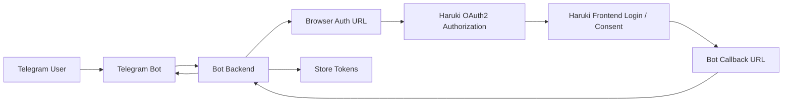

# Haruki Toolbox OAuth2 / OpenID Connect 接入说明

本文档说明一件事：

> **第三方客户端如何接入 Haruki Toolbox 的 OAuth2，以及如何把 Toolbox 作为 OIDC Provider 完成登录。**

覆盖公开客户端（SPA / Web 前端）、保密客户端（Telegram Bot / 服务端后端）以及数据更新回调，不展开旧版本历史与内部实现。

---

## 1. 接入地址与 OIDC 元数据

当前线上地址：

- 前端：`https://haruki.seiunx.com`
- 后端 / Oathkeeper：`https://toolbox-api-direct.haruki.seiunx.com`

Hydra 的浏览器跳转配置：

- `URLS_LOGIN = https://haruki.seiunx.com/oauth2/login`
- `URLS_CONSENT = https://haruki.seiunx.com/oauth2/consent`
- `URLS_LOGOUT = https://haruki.seiunx.com/logout`

这意味着：浏览器发起授权时，真正展示给用户的登录页和授权页是**前端页面**；后端提供的是 OAuth2 编排 API，前端页面负责消费这些 API 并完成跳转。

### 1.1 Toolbox 作为 OIDC Provider

OIDC issuer 由 Hydra 的 `HYDRA_PUBLIC_BASE_URL` 决定，当前线上是：

```text
https://toolbox-api-direct.haruki.seiunx.com
```

标准 OIDC 元数据与端点：

| 用途 | 端点 |
| --- | --- |
| Discovery | `/.well-known/openid-configuration` |
| Authorization | `/oauth2/auth` |
| Token | `/oauth2/token` |
| JWKS | `/oauth2/jwks.json` |
| UserInfo | `/userinfo` |

OIDC 客户端应从 Discovery 文档读取端点，**不要在 SDK 内硬编码**。现有 `/api/oauth2/authorize` 与 `/api/oauth2/token` 仍作为兼容入口保留。

发起登录时至少请求 `openid`，常见组合是 `scope=openid profile email`。

授权成功后 token 响应会包含 `id_token`。客户端必须使用 Discovery 中的 JWKS 校验签名，并校验 `iss`、`aud`、`exp` 与自己生成的 `nonce`；**账户主键应使用标准 `sub`，不要使用可能变化的邮箱**。`uid` 是兼容既有 Toolbox API 的本地用户 ID 扩展 claim。

标准 claims 按用户实际授权的 scope 最小化发放：

- `openid`：签发 ID Token 与标准 `sub`
- `profile`：增加 `name`
- `email`：增加 `email` 与 `email_verified`

只有管理员为 client 登记的 scope 才能被请求；`profile`、`email` 不能脱离 `openid` 单独登记。

> 当前先开放 OIDC 登录、ID Token 与 UserInfo。RP-Initiated Logout / Single Logout 尚未完成 Hydra `logout_challenge`、Kratos 会话注销与前端跳转的端到端编排，客户端暂时**不要依赖** Discovery 中可能出现的 `end_session_endpoint`；应用退出时应清理自己的本地会话，必要时调用 token revoke 接口。

---

## 2. 先选客户端类型

这是接入前唯一需要先定的事，后面的流程按它分叉。

| | 公开客户端 `public` | 保密客户端 `confidential` |
| --- | --- | --- |
| 适用 | SPA、Web 前端、移动端 | Telegram Bot、Web 后端、任何能安全保存密钥的服务端 |
| 是否有 `client_secret` | 无 | 有，仅创建时返回一次 |
| token 端点认证 | 无（靠 PKCE） | `client_secret_basic` |
| PKCE | **必须** | 可选（有后端时非必需） |
| 浏览器授权流程 | 相同 | 相同 |
| 差别所在 | — | **换 token 由你的后端完成,并携带 secret** |

保密客户端在 Hydra 侧会被创建为 `token_endpoint_auth_method = client_secret_basic`、`grant_types = ["authorization_code", "refresh_token"]`（见 [`hydra_clients.go`](../internal/modules/oauth2/hydra_clients.go)）。

两种类型的浏览器授权流程**完全一致** —— 用户都要经过前端登录页和授权页。唯一的区别在第 5 节换 token 那一步。

---

## 3. 接入前必须理解的三件事

### 3.1 `/api/oauth2/authorize` 是浏览器入口

客户端发起授权时，浏览器应该打开 `https://toolbox-api-direct.haruki.seiunx.com/api/oauth2/authorize?...`

### 3.2 `/api/oauth2/login` 和 `/api/oauth2/consent` 不是页面

这两个是 **JSON API**：

- `GET /api/oauth2/login?login_challenge=...`
- `GET /api/oauth2/consent?consent_challenge=...`

它们给前端页面调用，不是给用户直接看的网页。如果浏览器最终停在 JSON 页面，通常说明 Hydra 的 login / consent URL 还指向后端 API，或前端没有正确承接这两个页面。

### 3.3 前端必须提供两个页面

- `https://haruki.seiunx.com/oauth2/login`
- `https://haruki.seiunx.com/oauth2/consent`

这两个页面是浏览器授权流的关键组成部分。

---

## 4. 浏览器授权流程

### 第 1 步：生成 PKCE 参数（公开客户端必需）

客户端本地生成 `state`、`code_verifier`、`code_challenge`，其中 `code_challenge_method=S256`。

保密客户端可以跳过 PKCE，只生成 `state`。

### 第 2 步：浏览器跳转到授权入口

```text
https://toolbox-api-direct.haruki.seiunx.com/api/oauth2/authorize
  ?response_type=code
  &client_id=<你的 client_id>
  &redirect_uri=<你注册的 redirect_uri>
  &scope=<空格分隔或编码后的 scope>
  &state=<你的 state>
  &code_challenge=<你的 code_challenge>        # 公开客户端
  &code_challenge_method=S256                  # 公开客户端
```

公开客户端示例：

```text
https://toolbox-api-direct.haruki.seiunx.com/api/oauth2/authorize?response_type=code&client_id=uni-viewer-public&redirect_uri=https%3A%2F%2Fviewer.unipjsk.com%2Foauth2%2Fcallback%2Fcode&scope=game-data%3Aread&state=<state>&code_challenge=<challenge>&code_challenge_method=S256
```

保密客户端示例（无 PKCE）：

```text
https://toolbox-api-direct.haruki.seiunx.com/api/oauth2/authorize?response_type=code&client_id=telegram-bot-prod&redirect_uri=https%3A%2F%2Fbot.example.com%2Foauth%2Fcallback%2Fharuki&scope=offline_access%20user%3Aread%20bindings%3Aread%20game-data%3Aread&state=botbind_abc123xyz
```

### 第 3 步：后端把请求转给 Hydra

自动完成，客户端无需处理。

### 第 4 步：Hydra 把浏览器带到前端登录页

如果浏览器还没有可复用的登录结果，Hydra 会重定向到 `https://haruki.seiunx.com/oauth2/login?login_challenge=...`。**这里是前端页面，不是后端 JSON API。**

### 第 5 步：前端登录页读取 `login_challenge`

前端 `/oauth2/login` 页面从 URL 读取 `login_challenge`，然后调用：

```http
GET https://toolbox-api-direct.haruki.seiunx.com/api/oauth2/login?login_challenge=...
```

返回 login request 的 JSON，前端应关心 `challenge`、`skip`、`subject`、`client`、`requested_scope`。

### 第 6 步：用户未登录则先完成 Kratos 登录

先让用户走 Haruki 当前的前端登录流程（本质上是 Kratos 管理的浏览器身份体系），完成后再回到 `/oauth2/login?login_challenge=...`。

### 第 7 步：前端接受 login challenge

```http
POST https://toolbox-api-direct.haruki.seiunx.com/api/oauth2/login/accept
```

```json
{
  "loginChallenge": "<login_challenge>",
  "remember": true,
  "rememberFor": 3600
}
```

返回结果含 `redirect_to`，前端执行 `window.location = redirect_to`。

### 第 8 步：浏览器进入前端 consent 页面

Hydra 把浏览器导向 `https://haruki.seiunx.com/oauth2/consent?consent_challenge=...`，同样是前端页面。

### 第 9 步：前端读取 challenge 并查询详情

```http
GET https://toolbox-api-direct.haruki.seiunx.com/api/oauth2/consent?consent_challenge=...
```

前端应展示 client 名称、请求的 scopes、请求的 audience（如果有）。

### 第 10 步：用户确认授权

```http
POST https://toolbox-api-direct.haruki.seiunx.com/api/oauth2/consent/accept
```

```json
{
  "consentChallenge": "<consent_challenge>",
  "grantScope": ["game-data:read"],
  "grantAccessTokenAudience": [],
  "remember": true,
  "rememberFor": 3600
}
```

`grantScope` 必须是本次请求中允许的 scope 子集；最简单的做法是把后端返回的 `requested_scope` 原样回传。返回结果含 `redirect_to`。

### 第 11 步：浏览器回到客户端 `redirect_uri`

query 中带上 `code` 与 `state`。客户端此时应：校验 `state` → 读取 `code` → 换 token。

### 保密客户端的回调页要多做几件事

回调地址例如 `https://bot.example.com/oauth/callback/haruki`，后端收到请求后至少要：

1. 读取并**校验 `state`**
2. 根据 `state` 找回当前用户上下文（例如 Telegram 用户）
3. 用 `code` 换 token
4. 保存 token

`state` 对保密客户端尤其重要 —— 它是把这次浏览器授权绑回你自己业务用户的唯一凭据。推荐在服务端存一条临时记录：

```text
state / telegram_user_id / created_at / expires_at / used=false
```

授权回调完成后**立即标记为已使用**。

---

## 5. 换取与刷新 token

端点：`POST https://toolbox-api-direct.haruki.seiunx.com/api/oauth2/token`（由 backend 代理到 Hydra token endpoint）

### 5.1 公开客户端（PKCE）

```bash
curl -X POST 'https://toolbox-api-direct.haruki.seiunx.com/api/oauth2/token' \
  -H 'Content-Type: application/x-www-form-urlencoded' \
  -d 'grant_type=authorization_code' \
  -d 'client_id=<client_id>' \
  -d 'code=<authorization_code>' \
  -d 'redirect_uri=<redirect_uri>' \
  -d 'code_verifier=<code_verifier>'
```

### 5.2 保密客户端（Basic Auth）

```bash
curl -X POST 'https://toolbox-api-direct.haruki.seiunx.com/api/oauth2/token' \
  -u '<client_id>:<client_secret>' \
  -H 'Content-Type: application/x-www-form-urlencoded' \
  -d 'grant_type=authorization_code' \
  -d 'code=<authorization_code>' \
  -d 'redirect_uri=<redirect_uri>'
```

成功响应：

```json
{
  "access_token": "access-token",
  "refresh_token": "refresh-token",
  "expires_in": 3600,
  "token_type": "bearer",
  "scope": "user:read bindings:read game-data:read"
}
```

### 5.3 刷新 token

```bash
curl -X POST 'https://toolbox-api-direct.haruki.seiunx.com/api/oauth2/token' \
  -H 'Content-Type: application/x-www-form-urlencoded' \
  -d 'grant_type=refresh_token' \
  -d 'client_id=<client_id>' \
  -d 'refresh_token=<refresh_token>'
```

保密客户端应始终改用 Basic Auth 携带 `client_id` / `client_secret`。

### 5.4 为什么有时拿不到 `refresh_token`

**`grant_types` 包含 `refresh_token` ≠ 每次授权都会下发 `refresh_token`。**

要拿到它，授权请求和最终同意授权的 `grantScope` 都需要包含 `offline_access`。如果你请求的 scope 只有 `game-data:read` / `bindings:read` 而没有 `offline_access`，即使 client 本身允许 `refresh_token` grant，也不会返回。

### 5.5 常见错误

| 错误 | 通常原因 |
| --- | --- |
| `invalid_client` | `client_id` / `client_secret` 不匹配 |
| `invalid_grant` | `code` 已使用、已过期，或 `redirect_uri` 不匹配 |

---

## 6. 撤销 token

```bash
curl -X POST 'https://toolbox-api-direct.haruki.seiunx.com/api/oauth2/revoke' \
  -H 'Content-Type: application/x-www-form-urlencoded' \
  -d 'token=<token>' \
  -d 'token_type_hint=refresh_token'
```

---

## 7. Bearer Token 可访问的资源接口

统一使用 `Authorization: Bearer <access_token>`。

### 7.1 用户资料

- `GET /api/oauth2/user/profile`
- 需要 scope：`user:read`

### 7.2 用户绑定游戏账号

- `GET /api/oauth2/user/bindings`
- 需要 scope：`bindings:read`

### 7.3 游戏数据读取

- `GET /api/oauth2/game-data/:server/:data_type/:user_id`
- 需要 scope：`game-data:read`

该接口还会校验 token 对应的用户是否拥有这个绑定、绑定是否已验证通过。

**响应兼容说明：**

- `suite` 数据中的 `userGamedata.userId` 保持原有 number 字段
- 同时返回 `userGamedata.userIdString` 作为字符串镜像，**JS / TS 客户端应优先读取该字段**以避免 64 位整数精度丢失
- 当响应暴露顶层 `_id` 时，会同时返回 `_idString`

**条件拉取**（避免重复拉取未变化的数据）：

- 请求可附带 `?known_upload_time=<unix 秒>`，值取自上一次完整响应中的 `upload_time` 字段；如果你使用 `key` 过滤字段，必须把 `upload_time` 一并列入，否则该参数会被忽略
- 若数据未更新，返回 `304 Not Modified`（空响应体，附带 `X-Upload-Time` 响应头），客户端应继续使用本地数据；原本"先探测 `upload_time` 再拉全量"的两次请求可以合并为一次
- 若数据已更新（或服务端无法确认未变化），返回完整数据，行为与不带该参数时完全一致；此时应从响应体的 `upload_time` 刷新本地记录 —— 完整响应**不附带** `X-Upload-Time` 头，时间戳一律以响应体为准
- 参数值非法时按未携带处理（类比 HTTP 对不可解析 `If-Modified-Since` 的处理），不会报错
- 该参数不改变鉴权与字段可见性：suite 面上若公开字段允许列表不含 `upload_time`，该参数会被忽略；`key` 过滤无效时不会返回 304，而是照常返回原有错误
- 时间戳精度为 unix 秒，同一秒内的多次上传无法区分；服务端对时间戳有至多约 60 秒的短记忆，数据刚更新后的极短窗口内可能仍返回 304。**对一致性极敏感的场景请直接拉取完整数据**
- public API 与 private token API 的同形数据读取接口同样支持该参数

### 7.4 游戏数据上传（代理上传）

- `POST /api/oauth2/game-data/:server/:data_type/:user_id`
- 需要 scope：`game-data:write`

请求体是**原始游戏负载** —— 你从游戏抓到的、未解密的原文，与 `manual` / proxy / 脚本上传接口收的是同一种东西。`Content-Type` 不限，服务端读原始 body。成功返回与手动上传一致。

#### 为什么必须是原始负载

服务端解密之后，会要求**游戏自己写在负载里的** game user id 与 URL 里的 `:user_id` 一致，不一致直接拒绝。

这是这个接口的防伪基础：拿到某个账号的 token，并不等于可以往那个账号里写任意内容 —— 你还得拿得出游戏为该账号生成的真实负载。如果接口收已解码的 JSON，那个 id 就变成了客户端自己填的字段，这条防线就没了。

因此**不会**提供"提交已解码 JSON"的变体。

#### 授权比读取更严

读取允许通过 **grant**（其他用户把自己的数据共享给你）访问；上传**不允许**：

| | 自己拥有的绑定 | 通过 grant 获得的访问 |
|---|---|---|
| `GET`（读取） | ✅ | ✅ |
| `POST`（上传） | ✅ | ❌ `403` |

别人授权你**查看**他的数据，不等于授权你**覆盖**他的数据。

#### 其余校验

这个接口走的是与其他上传方式完全相同的处理链路，因此同样会：

- 校验该 token 对应的用户拥有这个绑定，且绑定已验证通过
- 校验账号所有者未被封禁
- 应用该账号的上传策略（例如公开 API 可见性、cn 服 mysekai 限制）
- 写入审计日志，上传方式记为 `oauth2`，可与账号所有者本人的上传区分开

另外，**token 所属 client 被停用后，该 token 立刻失去上传能力**，无需等待其自然过期。

---

## 8. Webhook：数据更新通知

用于通知已经通过 OAuth2 授权读取游戏数据的客户端：用户绑定账号的数据已更新。它和旧 public API Webhook 分离，**不需要用户开启 `allowPublicApi`**。

### 8.1 触发条件

一次上传成功后，服务端异步检查：

- 上传账号存在已验证的游戏账号绑定
- 绑定 owner 未被封禁
- OAuth2 client 配置了启用状态的 webhook endpoint
- 该 owner 对该 client 存在有效 Hydra consent session
- consent 的 grant scope 包含 `game-data:read`

满足条件时发起回调。Hydra 查询失败或回调失败**不会影响上传响应**，只记录日志。

### 8.2 上传来源不影响触发

判断条件只看"这个账号的数据更新了"，不看是谁上传的。手动上传、代理上传、iOS 脚本，以及第三方客户端自己用 `game-data:write` 发起的代理上传（§7.4），走的是同一条处理链路，因此都会触发回调。

这意味着两件事：

- 你用 `game-data:write` 上传成功后，**自己配置的 webhook 也会被回调一次**。如果你的实现是"收到回调就去拉数据"，注意避免自己触发自己的循环。
- 触发回调要求用户对你的 client 有包含 `game-data:read` 的有效 consent。**`game-data:write` 不隐含读权限** —— 只授予了写而没授予读的用户，其数据更新不会回调给你。

### 8.3 回调请求格式

- 方法：`POST`
- Body：空
- 默认请求头：`User-Agent: Haruki-Toolbox-Backend/<version>`
- 如果 endpoint 配置了 bearer，还会包含 `Authorization: Bearer <bearer>`

### 8.4 Callback URL 占位符

支持 `{user_id}`（游戏用户 ID）、`{server}`（区服）、`{data_type}`（数据类型）：

```text
https://example.com/oauth-webhook/{server}/{data_type}/{user_id}
```

用户 `123456789` 在 `jp` 上传 `suite` 数据时，实际请求：

```text
https://example.com/oauth-webhook/jp/suite/123456789
```

### 8.5 管理方式

endpoint 由管理员在 OAuth2 client 下维护：

- `GET /api/admin/oauth-clients/:client_id/webhooks`
- `POST /api/admin/oauth-clients/:client_id/webhooks`
- `PUT /api/admin/oauth-clients/:client_id/webhooks/:webhook_id`
- `DELETE /api/admin/oauth-clients/:client_id/webhooks/:webhook_id`

创建或更新时会校验 callback URL，拒绝 localhost、内网 IP、回环地址、带用户名密码的 URL 和非 HTTP/HTTPS URL。

### 8.6 与 public API Webhook 的区别

| | public API Webhook | OAuth2 Webhook |
| --- | --- | --- |
| 订阅方式 | 客户端 token 自行订阅具体游戏账号 | 管理员为 client 配置 endpoint |
| 触发前提 | 用户开启 `allowPublicApi` | 用户对 client 的 Hydra consent 含 `game-data:read` |

OAuth2 Webhook 不改变 OAuth2 game-data API 的响应格式，也不改变 public/private API 的权限语义。详见 [`webhook-integration.zh-CN.md`](webhook-integration.zh-CN.md)。

---

## 9. 当前可申请的 scope

```text
openid  profile  email  offline_access
user:read  bindings:read  game-data:read  game-data:write
```

全部 scope 均已对外可用且被本文覆盖。

`game-data:write` 是其中唯一的**写**权限，申请时请注意：

- 它允许你代表用户上传游戏数据（§7.4），只对用户**自己拥有**的绑定生效
- **它不隐含 `game-data:read`**，两者需要分别申请
- 同意页会向用户展示 "Upload game data on your behalf"，用户可以只授予读、不授予写

---

## 10. 管理员创建 OAuth Client 需要什么

需要提供 `clientId`、`name`、`clientType`、`redirectUris`、`scopes`，其中：

- `clientType` 只能是 `public` 或 `confidential`
- `redirectUris` 必须是合法 URI，且**不能包含 fragment**
- `scopes` 必须来自系统允许的 scope 集

服务端创建逻辑见 [`hydra_client_handlers.go`](../internal/modules/adminoauth/hydra_client_handlers.go)。

公开客户端示例：

```json
{
  "clientId": "uni-viewer-public",
  "name": "Uni PJSK Viewer",
  "clientType": "public",
  "redirectUris": ["https://viewer.unipjsk.com/oauth2/callback/code"],
  "scopes": ["openid", "profile", "email", "offline_access", "game-data:read"]
}
```

保密客户端示例：

```json
{
  "clientId": "telegram-bot-prod",
  "name": "Telegram Bot Prod",
  "clientType": "confidential",
  "redirectUris": ["https://bot.example.com/oauth/callback/haruki"],
  "scopes": ["offline_access", "user:read", "bindings:read", "game-data:read"]
}
```

保密客户端的响应会包含 **仅返回一次** 的 `clientSecret`：

```json
{
  "status": 200,
  "message": "oauth client created",
  "updatedData": {
    "clientId": "telegram-bot-prod",
    "clientSecret": "once-returned-secret",
    "clientType": "confidential"
  }
}
```

---

## 11. 安全要求

- **`client_secret` 只能保存在后端。** 不要写进 JS，不要写进浏览器可见配置，不要放进 Mini App 前端代码。
- **严格校验 `redirect_uri`。** 换 token 时的值必须与授权时一致，并与后台注册值一致。
- **`state` 必须一次性使用。** 不要只校验"存在"，还要校验是否过期、是否已消费、是否属于当前用户流程。
- **refresh token 视为高敏感凭证。** 建议加密存储；泄露时立即轮换 client secret 并撤销 token。

---

## 12. 不要这样接

### 12.1 把 `/api/oauth2/login` 当成网页

它返回 JSON，不是登录页。

### 12.2 把 Hydra 的 `URLS_LOGIN` / `URLS_CONSENT` 配成后端 API

配成 `https://toolbox-api-direct.haruki.seiunx.com/api/oauth2/login` 的结果是浏览器直接停在 JSON 页面。它们应指向前端页面。

### 12.3 前端没有 `/oauth2/login` 和 `/oauth2/consent` 页面

Hydra 跳过去后 404，流程无法继续。

### 12.4 公开客户端没做 PKCE

token 交换会失败。

### 12.5 `redirect_uri` 不是完全匹配

授权失败或换 token 失败。

### 12.6 把保密客户端当 SPA 用

浏览器前端直接持有 `client_secret` 是典型泄露风险。

### 12.7 指望不用浏览器回调页

当前服务端**不要默认当作已支持**：`device_code`、纯 `client_credentials` 获取用户资源、纯聊天窗口内完成授权。对 Telegram Bot 来说，这意味着**你必须提供一个浏览器授权回调页**，不能只靠 bot 消息对话完成 OAuth 登录。

### 12.8 用 `client_credentials` 替代用户授权

业务资源接口面向"用户授权后的 bearer token"，不是给 bot 自己拿一个机器 token 就能读所有用户数据。

---

## 13. 完整示例：Telegram Bot



1. **用户在 Telegram 中点击"绑定 Haruki"** —— Bot 后端生成临时授权记录：`telegram_user_id = 123456`、`state = random-string`、`expires_at = now + 10 min`
2. **Bot 发送浏览器授权链接**（形如 §4 第 2 步的保密客户端示例）
3. **用户在浏览器完成登录和授权** —— 这一段由 Haruki 前端承接
4. **回调页收到 `code` 与 `state`** —— 校验 `state` → 找到对应 `telegram_user_id` → 用 `code` 换 token
5. **保存授权结果** —— 至少保存 `telegram_user_id`、`haruki_subject`（或业务用户标识）、`access_token`、`refresh_token`、`expires_at`、`scope`
6. **回调页提示成功** —— 同时 Bot 可主动发消息提醒绑定完成

---

## 14. 一句话结论

**公开客户端：**

> 申请 `public` client，使用 `Authorization Code + PKCE`，浏览器发起授权访问 `https://toolbox-api-direct.haruki.seiunx.com/api/oauth2/authorize`，前端承接 `/oauth2/login` 与 `/oauth2/consent` 页面并调用后端的 challenge 编排 API，最后用 `/api/oauth2/token` 换 token。

**保密客户端：**

> 申请 `confidential` client，浏览器授权流程完全相同，但在你自己的后端回调页使用 `client_secret_basic` 换 token，并保存 refresh token 用于后续代表用户调用资源接口。
