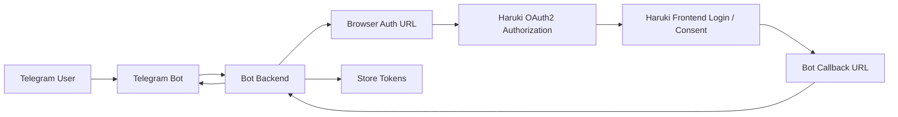

# Haruki Toolbox OAuth2 / OpenID Connect 接入说明

本文档说明一件事：

> **第三方客户端如何接入 Haruki Toolbox 的 OAuth2，以及如何把 Toolbox 作为 OIDC Provider 完成登录。**

覆盖公开客户端（SPA / Web 前端）、保密客户端（Telegram Bot / 服务端后端）、没有浏览器的程序使用的设备授权（§4A）以及数据更新回调，不展开旧版本历史与内部实现。

> 如果你**只想让用户用 Haruki 账号登录你的站点**、不需要读取游戏数据，请直接看
> [`oidc-provider.zh-CN.md`](oidc-provider.zh-CN.md) —— 那篇只讲 OIDC，更短。

---

## 1. 接入地址与 OIDC 元数据

当前线上地址：

- 前端：`https://haruki.seiunx.com`
- 后端 / Oathkeeper：`https://toolbox-api-direct.haruki.seiunx.com`

Hydra 的浏览器跳转配置：

- `URLS_LOGIN = https://haruki.seiunx.com/oauth2/login`
- `URLS_CONSENT = https://haruki.seiunx.com/oauth2/consent`
- `URLS_LOGOUT = https://haruki.seiunx.com/logout`

这意味着：浏览器发起授权时，真正展示给用户的登录页和授权页是**前端页面**；后端提供的是 OAuth2 编排 API，前端页面负责消费这些 API 并完成跳转。

### 1.1 Toolbox 作为 OIDC Provider

OIDC issuer 由 Hydra 的 `HYDRA_PUBLIC_BASE_URL` 决定，当前线上是：

```text
https://toolbox-api-direct.haruki.seiunx.com
```

标准 OIDC 元数据与端点：

| 用途 | 端点 | 实测 |
| --- | --- | --- |
| Discovery | `/.well-known/openid-configuration` | 200 |
| Authorization | `/oauth2/auth` | 302 |
| Token | `/api/oauth2/token`（Discovery 公布的 `token_endpoint`） | 可用 |
| JWKS | `/.well-known/jwks.json` | 200，2 把 RS256 |
| UserInfo | `/userinfo` | 可用 |
| Revocation | `/oauth2/revoke` | 可用 |
| End Session | `/oauth2/sessions/logout` | ✅ 可用，见下方 |
| Device Authorization | `/api/oauth2/device/auth`（Discovery 公布的 `device_authorization_endpoint`） | 可用，见 §4A |

OIDC 客户端应从 Discovery 文档读取端点，**不要在 SDK 内硬编码**。`/api/oauth2/authorize` 是浏览器入口（§3.1）。`/api/oauth2/token` 是 Discovery 公布的令牌端点：它是后端的令牌端点兼容层，授权码与刷新令牌请求原样转发给 Hydra、响应原样返回，只额外处理设备授权许可；以前写死的 Hydra 直连 `/oauth2/token` 对授权码与刷新令牌仍然可用，但设备授权只能用 `/api/oauth2/token`（§12.9）。

> ⚠️ **Discovery 的 `scopes_supported` 与 `claims_supported` 不完整。** 它们分别只公布
> `openid` / `offline_access` / `offline` 和 `sub`，这是 Hydra 的默认公告行为 —— 实际可用的
> scope 由管理员为你的 client 登记（完整清单见 §9），claims 见下文。**不要拿 Discovery 里
> 这两个字段当能力清单。**

发起登录时至少请求 `openid`，常见组合是 `scope=openid profile email`。

授权成功后 token 响应会包含 `id_token`。客户端必须使用 Discovery 中的 JWKS 校验签名，并校验 `iss`、`aud`、`exp` 与自己生成的 `nonce`；**账户主键应使用标准 `sub`，不要使用可能变化的邮箱**。`uid` 是兼容既有 Toolbox API 的本地用户 ID 扩展 claim。

标准 claims 按用户实际授权的 scope 最小化发放：

- `openid`：签发 ID Token 与标准 `sub`
- `profile`：增加 `name`
- `email`：增加 `email` 与 `email_verified`

只有管理员为 client 登记的 scope 才能被请求；`profile`、`email` 不能脱离 `openid` 单独登记。

> **RP-Initiated Logout 已打通（2026-08-26）。** 后端提供 `/api/oauth2/logout`、
> `/logout/accept`、`/logout/reject` 三个编排端点（与 login / consent 同构，但**匿名可访问** ——
> 到达登出挑战的用户正在退出，Kratos 会话可能已经失效，要求登录会让登出恰好在最需要时失败；
> challenge 本身就是凭证）；前端 `/logout` 页面消费它们，并在确认时一并结束 Kratos 会话。
>
> RP 侧需要登记 `post_logout_redirect_uri`，请求时带 `id_token_hint`。详见
> [`oidc-provider.zh-CN.md`](oidc-provider.zh-CN.md) §5。

---

## 2. 先选客户端类型

这是接入前唯一需要先定的事，后面的流程按它分叉。

| | 公开客户端 `public` | 保密客户端 `confidential` |
| --- | --- | --- |
| 适用 | SPA、Web 前端、移动端 | Telegram Bot、Web 后端、任何能安全保存密钥的服务端 |
| 是否有 `client_secret` | 无 | 有，仅创建时返回一次 |
| token 端点认证 | 无（靠 PKCE） | `client_secret_basic` |
| PKCE | **必须** | 可选（有后端时非必需） |
| 浏览器授权流程 | 相同 | 相同 |
| 差别所在 | — | **换 token 由你的后端完成,并携带 secret** |
| 设备授权（§4A） | 可用：发给用户自行运行的程序（无法保密 secret）用它 | 可用：token 端点用 Basic |

保密客户端在 Hydra 侧会被创建为 `token_endpoint_auth_method = client_secret_basic`，未指定授权类型时 `grant_types = ["authorization_code", "refresh_token"]`（见 [`hydra_clients.go`](../internal/modules/oauth2/hydra_clients.go)）。

两种类型的浏览器授权流程**完全一致** —— 用户都要经过前端登录页和授权页。唯一的区别在第 5 节换 token 那一步。

**没有浏览器、也没有回调地址的程序**（常驻进程、命令行工具、自行部署的机器人客户端）不是第三种客户端类型，而是另一种授权方式：设备授权（§4A）。程序显示一个短代码，用户在自己的浏览器里登录 Toolbox 并输入它；公开与保密客户端都可以由管理员开通（§10）。

---

## 3. 接入前必须理解的三件事

### 3.1 `/api/oauth2/authorize` 是浏览器入口

客户端发起授权时，浏览器应该打开 `https://toolbox-api-direct.haruki.seiunx.com/api/oauth2/authorize?...`

### 3.2 `/api/oauth2/login` 和 `/api/oauth2/consent` 不是页面

这两个是 **JSON API**：

- `GET /api/oauth2/login?login_challenge=...`
- `GET /api/oauth2/consent?consent_challenge=...`

它们给前端页面调用，不是给用户直接看的网页。如果浏览器最终停在 JSON 页面，通常说明 Hydra 的 login / consent URL 还指向后端 API，或前端没有正确承接这两个页面。

### 3.3 前端必须提供两个页面

- `https://haruki.seiunx.com/oauth2/login`
- `https://haruki.seiunx.com/oauth2/consent`

这两个页面是浏览器授权流的关键组成部分。

---

## 4. 浏览器授权流程

### 第 1 步：生成 PKCE 参数（公开客户端必需）

客户端本地生成 `state`、`code_verifier`、`code_challenge`，其中 `code_challenge_method=S256`。

保密客户端可以跳过 PKCE，只生成 `state`。

### 第 2 步：浏览器跳转到授权入口

```text
https://toolbox-api-direct.haruki.seiunx.com/api/oauth2/authorize
  ?response_type=code
  &client_id=<你的 client_id>
  &redirect_uri=<你注册的 redirect_uri>
  &scope=<空格分隔或编码后的 scope>
  &state=<你的 state>
  &code_challenge=<你的 code_challenge>        # 公开客户端
  &code_challenge_method=S256                  # 公开客户端
```

公开客户端示例：

```text
https://toolbox-api-direct.haruki.seiunx.com/api/oauth2/authorize?response_type=code&client_id=uni-viewer-public&redirect_uri=https%3A%2F%2Fviewer.unipjsk.com%2Foauth2%2Fcallback%2Fcode&scope=game-data%3Aread&state=<state>&code_challenge=<challenge>&code_challenge_method=S256
```

保密客户端示例（无 PKCE）：

```text
https://toolbox-api-direct.haruki.seiunx.com/api/oauth2/authorize?response_type=code&client_id=telegram-bot-prod&redirect_uri=https%3A%2F%2Fbot.example.com%2Foauth%2Fcallback%2Fharuki&scope=offline_access%20user%3Aread%20bindings%3Aread%20game-data%3Aread&state=botbind_abc123xyz
```

### 第 3 步：后端把请求转给 Hydra

自动完成，客户端无需处理。

### 第 4 步：Hydra 把浏览器带到前端登录页

如果浏览器还没有可复用的登录结果，Hydra 会重定向到 `https://haruki.seiunx.com/oauth2/login?login_challenge=...`。**这里是前端页面，不是后端 JSON API。**

### 第 5 步：前端登录页读取 `login_challenge`

前端 `/oauth2/login` 页面从 URL 读取 `login_challenge`，然后调用：

```http
GET https://toolbox-api-direct.haruki.seiunx.com/api/oauth2/login?login_challenge=...
```

返回 login request 的 JSON，前端应关心 `challenge`、`skip`、`subject`、`client`、`requested_scope`。

### 第 6 步：用户未登录则先完成 Kratos 登录

先让用户走 Haruki 当前的前端登录流程（本质上是 Kratos 管理的浏览器身份体系），完成后再回到 `/oauth2/login?login_challenge=...`。

### 第 7 步：前端接受 login challenge

```http
POST https://toolbox-api-direct.haruki.seiunx.com/api/oauth2/login/accept
```

```json
{
  "loginChallenge": "<login_challenge>",
  "remember": true,
  "rememberFor": 3600
}
```

返回结果含 `redirect_to`，前端执行 `window.location = redirect_to`。

### 第 8 步：浏览器进入前端 consent 页面

Hydra 把浏览器导向 `https://haruki.seiunx.com/oauth2/consent?consent_challenge=...`，同样是前端页面。

### 第 9 步：前端读取 challenge 并查询详情

```http
GET https://toolbox-api-direct.haruki.seiunx.com/api/oauth2/consent?consent_challenge=...
```

前端应展示 client 名称、请求的 scopes、请求的 audience（如果有）。

### 第 10 步：用户确认授权

```http
POST https://toolbox-api-direct.haruki.seiunx.com/api/oauth2/consent/accept
```

```json
{
  "consentChallenge": "<consent_challenge>",
  "grantScope": ["game-data:read"],
  "grantAccessTokenAudience": [],
  "remember": true,
  "rememberFor": 3600
}
```

`grantScope` 必须是本次请求中允许的 scope 子集；最简单的做法是把后端返回的 `requested_scope` 原样回传。返回结果含 `redirect_to`。

### 第 11 步：浏览器回到客户端 `redirect_uri`

query 中带上 `code` 与 `state`。客户端此时应：校验 `state` → 读取 `code` → 换 token。

### 保密客户端的回调页要多做几件事

回调地址例如 `https://bot.example.com/oauth/callback/haruki`，后端收到请求后至少要：

1. 读取并**校验 `state`**
2. 根据 `state` 找回当前用户上下文（例如 Telegram 用户）
3. 用 `code` 换 token
4. 保存 token

`state` 对保密客户端尤其重要 —— 它是把这次浏览器授权绑回你自己业务用户的唯一凭据。推荐在服务端存一条临时记录：

```text
state / telegram_user_id / created_at / expires_at / used=false
```

授权回调完成后**立即标记为已使用**。

## 4A. 设备授权（无头程序）

没有浏览器、也没有回调地址的程序（常驻进程、命令行工具、由运行者自行部署的机器人客户端，例如 Haruki-Client 的车牌收集）用 OAuth 2.0 设备授权许可（[RFC 8628](https://www.rfc-editor.org/rfc/rfc8628)）以 Toolbox 用户的身份取得令牌：程序向 Toolbox 申请一对代码并在本机显示，用户在**自己的**浏览器里打开 `https://haruki.seiunx.com/device`、登录 Toolbox、输入代码并批准；程序同时轮询令牌端点，直到拿到令牌或得到明确的结果。

拿到的令牌与授权码流程签发的完全相同（`ory_at_…` 访问令牌；带 `offline_access` 时有刷新令牌；带 `openid` 时有 id_token），§7 的资源接口、§5.3 的刷新和 §6 的撤销照常使用。本节的要求是规范性的：接入方必须遵守，服务端无法替你强制其中的展示与保存要求。

### 4A.1 前提与端点

- **客户端由管理员登记**，并开通设备授权许可（`grantTypes` 含 `urn:ietf:params:oauth:grant-type:device_code`，§10）。发给用户自行运行的程序无法保密 secret，应登记为**公开客户端**（仅设备时 `redirectUris` 为空）；能安全保存 secret 的服务端程序可以用保密客户端。授权码与设备授权可以登记在同一个客户端上。
- **scope**：客户端登记的 scope 与每次设备授权请求都必须含 `user:read`（程序要回显「已授权为 …」，4A.7）。经设备授权只能申请 `openid`、`profile`、`offline_access`、`user:read`、`bindings:read`、`game-data:read`、`station:room:write`，且都须已为该客户端登记；`email` 一律拒绝；`game-data:write` 只给 `devicePolicy.allowWrite=true` 的公开客户端；不支持 `audience` 参数。要长期使用就申请 `offline_access` 拿刷新令牌。
- **地址**：基址固定为 `https://toolbox-api-direct.haruki.seiunx.com`，不要用 `toolbox-api-cdn`。两份发现文档（`/.well-known/openid-configuration` 与 `/.well-known/oauth-authorization-server`）同时公布 `device_authorization_endpoint = …/api/oauth2/device/auth` 与 `token_endpoint = …/api/oauth2/token`，按发现文档配置的库不需要改端点。Hydra 自己的 `/oauth2/device/*` 不对外开放（404）。
- **客户端认证**（两个端点规则相同）：公开客户端只在表单里带 `client_id`；保密客户端用 HTTP Basic `base64(urlencode(client_id) ":" urlencode(client_secret))`（RFC 6749 §2.3.1），表单里的 `client_id` 可省，带了就必须与 Basic 用户名一致。

### 4A.2 发起：`POST /api/oauth2/device/auth`

请求体 `application/x-www-form-urlencoded`，不超过 4 KiB：

| 参数 | 必填 | 说明 |
| --- | --- | --- |
| `client_id` | 公开客户端必填 | 保密客户端可省（见 4A.1） |
| `scope` | 是 | 空格分隔；必须含 `user:read` |
| `device_label` | 否 | 设备自述，显示在用户的审核卡和「已授权应用」里；控制字符与双向覆盖字符会被删除，截断到 64 个字符。内容要求见 4A.3 |

其他参数一律忽略，不转发；同一参数出现两次、或带了 `audience`，返回 `invalid_request`。

```bash
curl -X POST 'https://toolbox-api-direct.haruki.seiunx.com/api/oauth2/device/auth' \
  -H 'Content-Type: application/x-www-form-urlencoded' \
  -d 'client_id=<client_id>' \
  --data-urlencode 'scope=user:read offline_access station:room:write' \
  --data-urlencode 'device_label=Haruki-Client @ home-server'
```

成功返回 200（响应带 `Cache-Control: no-store`）：

```json
{
  "device_code": "hdc_…",
  "user_code": "BCDF-GHJK",
  "verification_uri": "https://haruki.seiunx.com/device",
  "verification_uri_complete": "https://haruki.seiunx.com/device?user_code=BCDF-GHJK",
  "expires_in": 599,
  "interval": 5
}
```

- `device_code` 是不透明的 `hdc_…`，只能拿来轮询本服务的 `/api/oauth2/token`。它是秘密：只保存在内存或本机，不写日志。
- `user_code` 是 8 个辅音字母，以 `XXXX-XXXX` 显示；用户输入时大小写、`-`、空格与全角字符都会被归一化。
- `expires_in` 目前约 600 秒（代码 10 分钟有效）；`interval` 至少为 5。

错误响应是 RFC 6749 的 `{"error","error_description"}`，同样带 `Cache-Control: no-store`：

| HTTP | `error` | 原因 | 程序应该 |
| --- | --- | --- | --- |
| 400 | `invalid_request` | Content-Type 不是表单；body 超过 4 KiB 或无法解析；参数重复；缺 `client_id`；表单 `client_id` 与 Basic 用户名不一致；Basic 头格式错误；带了 `audience` | 修正请求，不要重试 |
| 401 | `invalid_client` | 客户端不存在；保密客户端的 secret 错误 | 检查配置，不要重试 |
| 400 | `unauthorized_client` | 设备授权未开放；客户端不在允许名单、已被停用或没有设备授权许可 | 联系管理员，不要循环重试 |
| 400 | `invalid_scope` | scope 为空；缺 `user:read`（`error_description` 为 `user:read is required for device authorization`）；含 `email`；scope 未为该客户端登记；该 scope 不能经设备授权申请（如未开通 `allowWrite` 的 `game-data:write`） | 修正 scope |
| 429 | `temporarily_unavailable`（附 `Retry-After`） | 该客户端或同类客户端 10 分钟内的发码数已达上限 | 等 `Retry-After` 秒后再发起 |
| 503 | `temporarily_unavailable` | 服务暂时不可用（包括服务端读取开关配置出错） | 退避后重试，不是终止信号 |
| 500 | `server_error` | 服务端配置异常 | 稍后重试；持续出现请联系管理员 |

此外，Hydra 对客户端认证给出的其他 4xx 原样返回。

### 4A.3 向用户展示（无头程序的展示要求）

- 用户码与完整验证地址**只在本机输出**：控制台、本地日志或本机界面。**不得**经聊天、群消息、邮件或任何第三方通道转发（例如不能让机器人把代码发到 QQ 群或私聊）：转发出去的代码可以被别人拿去批准，这正是 RFC 8628 §5.4 的远程钓鱼。
- 同时输出有效期（`expires_in`）和提示：「只有你本人刚刚启动本程序时才批准；不要把代码发给任何人」。
- 不要输出 `device_code`，也不要尝试替用户在浏览器里自动完成批准。
- `device_label` 由运行者自定义，用来让用户在审核卡和「已授权应用」里认出这台设备，例如默认取 `<程序名> @ <主机名>`。它**不得**包含 QQ 号、bot_id、邮箱等个人标识，也不得包含其他系统的标识或凭据；页面把它标为「应用自述」并按纯文本显示。

### 4A.4 轮询：`POST /api/oauth2/token`

```bash
curl -X POST 'https://toolbox-api-direct.haruki.seiunx.com/api/oauth2/token' \
  -H 'Content-Type: application/x-www-form-urlencoded' \
  -d 'grant_type=urn:ietf:params:oauth:grant-type:device_code' \
  -d 'device_code=hdc_…' \
  -d 'client_id=<client_id>'
```

保密客户端改用 Basic（`-u`），表单里的 `client_id` 可省。轮询算法（必须遵守）：

```text
deadline = now + expires_in            # client-side enforcement (MUST)
interval = max(interval, 5)
loop:
  sleep(interval)
  if now >= deadline: return EXPIRED
  r = POST /api/oauth2/token  grant_type=urn:ietf:params:oauth:grant-type:device_code, device_code, client_id (+Basic if confidential)
  200                         → return tokens
  400 authorization_pending   → continue
  400 slow_down               → interval = r.interval or interval + 5   # sticky for all later polls
  400 access_denied           → return DENIED
  400 expired_token           → return EXPIRED
  400 invalid_grant / invalid_request, 401 invalid_client → return FAILED (no retry)
  429                         → sleep(Retry-After); continue
  5xx / network               → interval = min(interval*2, 60); continue
```

| HTTP | `error` | 含义 | 程序应该 |
| --- | --- | --- | --- |
| 200 | — | 令牌响应，与 §5.2 相同 | 保存令牌（4A.6），停止轮询 |
| 400 | `authorization_pending` | 用户还没有批准 | 按 `interval` 继续 |
| 400 | `slow_down`（附 `interval`） | 轮询过快 | `interval` 取响应里的值（没有就 +5 秒），之后一直沿用 |
| 400 | `access_denied` | 用户拒绝了；或批准后客户端被管理员停用 | 停止，告诉用户；需要时重新发起 4A.2 |
| 400 | `expired_token` | 代码在 `expires_in` 内没有被批准；批准没能完成；无视 `slow_down` 超过 30 次；或设备授权已被关闭 | 停止；需要时重新发起 4A.2 |
| 400 | `invalid_grant` | `device_code` 不认识（拼错、不是本服务签发、已经兑换过）或属于另一个客户端；授权已被用户撤销 | 停止，不要重试 |
| 400 | `invalid_request` | 缺 `client_id` 或 `device_code`；参数重复；表单 `client_id` 与 Basic 用户名不一致 | 修正请求 |
| 401 | `invalid_client` | 客户端认证失败 | 检查 secret，不要重试 |
| 503 | `temporarily_unavailable` | 服务暂时不可用（包括服务端读取开关配置出错） | 按 5xx 退避后继续，不是终止信号 |
| 5xx / 网络错误 | — | — | `interval = min(interval×2, 60)` 后继续，直到 `deadline` |

- 第一次轮询前也要先等 `interval`。拿到令牌后立即停止：同一个 `device_code` 只能兑换一次，再轮询只会得到 `invalid_grant`。
- 已拒绝、客户端已停用、已过期这些结果只在客户端认证通过之后才会告诉你；secret 错误的保密客户端只会看到 401。

### 4A.5 服务端已吸收的差异，以及常见库

- **已吸收**：响应里没有 Hydra 多出来的 `Header` 字段；`interval` 至少为 5；验证地址是前端的短地址 `https://haruki.seiunx.com/device`；用户码会被归一化；拒绝会作为 `access_denied`、过期会作为 `expired_token` 交给设备（Hydra 自己做不到）；限流用 429 `temporarily_unavailable` 加 `Retry-After`，不用 `slow_down`。这些都不需要接入方做特殊处理。
- **`device_code` 不透明**：它是 Toolbox 签发的 `hdc_…`，不是 Hydra 的设备码。只能交给 `/api/oauth2/token`；直接发给 Hydra 的 `/oauth2/token` 只会得到 `invalid_grant`（§12.9）。
- **`golang.org/x/oauth2`**（v0.37.0）：`DeviceAccessToken` 只在 `authorization_pending` / `slow_down` 时继续，遇到 429、5xx（包括 503）与网络错误立即返回；必须在外层按上面的算法退避，并在 `da.Expiry` 之前用同一个 `da` 再调用（4A.8 的 Go 示例就是这样做的）。`DeviceAuth` 不发送 client secret：保密客户端要自己发表单，或在 `ctx` 里放一个会补 Basic 头的 `*http.Client`。
- **Rust `oauth2` crate**（5.0）：`exchange_device_access_token(…).request_async` 先立即轮询一次再按间隔等待，自己处理 `authorization_pending`、`slow_down` 和网络错误（间隔翻倍，上限用 `set_max_backoff_interval` 设为 60 秒），遇到 503 `temporarily_unavailable`、`server_error` 与非 JSON 的 5xx 立即返回，需要外层退避后用同一个 `details` 再调用。重新调用时 crate 从 `details.interval()` 重新计时，可能多收到一次 `slow_down`，无害。
- **Python** 没有通行的设备授权库，按 4A.4 的算法自己写（4A.8 的 Python 示例）。

### 4A.6 令牌保存、刷新与撤销

- 刷新令牌只存在本机，与其他凭据分开保存：文件权限 0600，或系统密钥库。例如 Haruki-Client 存在工作目录下单独的 `toolbox_oauth.json`（0600），与 Haruki Cloud 凭据、`configs.yaml` 分开。令牌与 `device_code` 都不写日志。
- 同一时刻最多一个刷新请求在途：刷新令牌每次刷新都会轮换，并有重用检测，重复使用旧的刷新令牌会让整条授权链上的令牌全部作废。
- 刷新与授权码令牌相同（§5.3，公开客户端带 `client_id`，保密客户端用 Basic）。
- 访问令牌返回 401 时，先串行刷新一次；刷新仍失败（如 `invalid_grant`）就重新发起设备授权（4A.2）。
- 用户可以在「已授权应用」里按设备撤销；撤销后访问令牌立即失效，刷新得到 `invalid_grant`，按上一条重新发起。
- 停用该功能或卸载程序时，用刷新令牌调 `POST /api/oauth2/revoke`（§6），然后删除本地记录。

### 4A.7 回显账号，与其他认证分开

- 拿到令牌后调用 `GET /api/oauth2/user/profile`（需要 `user:read`），并输出「已授权为 Toolbox 账号「<name>」」。用户据此确认批准的是自己的账号；这是 Toolbox 强制设备授权带 `user:read` 的原因。
- 设备授权与其他系统的认证完全分开，不复用、不派生、不互相传递凭据。例如 Haruki-Client 的机器人功能（命令路由、调用 Haruki Cloud）使用 Haruki Cloud 的认证，车牌收集使用 Toolbox 设备授权：发码与展示不经机器人通道，`device_label` 里没有 bot_id 或 QQ 号，Toolbox 令牌只发给需要它的资源服务（Toolbox 的资源接口、Sekai Station），从不发给 Haruki Cloud。

### 4A.8 示例

三个示例都完成同一件事：发起设备授权、只在本机显示代码、按 4A.4 轮询并退避、回显账号名。

**Rust**（`oauth2 = "5"`，默认 feature 自带 reqwest 0.12 与 rustls；另需 `tokio` 的 `macros`、`rt-multi-thread`、`time`，以及 `serde_json`）：

```rust
use std::error::Error;
use std::time::{Duration, Instant};

use oauth2::basic::{BasicClient, BasicErrorResponseType, BasicTokenResponse};
use oauth2::{
    ClientId, DeviceAuthorizationUrl, DeviceCodeErrorResponseType, RequestTokenError, Scope,
    StandardDeviceAuthorizationResponse, TokenResponse, TokenUrl,
};

const BASE_URL: &str = "https://toolbox-api-direct.haruki.seiunx.com";

/// 用 OAuth2 设备授权（RFC 8628）登录无头程序，返回令牌。
///
/// show 只能把用户码与完整验证地址输出到本机（控制台、本地日志或本地界面），
/// 不得经聊天、群消息或任何第三方通道转发；同时提示有效期，以及
/// 「只有你本人刚刚启动本程序时才批准」。
///
/// exchange_device_access_token 自己处理 authorization_pending 与 slow_down
/// （间隔 +5 s）和网络错误（间隔翻倍）；其余回答立即返回。
/// 503 / 500（temporarily_unavailable、server_error）与非 JSON 的 5xx
/// 不是终止信号：在外层按 min(2×间隔, 60 s) 退避后，用同一个 details 继续，
/// 直到 expires_in 用完。access_denied、expired_token、invalid_grant、
/// invalid_client、invalid_request 是终止信号。
async fn device_login(
    client_id: &str,
    scopes: &[&str],
    label: &str,
    show: impl Fn(&StandardDeviceAuthorizationResponse),
) -> Result<BasicTokenResponse, Box<dyn Error>> {
    // 公开客户端：没有 secret，crate 把 client_id 放进表单。
    // 保密客户端加 .set_client_secret(ClientSecret::new(...))，crate 改用 Basic。
    let client = BasicClient::new(ClientId::new(client_id.to_owned()))
        .set_device_authorization_url(DeviceAuthorizationUrl::new(format!(
            "{BASE_URL}/api/oauth2/device/auth"
        ))?)
        .set_token_uri(TokenUrl::new(format!("{BASE_URL}/api/oauth2/token"))?);
    // 不跟随重定向（oauth2 crate 的建议，防 SSRF）。
    let http = oauth2::reqwest::ClientBuilder::new()
        .redirect(oauth2::reqwest::redirect::Policy::none())
        .build()?;

    let details: StandardDeviceAuthorizationResponse = client
        .exchange_device_code()
        .add_scopes(scopes.iter().map(|s| Scope::new((*s).to_owned())))
        .add_extra_param("device_label", label)
        .request_async(&http)
        .await?;
    show(&details);

    let deadline = Instant::now() + details.expires_in();
    let mut backoff = details.interval().max(Duration::from_secs(5));
    loop {
        let remaining = deadline.saturating_duration_since(Instant::now());
        let result = client
            .exchange_device_access_token(&details)
            .set_max_backoff_interval(Duration::from_secs(60))
            .request_async(&http, tokio::time::sleep, Some(remaining))
            .await;
        let retryable = match &result {
            Err(RequestTokenError::ServerResponse(response)) => matches!(
                response.error(),
                DeviceCodeErrorResponseType::Basic(BasicErrorResponseType::Extension(code))
                    if code == "temporarily_unavailable" || code == "server_error"
            ),
            Err(RequestTokenError::Parse(..)) => true, // 网关返回的非 JSON 5xx
            _ => false,
        };
        if !retryable || Instant::now() + backoff >= deadline {
            return Ok(result?);
        }
        backoff = (backoff * 2).min(Duration::from_secs(60));
        tokio::time::sleep(backoff).await;
    }
}

/// 令牌所代表的 Toolbox 账号名；程序必须把它显示出来。
async fn authorized_account_name(access_token: &str) -> Result<String, Box<dyn Error>> {
    let body = oauth2::reqwest::Client::new()
        .get(format!("{BASE_URL}/api/oauth2/user/profile"))
        .bearer_auth(access_token)
        .send()
        .await?
        .error_for_status()?
        .text()
        .await?;
    let profile: serde_json::Value = serde_json::from_str(&body)?;
    Ok(profile["updatedData"]["name"].as_str().unwrap_or_default().to_owned())
}

#[tokio::main]
async fn main() -> Result<(), Box<dyn Error>> {
    let token = device_login(
        "haruki-client",
        &["user:read", "offline_access", "station:room:write"],
        "Haruki-Client @ home-server",
        |d| {
            eprintln!(
                "请在浏览器打开 {} 并输入代码 {}（{} 分钟内有效）",
                d.verification_uri().as_str(),
                d.user_code().secret(),
                d.expires_in().as_secs() / 60
            );
            if let Some(complete) = d.verification_uri_complete() {
                eprintln!("也可以直接打开 {}", complete.secret());
            }
            eprintln!("只有你本人刚刚启动本程序时才批准；不要把代码发给任何人。");
        },
    )
    .await?;
    let name = authorized_account_name(token.access_token().secret()).await?;
    eprintln!("已授权为 Toolbox 账号「{name}」");
    // 把 token.refresh_token() 与过期时间存到本机（0600），见 4A.6。
    Ok(())
}
```

**Go**（`golang.org/x/oauth2` v0.37.0）。下面的函数原样取自后端的真实 Hydra 集成测试（`internal/modules/oauth2/hydra_device_live_test.go`，在 v25.4.0 与 v26.2.0 上运行，并注入一次 503 验证退避），架构测试 `TestIntegrationDocGoSampleMatchesLiveTest` 保证这里与测试代码一致。示例与后端一样用 `encoding/json/v2`（Go 1.27）；改用 `encoding/json` 时把 `json.UnmarshalRead(resp.Body, &profile)` 换成 `json.NewDecoder(resp.Body).Decode(&profile)`：

```go
import (
	"context"
	json "encoding/json/v2"
	"errors"
	"fmt"
	"net/http"
	"strconv"
	"time"

	"golang.org/x/oauth2"
)

// deviceLogin signs a headless program in with the OAuth2 device
// authorization grant (RFC 8628) through golang.org/x/oauth2. It is the Go
// example of the integration docs.
//
// conf names the Toolbox endpoints, https://toolbox-api-direct.haruki.seiunx.com
// + /api/oauth2/device/auth and /api/oauth2/token (both are also in the
// discovery document). For a public client leave ClientSecret empty and set
// AuthStyle to oauth2.AuthStyleInParams, so client_id goes in the form and no
// Basic header is sent; a confidential client must add its Basic credentials
// itself (DeviceAuth never sends the secret), for example with an
// *http.Client in ctx (oauth2.HTTPClient) whose transport sets them.
//
// show must print the user code and the complete verification URI on the
// local console only, never through a chat or any other channel, with the
// expiry and a warning to approve only a request the user just started.
//
// DeviceAccessToken keeps polling only on authorization_pending and slow_down;
// it returns on anything else. A 429 (wait Retry-After), a 5xx such as 503
// temporarily_unavailable, and a network error are not final: poll again with
// the same da until da.Expiry, doubling the interval after a 5xx or a network
// error. access_denied, expired_token, invalid_grant and invalid_client are
// final.
func deviceLogin(ctx context.Context, conf *oauth2.Config, label string, show func(*oauth2.DeviceAuthResponse)) (*oauth2.Token, error) {
	da, err := conf.DeviceAuth(ctx, oauth2.SetAuthURLParam("device_label", label))
	if err != nil {
		return nil, fmt.Errorf("start device authorization: %w", err)
	}
	show(da)

	interval := max(da.Interval, 5)
	for {
		// DeviceAccessToken waits da.Interval before every poll.
		da.Interval = interval
		token, err := conf.DeviceAccessToken(ctx, da)
		if err == nil {
			return token, nil
		}
		if ctx.Err() != nil || !time.Now().Before(da.Expiry) {
			return nil, fmt.Errorf("device authorization expired: %w", err)
		}
		var retrieveErr *oauth2.RetrieveError
		if !errors.As(err, &retrieveErr) {
			interval = min(interval*2, 60) // network error
			continue
		}
		switch status := retrieveErr.Response.StatusCode; {
		case status == http.StatusTooManyRequests:
			if err := sleepContext(ctx, retryAfter(retrieveErr.Response, interval)); err != nil {
				return nil, err
			}
		case status >= http.StatusInternalServerError:
			interval = min(interval*2, 60)
		default:
			return nil, err // access_denied, expired_token, invalid_grant, invalid_client
		}
	}
}

// authorizedAccountName returns the Toolbox account the token acts for; the
// program must show it ("Authorized as Toolbox account <name>").
func authorizedAccountName(ctx context.Context, conf *oauth2.Config, token *oauth2.Token, baseURL string) (string, error) {
	resp, err := conf.Client(ctx, token).Get(baseURL + "/api/oauth2/user/profile")
	if err != nil {
		return "", err
	}
	defer func() { _ = resp.Body.Close() }()
	if resp.StatusCode != http.StatusOK {
		return "", fmt.Errorf("profile: HTTP %d", resp.StatusCode)
	}
	var profile struct {
		UpdatedData struct {
			Name string `json:"name"`
		} `json:"updatedData"`
	}
	if err := json.UnmarshalRead(resp.Body, &profile); err != nil {
		return "", err
	}
	return profile.UpdatedData.Name, nil
}

// retryAfter reads Retry-After in seconds, falling back to the poll interval.
func retryAfter(resp *http.Response, fallbackSeconds int64) time.Duration {
	if seconds, err := strconv.Atoi(resp.Header.Get("Retry-After")); err == nil && seconds > 0 {
		return time.Duration(seconds) * time.Second
	}
	return time.Duration(fallbackSeconds) * time.Second
}

func sleepContext(ctx context.Context, d time.Duration) error {
	timer := time.NewTimer(d)
	defer timer.Stop()
	select {
	case <-ctx.Done():
		return ctx.Err()
	case <-timer.C:
		return nil
	}
}
```

调用方式：

```go
conf := &oauth2.Config{
	ClientID: "haruki-client",
	Scopes:   []string{"user:read", "offline_access", "station:room:write"},
	Endpoint: oauth2.Endpoint{
		DeviceAuthURL: "https://toolbox-api-direct.haruki.seiunx.com/api/oauth2/device/auth",
		TokenURL:      "https://toolbox-api-direct.haruki.seiunx.com/api/oauth2/token",
		AuthStyle:     oauth2.AuthStyleInParams,
	},
}
tokens, err := deviceLogin(ctx, conf, "Haruki-Client @ home-server", func(da *oauth2.DeviceAuthResponse) {
	fmt.Fprintf(os.Stderr, "请在浏览器打开 %s 并输入代码 %s（%s 前有效）\n", da.VerificationURI, da.UserCode, da.Expiry.Format(time.Kitchen))
	fmt.Fprintln(os.Stderr, "只有你本人刚刚启动本程序时才批准；不要把代码发给任何人。")
})
if err != nil {
	return err
}
name, err := authorizedAccountName(ctx, conf, tokens, "https://toolbox-api-direct.haruki.seiunx.com")
if err != nil {
	return err
}
fmt.Fprintf(os.Stderr, "已授权为 Toolbox 账号「%s」\n", name)
```

**Python**（`requests`）：

```python
import sys
import time
from urllib.parse import quote

import requests

BASE_URL = "https://toolbox-api-direct.haruki.seiunx.com"
DEVICE_GRANT = "urn:ietf:params:oauth:grant-type:device_code"


def device_login(client_id, scope, label, client_secret=None):
    """用 OAuth2 设备授权（RFC 8628）登录，返回 (结果, 令牌)。

    结果是 "ok"、"denied"、"expired" 或 "failed"。保密客户端传 client_secret，
    用 Basic 认证（RFC 6749 §2.3.1：两部分先做 URL 编码）。
    """
    auth = (quote(client_id, safe=""), quote(client_secret, safe="")) if client_secret else None
    client_form = {} if auth else {"client_id": client_id}

    r = requests.post(
        f"{BASE_URL}/api/oauth2/device/auth",
        data={**client_form, "scope": scope, "device_label": label},
        auth=auth,
        timeout=15,
    )
    if r.status_code != 200:
        # 4A.2 的错误表：429 / 503 稍后重试，其余先修正请求或联系管理员。
        raise RuntimeError(f"device authorization failed: HTTP {r.status_code} {r.text}")
    da = r.json()

    # 只在本机输出；不得经聊天、群消息或任何第三方通道转发。
    print(f"请在浏览器打开 {da['verification_uri']} 并输入代码 {da['user_code']}"
          f"（{da['expires_in'] // 60} 分钟内有效）", file=sys.stderr)
    print(f"也可以直接打开 {da['verification_uri_complete']}", file=sys.stderr)
    print("只有你本人刚刚启动本程序时才批准；不要把代码发给任何人。", file=sys.stderr)

    deadline = time.monotonic() + da["expires_in"]
    interval = max(da.get("interval", 5), 5)
    while True:
        time.sleep(interval)
        if time.monotonic() >= deadline:
            return "expired", None
        try:
            r = requests.post(
                f"{BASE_URL}/api/oauth2/token",
                data={**client_form, "grant_type": DEVICE_GRANT, "device_code": da["device_code"]},
                auth=auth,
                timeout=15,
            )
        except requests.RequestException:
            interval = min(interval * 2, 60)
            continue
        if r.status_code == 200:
            return "ok", r.json()
        if r.status_code == 429:
            time.sleep(int(r.headers.get("Retry-After", interval)))
            continue
        if r.status_code >= 500:  # 含 503 temporarily_unavailable，不是终止信号
            interval = min(interval * 2, 60)
            continue
        try:
            body = r.json()
        except ValueError:
            body = {}
        error = body.get("error")
        if error == "authorization_pending":
            continue
        if error == "slow_down":
            interval = body.get("interval", interval + 5)  # 之后的轮询一直沿用
            continue
        if error == "access_denied":
            return "denied", None
        if error == "expired_token":
            return "expired", None
        return "failed", None  # invalid_grant、invalid_request、invalid_client：不要重试


def authorized_account_name(access_token):
    """令牌所代表的 Toolbox 账号名；程序必须把它显示出来。"""
    r = requests.get(
        f"{BASE_URL}/api/oauth2/user/profile",
        headers={"Authorization": f"Bearer {access_token}"},
        timeout=15,
    )
    r.raise_for_status()
    return r.json()["updatedData"]["name"]


if __name__ == "__main__":
    result, tokens = device_login("haruki-client", "user:read offline_access station:room:write",
                                  "Haruki-Client @ home-server")
    if result != "ok":
        sys.exit(f"设备授权未完成：{result}")
    print(f"已授权为 Toolbox 账号「{authorized_account_name(tokens['access_token'])}」", file=sys.stderr)
```

### 4A.9 用户那一侧

接入方不需要实现，但可以据此写使用说明：

- `/device` 页面必须先登录 Toolbox 才能输入代码；带 `?user_code=` 打开时只预填，不会自动提交。
- 审核卡展示应用名与 `client_id`、申请的权限（写权限标红，例如 `station:room:write`）、应用自述（`device_label`）、发起时间与剩余时间、当前账号；公开客户端永远不显示「官方」，并提示「任何人都可以以此应用的名义发起请求」。用户必须勾选「我确认这是我本人刚刚在自己的设备或程序上发起的」才能允许，也可以点「拒绝」或「不是我发起的」。
- 一个代码只能被一个账号批准一次；别的账号拿到同一个代码只会看到「代码无效、已过期或已被其他账号使用」。
- 批准后，「已授权应用」按设备分别列出每一次设备授权（带标签），可以单独撤销某一台设备。

---

## 5. 换取与刷新 token

端点：`POST https://toolbox-api-direct.haruki.seiunx.com/api/oauth2/token`（Discovery 公布的 `token_endpoint`；授权码与刷新令牌请求由 backend 原样转发给 Hydra token endpoint）。设备授权许可也用这个端点轮询，请求与错误码见 §4A.4。

### 5.1 公开客户端（PKCE）

```bash
curl -X POST 'https://toolbox-api-direct.haruki.seiunx.com/api/oauth2/token' \
  -H 'Content-Type: application/x-www-form-urlencoded' \
  -d 'grant_type=authorization_code' \
  -d 'client_id=<client_id>' \
  -d 'code=<authorization_code>' \
  -d 'redirect_uri=<redirect_uri>' \
  -d 'code_verifier=<code_verifier>'
```

### 5.2 保密客户端（Basic Auth）

```bash
curl -X POST 'https://toolbox-api-direct.haruki.seiunx.com/api/oauth2/token' \
  -u '<client_id>:<client_secret>' \
  -H 'Content-Type: application/x-www-form-urlencoded' \
  -d 'grant_type=authorization_code' \
  -d 'code=<authorization_code>' \
  -d 'redirect_uri=<redirect_uri>'
```

成功响应：

```json
{
  "access_token": "access-token",
  "refresh_token": "refresh-token",
  "expires_in": 3600,
  "token_type": "bearer",
  "scope": "user:read bindings:read game-data:read"
}
```

### 5.3 刷新 token

```bash
curl -X POST 'https://toolbox-api-direct.haruki.seiunx.com/api/oauth2/token' \
  -H 'Content-Type: application/x-www-form-urlencoded' \
  -d 'grant_type=refresh_token' \
  -d 'client_id=<client_id>' \
  -d 'refresh_token=<refresh_token>'
```

保密客户端应始终改用 Basic Auth 携带 `client_id` / `client_secret`。

### 5.4 为什么有时拿不到 `refresh_token`

**`grant_types` 包含 `refresh_token` ≠ 每次授权都会下发 `refresh_token`。**

要拿到它，授权请求和最终同意授权的 `grantScope` 都需要包含 `offline_access`。如果你请求的 scope 只有 `game-data:read` / `bindings:read` 而没有 `offline_access`，即使 client 本身允许 `refresh_token` grant，也不会返回。

### 5.5 常见错误

| 错误 | 通常原因 |
| --- | --- |
| `invalid_client` | `client_id` / `client_secret` 不匹配 |
| `invalid_grant` | `code` 已使用、已过期，或 `redirect_uri` 不匹配；刷新时：refresh token 已被使用过（重用会作废整条链）、已撤销或已过期 |

设备授权轮询的错误码（`authorization_pending`、`slow_down`、`access_denied`、`expired_token` 等）见 §4A.4。

---

## 6. 撤销 token

```bash
curl -X POST 'https://toolbox-api-direct.haruki.seiunx.com/api/oauth2/revoke' \
  -H 'Content-Type: application/x-www-form-urlencoded' \
  -d 'client_id=<client_id>' \
  -d 'token=<token>' \
  -d 'token_type_hint=refresh_token'
```

撤销同样要认证客户端：公开客户端在表单里带 `client_id`（如上），保密客户端改用 Basic（`-u '<client_id>:<client_secret>'`）。撤销 refresh token 会让它所在授权签发的 access token 一并失效。设备授权取得的令牌用同一个端点撤销；程序停用该功能或被卸载时应当这样做（§4A.6）。

用户自己也可以在 Toolbox 的「已授权应用」里撤销：按应用撤销会删除该应用的全部授权（浏览器授权与所有设备授权），按设备撤销只删除那一次设备授权。撤销后 access token 立即失效，刷新得到 `invalid_grant`。

---

## 7. Bearer Token 可访问的资源接口

统一使用 `Authorization: Bearer <access_token>`。

### 7.1 用户资料

- `GET /api/oauth2/user/profile`
- 需要 scope：`user:read`

### 7.2 用户绑定游戏账号

- `GET /api/oauth2/user/bindings`
- 需要 scope：`bindings:read`

### 7.3 游戏数据读取

- `GET /api/oauth2/game-data/:server/:data_type/:user_id`
- 需要 scope：`game-data:read`

该接口还会校验 token 对应的用户是否拥有这个绑定、绑定是否已验证通过。

**响应兼容说明：**

- `suite` 数据中的 `userGamedata.userId` 保持原有 number 字段
- 同时返回 `userGamedata.userIdString` 作为字符串镜像，**JS / TS 客户端应优先读取该字段**以避免 64 位整数精度丢失
- 当响应暴露顶层 `_id` 时，会同时返回 `_idString`

**条件拉取**（避免重复拉取未变化的数据）：

- 请求可附带 `?known_upload_time=<unix 秒>`，值取自上一次完整响应中的 `upload_time` 字段；如果你使用 `key` 过滤字段，必须把 `upload_time` 一并列入，否则该参数会被忽略
- 若数据未更新，返回 `304 Not Modified`（空响应体，附带 `X-Upload-Time` 响应头），客户端应继续使用本地数据；原本"先探测 `upload_time` 再拉全量"的两次请求可以合并为一次
- 若数据已更新（或服务端无法确认未变化），返回完整数据，行为与不带该参数时完全一致；此时应从响应体的 `upload_time` 刷新本地记录 —— 完整响应**不附带** `X-Upload-Time` 头，时间戳一律以响应体为准
- 参数值非法时按未携带处理（类比 HTTP 对不可解析 `If-Modified-Since` 的处理），不会报错
- 该参数不改变鉴权与字段可见性：suite 面上若公开字段允许列表不含 `upload_time`，该参数会被忽略；`key` 过滤无效时不会返回 304，而是照常返回原有错误
- 时间戳精度为 unix 秒，同一秒内的多次上传无法区分；服务端对时间戳有至多约 60 秒的短记忆，数据刚更新后的极短窗口内可能仍返回 304。**对一致性极敏感的场景请直接拉取完整数据**
- public API 与 private token API 的同形数据读取接口同样支持该参数

### 7.4 游戏数据上传（代理上传）

- `POST /api/oauth2/game-data/:server/:data_type/:user_id`
- 需要 scope：`game-data:write`

请求体是**原始游戏负载** —— 你从游戏抓到的、未解密的原文，与 `manual` / proxy / 脚本上传接口收的是同一种东西。`Content-Type` 不限，服务端读原始 body。成功返回与手动上传一致。

#### 账号读写授权

原始载荷仍是不可信输入；可解密不代表真实，服务端保留有界解析和账号一致性校验。

| 权限 | 本人 verified binding | read grant | write grant | read+write grant |
| --- | --- | --- | --- | --- |
| 读取（另需读取 scope） | 允许 | 允许 | 拒绝 | 允许 |
| 上传（另需 game-data:write） | 允许 | 拒绝 | 允许 | 允许 |

写授权按区服、账号及 suite/mysekai 独立判定，不隐含读取或 webhook 订阅权限。OAuth2 用户是实际上传者，数据所属用户从目标绑定解析。历史授权保持只读。

`GET /api/oauth2/game-data/upload-targets` 提供可写目标，要求 `bindings:read` 和 `game-data:write`。响应与客户端处理见 [HarukiProxy OAuth2 对接](harukiproxy-v3-client-integration.zh-CN.md)。

#### 其余校验

这个接口走的是与其他上传方式完全相同的处理链路，因此同样会：

- 校验 token 对应用户拥有该 verified binding，或持有当前所有者授予的有效 write grant
- 校验账号所有者未被封禁
- 应用该账号的上传策略（例如公开 API 可见性、cn 服 mysekai 限制）
- 写入审计日志，上传方式记为 `oauth2`，可与账号所有者本人的上传区分开

另外，**token 所属 client 被停用后，该 token 立刻失去上传能力**，无需等待其自然过期。

---

## 8. Webhook：数据更新通知

用于通知已经通过 OAuth2 授权读取游戏数据的客户端：用户绑定账号的数据已更新。它和旧 public API Webhook 分离，**不需要用户开启 `allowPublicApi`**。

### 8.1 触发条件

一次上传成功后，服务端异步检查：

- 上传账号存在已验证的游戏账号绑定
- 绑定 owner 未被封禁
- OAuth2 client 本身处于启用状态（被管理员停用或已删除的 client 不再收到回调，即使用户的 consent session 还在）
- OAuth2 client 配置了启用状态的 webhook endpoint
- 该 owner 对该 client 存在有效 Hydra consent session
- consent 的 grant scope 包含 `game-data:read`

满足条件时发起回调。Hydra 查询失败或回调失败**不会影响上传响应**，只记录日志。

设备授权（§4A）取得的授权同样是 Hydra consent session，按上面的条件触发回调；用户按设备撤销某一台设备后，只要该用户对该 client 还有别的有效授权，回调照常。已批准却从未兑换令牌的设备授权会在代码过期约 1 分钟后被服务端自动撤销，不会长期留在回调范围里。

### 8.2 上传来源不影响触发

判断条件只看"这个账号的数据更新了"，不看是谁上传的。手动上传、代理上传、iOS 脚本，以及第三方客户端自己用 `game-data:write` 发起的代理上传（§7.4），走的是同一条处理链路，因此都会触发回调。

这意味着两件事：

- 你用 `game-data:write` 上传成功后，**自己配置的 webhook 也会被回调一次**。如果你的实现是"收到回调就去拉数据"，注意避免自己触发自己的循环。
- 触发回调要求用户对你的 client 有包含 `game-data:read` 的有效 consent。**`game-data:write` 不隐含读权限** —— 只授予了写而没授予读的用户，其数据更新不会回调给你。

### 8.3 回调请求格式

- 方法：`POST`
- Body：空
- 默认请求头：`User-Agent: Haruki-Toolbox-Backend/<version>`
- 如果 endpoint 配置了 bearer，还会包含 `Authorization: Bearer <bearer>`

### 8.4 Callback URL 占位符

支持 `{user_id}`（游戏用户 ID）、`{server}`（区服）、`{data_type}`（数据类型）：

```text
https://example.com/oauth-webhook/{server}/{data_type}/{user_id}
```

用户 `123456789` 在 `jp` 上传 `suite` 数据时，实际请求：

```text
https://example.com/oauth-webhook/jp/suite/123456789
```

### 8.5 管理方式

endpoint 由管理员在 OAuth2 client 下维护：

- `GET /api/admin/oauth-clients/:client_id/webhooks`
- `POST /api/admin/oauth-clients/:client_id/webhooks`
- `PUT /api/admin/oauth-clients/:client_id/webhooks/:webhook_id`
- `DELETE /api/admin/oauth-clients/:client_id/webhooks/:webhook_id`

创建或更新时会校验 callback URL，拒绝 localhost、内网 IP、回环地址、带用户名密码的 URL 和非 HTTP/HTTPS URL。

### 8.6 与 public API Webhook 的区别

| | public API Webhook | OAuth2 Webhook |
| --- | --- | --- |
| 订阅方式 | 客户端 token 自行订阅具体游戏账号 | 管理员为 client 配置 endpoint |
| 触发前提 | 用户开启 `allowPublicApi` | 用户对 client 的 Hydra consent 含 `game-data:read` |

OAuth2 Webhook 不改变 OAuth2 game-data API 的响应格式，也不改变 public/private API 的权限语义。详见 [`webhook-integration.zh-CN.md`](webhook-integration.zh-CN.md)。

---

## 9. 当前可申请的 scope

```text
openid  profile  email  offline_access
user:read  bindings:read  game-data:read  game-data:write
station:room:write
```

全部 scope 均已对外可用且被本文覆盖，都要由管理员为你的 client 登记后才能申请（§10）。

其中有两个**写**权限，同意页和设备授权的审核卡都会把它们标红：

`game-data:write`：

- 它允许你代表用户上传游戏数据（§7.4），只对用户**自己拥有**或获得写授权的绑定生效
- **它不隐含 `game-data:read`**，两者需要分别申请
- 同意页会向用户展示 "Upload game data on your behalf"，用户可以只授予读、不授予写
- 经设备授权只能由 `devicePolicy.allowWrite=true` 的公开客户端申请（§10）

`station:room:write`：

- 以用户的身份向 Sekai Station 提交车牌（房间号）。向 Station 提交时以 `Authorization: Bearer <access_token>` 携带令牌
- 它是公开可用的普通 scope：任何由管理员登记了它的 client 都可以申请，授权码流程与设备授权（§4A）都行；Sekai Station 接受**任何**有效且带此 scope 的 Toolbox 访问令牌，不限 client
- 它只用于向 Station 提交，不给 Toolbox 自己的资源接口任何权限

经设备授权（§4A）申请 scope 另有限制：必须含 `user:read`；只能申请 `openid`、`profile`、`offline_access`、`user:read`、`bindings:read`、`game-data:read`、`station:room:write`，以及上面条件下的 `game-data:write`；`email` 永远不会经设备授权授予。

---

## 10. 管理员创建 OAuth Client 需要什么

创建（`POST /api/admin/oauth-clients`）需要提供 `clientId`、`name`、`clientType`、`scopes`，授权码客户端还要 `redirectUris`；可选 `postLogoutRedirectUris`、`grantTypes`、`devicePolicy`。编辑（`PUT /api/admin/oauth-clients/:client_id`）的请求体相同但不带 `clientId`。其中：

- `clientId` 只能含字母、数字、`.`、`_`、`-`
- `clientType` 只能是 `public` 或 `confidential`
- `grantTypes` 只能取 `authorization_code`、`refresh_token`、`urn:ietf:params:oauth:grant-type:device_code`（设备授权许可），并且必须含 `authorization_code` 或设备授权许可；`refresh_token` 只能与它们之一同时出现。创建时省略等于 `["authorization_code", "refresh_token"]`。`response_types` 由它推导：含 `authorization_code` 时为 `["code"]`，否则为空
- `redirectUris` 必须是合法 URI，且**不能包含 fragment**。授权类型含 `authorization_code` 时必填；仅设备客户端可以为空或省略
- `postLogoutRedirectUris`（RP 发起登出后的回跳地址）规则同 `redirectUris`，并且每一个都必须与某个 `redirectUris` 的 scheme、host、port 一致（Hydra 自身的规则），否则返回 400。`redirectUris` 为空（仅设备客户端）时它也必须为空
- `scopes` 必须来自 §9 的 scope 集；含 `offline_access` 时授权类型必须含 `refresh_token`；授权类型含设备授权许可时 scope 必须含 `user:read`。设备授权许可永远不会授予 `email`，与它同时登记只记警告
- `devicePolicy` 是设备授权的按客户端策略，保存在 Hydra client 的 `metadata.haruki.device`：
  - `firstParty`（默认 `false`）：设备授权审核卡上的「官方」徽章，只对保密客户端显示（公开客户端的 `client_id` 任何人都能冒用）
  - `allowWrite`（默认 `false`）：允许经设备授权申请 `game-data:write`。只能给有设备授权许可、scope 含 `game-data:write` 的**公开**客户端
  - `maxCodesPer10m`（默认 `60`，范围 1–600）：每 10 分钟最多为该客户端签发的设备码数，超过时 device/auth 返回 429（§4A.2）

以下规则「看生效值」：编辑时省略 `grantTypes` / `devicePolicy` 就按客户端现有的值判断，所以编辑一个仅设备客户端而不传 `grantTypes`，不会因为 `redirectUris` 为空被拒绝。违反下列规则返回 400，`updatedData.code` 为：

| `updatedData.code` | 原因 |
| --- | --- |
| `unsupported_grant_type` | `grantTypes` 含上述三种以外的授权类型 |
| `grant_type_required` | `grantTypes` 既没有 `authorization_code` 也没有设备授权许可（含空列表、只有 `refresh_token`） |
| `redirect_uris_required` | 授权类型含 `authorization_code` 却没有 `redirectUris` |
| `post_logout_requires_redirect_uris` | 没有 `redirectUris` 却给了 `postLogoutRedirectUris` |
| `offline_access_requires_refresh_token` | scope 含 `offline_access`，授权类型却没有 `refresh_token` |
| `device_requires_user_read` | 授权类型含设备授权许可，scope 却没有 `user:read` |
| `device_write_requires_public_client` | `allowWrite=true`，但客户端不是公开客户端、没有设备授权许可或 scope 没有 `game-data:write` |
| `invalid_device_policy` | `maxCodesPer10m` 不在 1–600 之间 |

创建、编辑和列表的响应都带 `clientId`、`name`、`clientType`、`active`、`redirectUris`、`postLogoutRedirectUris`、`scopes`、`grantTypes`（Hydra 中登记的授权类型）、`deviceEnabled`（是否有设备授权许可）和 `devicePolicy`（未保存的项显示默认值）；创建保密客户端时另有只返回一次的 `clientSecret`。登记设备授权许可只是让客户端具备资格，客户端还要在全站设备授权开放时才能使用，接入方式见 §4A。

服务端创建逻辑见 [`hydra_client_handlers.go`](../internal/modules/adminoauth/hydra_client_handlers.go)。

编辑、启停、恢复和轮换 secret 都用 JSON Patch 只改管理端负责的字段。在 Hydra 侧单独配置的 token 寿命和其他 metadata 不会被覆盖，没传 `grantTypes` 时授权类型也不会。另外：

- 编辑时省略 `postLogoutRedirectUris` 表示保留现有列表，传 `[]` 表示清空
- 编辑时省略 `grantTypes` 表示保留现有授权类型；传了就整体替换，`response_types` 随之重新推导。把客户端改成仅设备（`redirectUris: []`）时，`postLogoutRedirectUris` 会在同一次修改中清空
- 编辑时省略 `devicePolicy` 表示保留已保存的策略；传了就写入三项（省略的 `maxCodesPer10m` 按 60），`metadata.haruki.device` 下的其他键保留
- 把公开客户端改成 `confidential` 时，更新响应会带一次性的 `clientSecret`，与创建时一样只返回这一次
- 公开客户端没有 secret，对它调用 `rotate-secret` 返回 400，`updatedData.code` 为 `public_client_has_no_secret`
- 停用客户端后，该客户端的 token 不能再访问本服务的资源接口（资源端会检查客户端是否启用），Sekai Station 也不再接受它的令牌；设备授权立刻对它关闭：发起返回 `unauthorized_client`，已批准未兑换的流程兑换时返回 `access_denied`。同时后端会逐个用户撤销它能找到的授权，撤销到的授权的 access token 和 refresh token 一并失效。少数授权找不到，不会被撤销，客户端重新启用后它们又能使用，见 [ory-suite-usage.zh-CN.md](./ory-suite-usage.zh-CN.md) §10.4
- 停用一旦生效就返回 200：`revokedSubjects` 是撤销成功的 subject 数，`failedSubjects` 列出撤销失败的 subject，`revocationComplete` 为 false 表示有一步失败、还有授权没撤销掉，这时对该客户端执行「撤销全部授权」补救。「撤销全部授权」部分失败时同样返回 200 和这三个字段；一条授权都没撤销成功时返回 500
- 删除客户端时，它的授权和 token 由 Hydra 一并删除

公开客户端示例：

```json
{
  "clientId": "uni-viewer-public",
  "name": "Uni PJSK Viewer",
  "clientType": "public",
  "redirectUris": ["https://viewer.unipjsk.com/oauth2/callback/code"],
  "scopes": ["openid", "profile", "email", "offline_access", "game-data:read"]
}
```

保密客户端示例：

```json
{
  "clientId": "telegram-bot-prod",
  "name": "Telegram Bot Prod",
  "clientType": "confidential",
  "redirectUris": ["https://bot.example.com/oauth/callback/haruki"],
  "scopes": ["offline_access", "user:read", "bindings:read", "game-data:read"]
}
```

仅设备的公开客户端示例（例如 Haruki-Client 的车牌收集）：

```json
{
  "clientId": "haruki-client",
  "name": "Haruki-Client",
  "clientType": "public",
  "redirectUris": [],
  "grantTypes": ["urn:ietf:params:oauth:grant-type:device_code", "refresh_token"],
  "scopes": ["user:read", "offline_access", "station:room:write"],
  "devicePolicy": {"firstParty": false, "allowWrite": false, "maxCodesPer10m": 60}
}
```

保密客户端的响应会包含 **仅返回一次** 的 `clientSecret`：

```json
{
  "status": 200,
  "message": "oauth client created",
  "updatedData": {
    "clientId": "telegram-bot-prod",
    "clientSecret": "once-returned-secret",
    "clientType": "confidential"
  }
}
```

---

## 11. 安全要求

- **`client_secret` 只能保存在后端。** 不要写进 JS，不要写进浏览器可见配置，不要放进 Mini App 前端代码。
- **严格校验 `redirect_uri`。** 换 token 时的值必须与授权时一致，并与后台注册值一致。
- **`state` 必须一次性使用。** 不要只校验"存在"，还要校验是否过期、是否已消费、是否属于当前用户流程。
- **refresh token 视为高敏感凭证。** 建议加密存储；泄露时立即轮换 client secret 并撤销 token。同一时刻只发一个刷新请求：refresh token 每次刷新都会轮换，重复使用旧值会让整条授权链失效。
- **设备授权的代码只在本机显示。** 用户码和验证地址不得经聊天、群消息或其他第三方通道转发；`device_label` 不放个人标识；拿到令牌后回显账号名（§4A.3、§4A.7）。
- **不同系统的凭据互不传递。** Toolbox 令牌只发给需要它的资源服务，不发给其他系统，也不从其他系统的凭据派生（§4A.7）。

---

## 12. 不要这样接

### 12.1 把 `/api/oauth2/login` 当成网页

它返回 JSON，不是登录页。

### 12.2 把 Hydra 的 `URLS_LOGIN` / `URLS_CONSENT` 配成后端 API

配成 `https://toolbox-api-direct.haruki.seiunx.com/api/oauth2/login` 的结果是浏览器直接停在 JSON 页面。它们应指向前端页面。

### 12.3 前端没有 `/oauth2/login` 和 `/oauth2/consent` 页面

Hydra 跳过去后 404，流程无法继续。

### 12.4 公开客户端没做 PKCE

token 交换会失败。

### 12.5 `redirect_uri` 不是完全匹配

授权失败或换 token 失败。

### 12.6 把保密客户端当 SPA 用

浏览器前端直接持有 `client_secret` 是典型泄露风险。

### 12.7 没有浏览器回调页时硬套授权码流程，或在聊天里传代码

没有浏览器、也没有回调地址的程序用设备授权（§4A），不要自己拼一个回调页或去模拟浏览器。但设备授权**不是**「在聊天窗口里完成授权」：用户码只能在程序所在的机器上显示，不能让 bot 把代码发到群聊或私聊，否则任何拿到代码的人都可能被诱导去批准（§4A.3）。

像 Telegram Bot 这样「用户在聊天里、bot 在服务器上」的场景，仍然要提供浏览器授权回调页，走授权码流程（§13）。纯 `client_credentials` 拿不到用户资源（§12.8）。

### 12.8 用 `client_credentials` 替代用户授权

业务资源接口面向"用户授权后的 bearer token"，不是给 bot 自己拿一个机器 token 就能读所有用户数据。

### 12.9 直连 Hydra 的 `/oauth2/token` 轮询设备码

设备授权返回的 `device_code` 是 Toolbox 签发的 `hdc_…`，Hydra 不认识它：发给 Hydra 直连的 `/oauth2/token` 只会得到 `invalid_grant`，程序会以为授权失败，而且收不到拒绝、过期与降速信号。设备授权只能经 `/api/oauth2/device/auth` 发起、经 `/api/oauth2/token` 轮询；从 Discovery 读端点就不会出错（§4A.1）。同理，Hydra 的 `/oauth2/device/auth`、`/oauth2/device/verify` 不对外开放，请求它们得到 404。

---

## 13. 完整示例：Telegram Bot


```mermaid
flowchart LR
  A["Telegram User"] --> B["Telegram Bot"]
  B --> C["Bot Backend"]
  C --> D["Browser Auth URL"]
  D --> E["Haruki OAuth2 Authorization"]
  E --> F["Haruki Frontend Login / Consent"]
  F --> G["Bot Callback URL"]
  G --> C
  C --> H["Store Tokens"]
  C --> B
```

1. **用户在 Telegram 中点击"绑定 Haruki"** —— Bot 后端生成临时授权记录：`telegram_user_id = 123456`、`state = random-string`、`expires_at = now + 10 min`
2. **Bot 发送浏览器授权链接**（形如 §4 第 2 步的保密客户端示例）
3. **用户在浏览器完成登录和授权** —— 这一段由 Haruki 前端承接
4. **回调页收到 `code` 与 `state`** —— 校验 `state` → 找到对应 `telegram_user_id` → 用 `code` 换 token
5. **保存授权结果** —— 至少保存 `telegram_user_id`、`haruki_subject`（或业务用户标识）、`access_token`、`refresh_token`、`expires_at`、`scope`
6. **回调页提示成功** —— 同时 Bot 可主动发消息提醒绑定完成

---

## 14. 一句话结论

**公开客户端：**

> 申请 `public` client，使用 `Authorization Code + PKCE`，浏览器发起授权访问 `https://toolbox-api-direct.haruki.seiunx.com/api/oauth2/authorize`，前端承接 `/oauth2/login` 与 `/oauth2/consent` 页面并调用后端的 challenge 编排 API，最后用 `/api/oauth2/token` 换 token。

**保密客户端：**

> 申请 `confidential` client，浏览器授权流程完全相同，但在你自己的后端回调页使用 `client_secret_basic` 换 token，并保存 refresh token 用于后续代表用户调用资源接口。

**无头程序（设备授权）：**

> 申请开通设备授权许可的 client（发给用户自行运行的程序用 `public`），调 `/api/oauth2/device/auth` 拿到代码并只在本机显示，用户在 `https://haruki.seiunx.com/device` 登录并批准，程序按 §4A.4 的算法轮询 `/api/oauth2/token`，拿到令牌后回显「已授权为 <账号名>」，refresh token 单独加密存放在本机。

## JSON 请求兼容性（Go 1.27）

后端 JSON 解码已迁移到 json/v2。请使用文档中 JSON 字段的准确大小写；重复字段、非法 UTF-8 和尾随的第二个 JSON 值会被拒绝。HTTP 响应保留 nil 集合的 null 表示，以及可选布尔字段中省略与 false 的区别。游戏账号的大整数 ID 请优先读取字符串字段。详细变更见 [JSON 与数字精度约定](json-conventions.zh-CN.md)。
